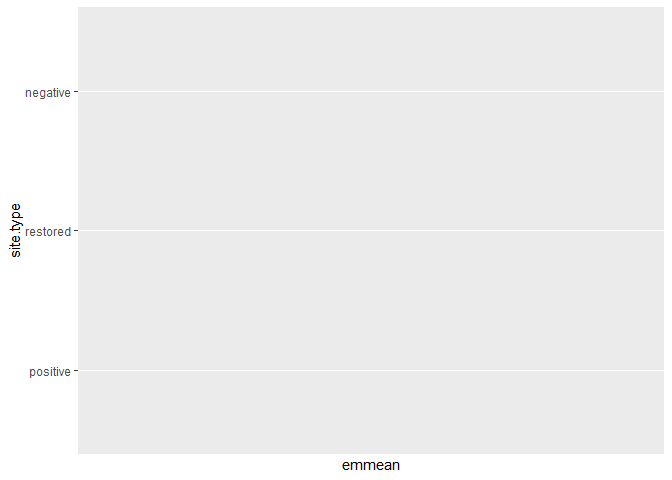

Analysis of Bauer et al. (submitted) Functional traits of grasslands:
<br> Community weighted mean of canopy height per plot (esy4)
================
<b>Markus Bauer</b> <br>
<b>2025-05-05</b>

- [Preparation](#preparation)
- [Statistics](#statistics)
  - [Data exploration](#data-exploration)
    - [Means and deviations](#means-and-deviations)
    - [Graphs of raw data (Step 2, 6,
      7)](#graphs-of-raw-data-step-2-6-7)
    - [Outliers, zero-inflation, transformations? (Step 1, 3,
      4)](#outliers-zero-inflation-transformations-step-1-3-4)
    - [Check collinearity part 1 (Step
      5)](#check-collinearity-part-1-step-5)
  - [Models](#models)
  - [Model check](#model-check)
    - [DHARMa](#dharma)
    - [Check collinearity part 2 (Step
      5)](#check-collinearity-part-2-step-5)
  - [Model comparison](#model-comparison)
    - [<i>R</i><sup>2</sup> values](#r2-values)
    - [AICc](#aicc)
  - [Predicted values](#predicted-values)
    - [Summary table](#summary-table)
    - [Forest plot](#forest-plot)
    - [Effect sizes](#effect-sizes)
- [Session info](#session-info)

<br/> <br/> <b>Markus Bauer</b>

Technichal University of Munich, TUM School of Life Sciences, Chair of
Restoration Ecology, Emil-Ramann-Straße 6, 85354 Freising, Germany

<markus1.bauer@tum.de>

ORCiD ID: [0000-0001-5372-4174](https://orcid.org/0000-0001-5372-4174)
<br> [Google
Scholar](https://scholar.google.de/citations?user=oHhmOkkAAAAJ&hl=de&oi=ao)
<br> GitHub: [markus1bauer](https://github.com/markus1bauer)

> **NOTE:** To compare different models, you only have to change the
> models in the section ‘Load models’

# Preparation

Protocol of data exploration (Steps 1-8) used from Zuur et al. (2010)
Methods Ecol Evol [DOI:
10.1111/2041-210X.12577](https://doi.org/10.1111/2041-210X.12577)

#### Packages

``` r
library(here)
library(tidyverse)
library(ggbeeswarm)
library(patchwork)
library(DHARMa)
library(emmeans)
```

#### Load data

``` r
sites <- read_csv(
  here("data", "processed", "data_processed_sites_esy4.csv"),
  col_names = TRUE, na = c("na", "NA", ""), col_types = cols(
    .default = "?",
    eco.id = "f",
    region = col_factor(levels = c("north", "centre", "south"), ordered = TRUE),
    site.type = col_factor(
      levels = c("positive", "restored", "negative"), ordered = TRUE
      ),
    fertilized = "f",
    freq.mow = "f",
    obs.year = "f"
  )
) %>%
  filter(esy4 %in% c("R", "R22", "R1A") & !(eco.id == 647)) %>%
  mutate(
    esy4 = fct_relevel(esy4, "R", "R22", "R1A"),
    eco.id = factor(eco.id)
    ) %>%
  rename(y = cwm.abu.height) %>%
  filter(y < 1) # see section Outliers: Exclude site N_DAM (more or less only the tall grass Arrhenatherum elatius germinated at this young restoration site)
```

# Statistics

## Data exploration

### Means and deviations

``` r
Rmisc::CI(sites$y, ci = .95)
```

    ##     upper      mean     lower 
    ## 0.4803880 0.4706761 0.4609642

``` r
median(sites$y)
```

    ## [1] 0.46

``` r
sd(sites$y)
```

    ## [1] 0.1247259

``` r
quantile(sites$y, probs = c(0.05, 0.95), na.rm = TRUE)
```

    ##   5%  95% 
    ## 0.27 0.68

``` r
sites %>% count(eco.id)
```

    ## # A tibble: 3 × 2
    ##   eco.id     n
    ##   <fct>  <int>
    ## 1 654      202
    ## 2 686      235
    ## 3 664      199

``` r
sites %>% count(site.type)
```

    ## # A tibble: 3 × 2
    ##   site.type     n
    ##   <ord>     <int>
    ## 1 positive    114
    ## 2 restored    404
    ## 3 negative    118

``` r
sites %>% count(esy4)
```

    ## # A tibble: 3 × 2
    ##   esy4      n
    ##   <fct> <int>
    ## 1 R       334
    ## 2 R22     218
    ## 3 R1A      84

``` r
sites %>% count(esy4, eco.id)
```

    ## # A tibble: 8 × 3
    ##   esy4  eco.id     n
    ##   <fct> <fct>  <int>
    ## 1 R     654      101
    ## 2 R     686      123
    ## 3 R     664      110
    ## 4 R22   654       48
    ## 5 R22   686       81
    ## 6 R22   664       89
    ## 7 R1A   654       53
    ## 8 R1A   686       31

``` r
sites %>% count(esy4, site.type)
```

    ## # A tibble: 9 × 3
    ##   esy4  site.type     n
    ##   <fct> <ord>     <int>
    ## 1 R     positive     62
    ## 2 R     restored    179
    ## 3 R     negative     93
    ## 4 R22   positive     29
    ## 5 R22   restored    173
    ## 6 R22   negative     16
    ## 7 R1A   positive     23
    ## 8 R1A   restored     52
    ## 9 R1A   negative      9

### Graphs of raw data (Step 2, 6, 7)

<!-- --><!-- --><!-- --><!-- --><!-- -->

### Outliers, zero-inflation, transformations? (Step 1, 3, 4)

<!-- -->

### Check collinearity part 1 (Step 5)

Exclude r \> 0.7 <br> Dormann et al. 2013 Ecography [DOI:
10.1111/j.1600-0587.2012.07348.x](https://doi.org/10.1111/j.1600-0587.2012.07348.x)

``` r
# sites %>%
#   select(where(is.numeric), -y, -starts_with("cwm.")) %>%
#   GGally::ggpairs(
#     lower = list(continuous = "smooth_loess")
#     ) +
#   theme(strip.text = element_text(size = 7))

# -> no continuous variables
```

## Models

> **NOTE:** Only here you have to modify the script to compare other
> models

``` r
load(file = here("outputs", "models", "model_height_esy4_1.Rdata"))
load(file = here("outputs", "models", "model_height_esy4_3.Rdata"))
m_1 <- m1
m_2 <- m3
```

``` r
m_1@call
## lmer(formula = y ~ esy4 * (site.type + eco.id) + obs.year + (1 | 
##     id.site), data = sites, REML = FALSE)
m_2@call
## lmer(formula = y ~ esy4 * (site.type + eco.id) + obs.year + hydrology + 
##     (1 | id.site), data = sites, REML = FALSE)
```

## Model check

### DHARMa

``` r
simulation_output_1 <- simulateResiduals(m_1, plot = TRUE)
```

<!-- -->

``` r
simulation_output_2 <- simulateResiduals(m_2, plot = TRUE)
```

<!-- -->

``` r
plotResiduals(simulation_output_1$scaledResiduals, sites$eco.id)
```

<!-- -->

``` r
plotResiduals(simulation_output_2$scaledResiduals, sites$eco.id)
```

<!-- -->

``` r
plotResiduals(simulation_output_1$scaledResiduals, sites$site.type)
```

<!-- -->

``` r
plotResiduals(simulation_output_2$scaledResiduals, sites$site.type)
```

<!-- -->

``` r
plotResiduals(simulation_output_1$scaledResiduals, sites$obs.year)
```

<!-- -->

``` r
plotResiduals(simulation_output_2$scaledResiduals, sites$obs.year)
```

<!-- -->

``` r
plotResiduals(simulation_output_1$scaledResiduals, sites$history)
```

<!-- -->

``` r
plotResiduals(simulation_output_2$scaledResiduals, sites$history)
```

<!-- -->

``` r
plotResiduals(simulation_output_1$scaledResiduals, sites$hydrology)
## Warning in ensurePredictor(simulationOutput, form): DHARMa:::ensurePredictor:
## character string was provided as predictor. DHARMa has converted to factor
## automatically. To remove this warning, please convert to factor before
## attempting to plot with DHARMa.
```

<!-- -->

``` r
plotResiduals(simulation_output_2$scaledResiduals, sites$hydrology)
## Warning in ensurePredictor(simulationOutput, form): DHARMa:::ensurePredictor:
## character string was provided as predictor. DHARMa has converted to factor
## automatically. To remove this warning, please convert to factor before
## attempting to plot with DHARMa.
```

<!-- -->

``` r
plotResiduals(simulation_output_1$scaledResiduals, sites$land.use.hist)
## Warning in ensurePredictor(simulationOutput, form): DHARMa:::ensurePredictor:
## character string was provided as predictor. DHARMa has converted to factor
## automatically. To remove this warning, please convert to factor before
## attempting to plot with DHARMa.
```

<!-- -->

``` r
plotResiduals(simulation_output_2$scaledResiduals, sites$land.use.hist)
## Warning in ensurePredictor(simulationOutput, form): DHARMa:::ensurePredictor:
## character string was provided as predictor. DHARMa has converted to factor
## automatically. To remove this warning, please convert to factor before
## attempting to plot with DHARMa.
```

<!-- -->

``` r
plotResiduals(simulation_output_1$scaledResiduals, sites$fertilized)
```

<!-- -->

``` r
plotResiduals(simulation_output_2$scaledResiduals, sites$fertilized)
```

<!-- -->

``` r
plotResiduals(simulation_output_1$scaledResiduals, sites$freq.mow)
```

<!-- -->

``` r
plotResiduals(simulation_output_2$scaledResiduals, sites$freq.mow)
```

<!-- -->

### Check collinearity part 2 (Step 5)

Remove VIF \> 3 or \> 10 <br> Zuur et al. 2010 Methods Ecol Evol [DOI:
10.1111/j.2041-210X.2009.00001.x](https://doi.org/10.1111/j.2041-210X.2009.00001.x)

``` r
car::vif(m_1)
```

    ##                     GVIF Df GVIF^(1/(2*Df))
    ## esy4           11.864594  2        1.855937
    ## site.type       1.490355  2        1.104899
    ## eco.id          1.697649  2        1.141463
    ## obs.year        1.020805  1        1.010349
    ## esy4:site.type  5.153993  4        1.227490
    ## esy4:eco.id    10.133575  3        1.471049

``` r
car::vif(m_2)
```

    ##                     GVIF Df GVIF^(1/(2*Df))
    ## esy4           13.322909  2        1.910512
    ## site.type       1.634174  2        1.130641
    ## eco.id          1.826024  2        1.162456
    ## obs.year        1.025861  1        1.012848
    ## hydrology       1.336791  2        1.075266
    ## esy4:site.type  5.349112  4        1.233205
    ## esy4:eco.id    10.736559  3        1.485289

## Model comparison

### <i>R</i><sup>2</sup> values

``` r
MuMIn::r.squaredGLMM(m_1)
##            R2m       R2c
## [1,] 0.1666915 0.6593747
MuMIn::r.squaredGLMM(m_2)
##            R2m      R2c
## [1,] 0.3105558 0.687387
```

### AICc

Use AICc and not AIC since ratio n/K \< 40 <br> Burnahm & Anderson 2002
p. 66 ISBN: 978-0-387-95364-9

``` r
MuMIn::AICc(m_1, m_2) %>%
  arrange(AICc)
##     df      AICc
## m_2 19 -1259.429
## m_1 17 -1226.279
```

## Predicted values

### Summary table

``` r
car::Anova(m_2)
```

    ## Analysis of Deviance Table (Type II Wald chisquare tests)
    ## 
    ## Response: y
    ##                  Chisq Df Pr(>Chisq)    
    ## esy4           26.3551  2  1.893e-06 ***
    ## site.type      12.4137  2   0.002016 ** 
    ## eco.id          4.0869  2   0.129578    
    ## obs.year        2.6054  1   0.106499    
    ## hydrology      39.8480  2  2.224e-09 ***
    ## esy4:site.type  2.4408  4   0.655266    
    ## esy4:eco.id     2.8044  3   0.422778    
    ## ---
    ## Signif. codes:  0 '***' 0.001 '**' 0.01 '*' 0.05 '.' 0.1 ' ' 1

``` r
summary(m_2)
```

    ## Linear mixed model fit by maximum likelihood  ['lmerMod']
    ## Formula: y ~ esy4 * (site.type + eco.id) + obs.year + hydrology + (1 |  
    ##     id.site)
    ##    Data: sites
    ## 
    ##       AIC       BIC    logLik -2*log(L)  df.resid 
    ##   -1260.7   -1176.0     649.3   -1298.7       617 
    ## 
    ## Scaled residuals: 
    ##     Min      1Q  Median      3Q     Max 
    ## -3.2542 -0.5231  0.0175  0.4627  5.4698 
    ## 
    ## Random effects:
    ##  Groups   Name        Variance Std.Dev.
    ##  id.site  (Intercept) 0.005759 0.07589 
    ##  Residual             0.004778 0.06912 
    ## Number of obs: 636, groups:  id.site, 181
    ## 
    ## Fixed effects:
    ##                     Estimate Std. Error t value
    ## (Intercept)          0.42872    0.01965  21.814
    ## esy4R22              0.03076    0.01789   1.719
    ## esy4R1A             -0.06059    0.02380  -2.546
    ## site.type.L          0.04966    0.01660   2.991
    ## site.type.Q          0.01250    0.01223   1.022
    ## eco.id686           -0.02409    0.01770  -1.361
    ## eco.id664           -0.02214    0.01859  -1.190
    ## obs.year2023        -0.02066    0.01280  -1.614
    ## hydrologyfresh       0.09428    0.01693   5.568
    ## hydrologymoist       0.11216    0.01955   5.737
    ## esy4R22:site.type.L -0.01112    0.02229  -0.499
    ## esy4R1A:site.type.L  0.03997    0.04034   0.991
    ## esy4R22:site.type.Q -0.01573    0.01524  -1.032
    ## esy4R1A:site.type.Q  0.02044    0.02746   0.744
    ## esy4R22:eco.id686   -0.02098    0.02039  -1.029
    ## esy4R1A:eco.id686    0.02151    0.03030   0.710
    ## esy4R22:eco.id664   -0.03115    0.02232  -1.396

    ## 
    ## Correlation matrix not shown by default, as p = 17 > 12.
    ## Use print(x, correlation=TRUE)  or
    ##     vcov(x)        if you need it

    ## fit warnings:
    ## fixed-effect model matrix is rank deficient so dropping 1 column / coefficient

### Forest plot

``` r
dotwhisker::dwplot(
  list(m_1, m_2),
  ci = 0.95,
  show_intercept = FALSE,
  vline = geom_vline(xintercept = 0, colour = "grey60", linetype = 2)) +
  xlim(-0.2, 0.2) +
  theme_classic()
```

<!-- -->

### Effect sizes

Effect sizes of chosen model just to get exact values of means etc. if
necessary.

#### Habiat type x Region

``` r
(emm <- emmeans(
  m_2,
  revpairwise ~ eco.id,
  type = "response"
  ))
```

    ## $emmeans
    ##  eco.id emmean     SE  df lower.CL upper.CL
    ##  654     0.477 0.0131 219    0.451    0.503
    ##  686     0.453 0.0139 248    0.426    0.481
    ##  664    nonEst     NA  NA       NA       NA
    ## 
    ## Results are averaged over the levels of: esy4, site.type, obs.year, hydrology 
    ## Degrees-of-freedom method: kenward-roger 
    ## Confidence level used: 0.95 
    ## 
    ## $contrasts
    ##  contrast              estimate    SE  df t.ratio p.value
    ##  eco.id686 - eco.id654  -0.0239 0.017 219  -1.407  0.1610
    ##  eco.id664 - eco.id654   nonEst    NA  NA      NA      NA
    ##  eco.id664 - eco.id686   nonEst    NA  NA      NA      NA
    ## 
    ## Results are averaged over the levels of: esy4, site.type, obs.year, hydrology 
    ## Degrees-of-freedom method: kenward-roger 
    ## P value adjustment: tukey method for comparing a family of 2 estimates

``` r
plot(emm, comparison = TRUE)
```

    ## Warning: Removed 1 row containing missing values or values outside the scale range
    ## (`geom_point()`).

    ## Warning: Removed 1 row containing missing values or values outside the scale range
    ## (`geom_segment()`).

    ## Warning: Removed 1 row containing missing values or values outside the scale range
    ## (`geom_point()`).

<!-- -->

#### Habiat type x Site type

``` r
(emm <- emmeans(
  m_2,
  revpairwise ~ site.type,
  type = "response"
  ))
```

    ## $emmeans
    ##  site.type emmean SE df asymp.LCL asymp.UCL
    ##  positive  nonEst NA NA        NA        NA
    ##  restored  nonEst NA NA        NA        NA
    ##  negative  nonEst NA NA        NA        NA
    ## 
    ## Results are averaged over the levels of: esy4, eco.id, obs.year, hydrology 
    ## Degrees-of-freedom method: kenward-roger 
    ## Confidence level used: 0.95 
    ## 
    ## $contrasts
    ##  contrast            estimate     SE  df t.ratio p.value
    ##  restored - positive   0.0247 0.0185 217   1.331  0.3794
    ##  negative - positive   0.0838 0.0268 259   3.128  0.0055
    ##  negative - restored   0.0591 0.0230 277   2.570  0.0287
    ## 
    ## Results are averaged over the levels of: esy4, eco.id, obs.year, hydrology 
    ## Degrees-of-freedom method: kenward-roger 
    ## P value adjustment: tukey method for comparing a family of 3 estimates

``` r
plot(emm, comparison = TRUE)
```

    ## Warning: Removed 3 rows containing missing values or values outside the scale range
    ## (`geom_point()`).

    ## Warning: Removed 3 rows containing missing values or values outside the scale range
    ## (`geom_segment()`).

    ## Warning: Removed 3 rows containing missing values or values outside the scale range
    ## (`geom_point()`).

<!-- -->

# Session info

    ## R version 4.4.2 (2024-10-31 ucrt)
    ## Platform: x86_64-w64-mingw32/x64
    ## Running under: Windows 11 x64 (build 26100)
    ## 
    ## Matrix products: default
    ## 
    ## 
    ## locale:
    ## [1] LC_COLLATE=German_Germany.utf8  LC_CTYPE=German_Germany.utf8   
    ## [3] LC_MONETARY=German_Germany.utf8 LC_NUMERIC=C                   
    ## [5] LC_TIME=German_Germany.utf8    
    ## 
    ## time zone: Europe/Berlin
    ## tzcode source: internal
    ## 
    ## attached base packages:
    ## [1] stats     graphics  grDevices utils     datasets  methods   base     
    ## 
    ## other attached packages:
    ##  [1] emmeans_1.11.0   DHARMa_0.4.7     patchwork_1.2.0  ggbeeswarm_0.7.2
    ##  [5] lubridate_1.9.3  forcats_1.0.0    stringr_1.5.1    dplyr_1.1.4     
    ##  [9] purrr_1.0.2      readr_2.1.5      tidyr_1.3.1      tibble_3.2.1    
    ## [13] ggplot2_3.5.1    tidyverse_2.0.0  here_1.0.1      
    ## 
    ## loaded via a namespace (and not attached):
    ##   [1] mnormt_2.1.1        Rdpack_2.6.3        gridExtra_2.3      
    ##   [4] sandwich_3.1-1      rlang_1.1.4         magrittr_2.0.3     
    ##   [7] compiler_4.4.2      mgcv_1.9-1          vctrs_0.6.5        
    ##  [10] quadprog_1.5-8      pkgconfig_2.0.3     crayon_1.5.3       
    ##  [13] fastmap_1.2.0       backports_1.5.0     labeling_0.4.3     
    ##  [16] pbivnorm_0.6.0      utf8_1.2.4          ggstance_0.3.7     
    ##  [19] promises_1.3.2      rmarkdown_2.27      tzdb_0.4.0         
    ##  [22] nloptr_2.2.1        bit_4.0.5           xfun_0.45          
    ##  [25] highr_0.11          later_1.4.1         broom_1.0.6        
    ##  [28] lavaan_0.6-19       parallel_4.4.2      R6_2.5.1           
    ##  [31] gap.datasets_0.0.6  stringi_1.8.4       qgam_1.3.4         
    ##  [34] car_3.1-3           boot_1.3-31         numDeriv_2016.8-1.1
    ##  [37] estimability_1.5.1  Rcpp_1.0.14         iterators_1.0.14   
    ##  [40] knitr_1.48          zoo_1.8-13          parameters_0.24.2  
    ##  [43] httpuv_1.6.15       Matrix_1.7-0        splines_4.4.2      
    ##  [46] timechange_0.3.0    tidyselect_1.2.1    rstudioapi_0.16.0  
    ##  [49] abind_1.4-8         yaml_2.3.9          MuMIn_1.48.11      
    ##  [52] doParallel_1.0.17   codetools_0.2-20    nonnest2_0.5-8     
    ##  [55] lattice_0.22-6      plyr_1.8.9          shiny_1.10.0       
    ##  [58] withr_3.0.0         bayestestR_0.15.2   coda_0.19-4.1      
    ##  [61] evaluate_0.24.0     CompQuadForm_1.4.3  pillar_1.9.0       
    ##  [64] gap_1.6             carData_3.0-5       foreach_1.5.2      
    ##  [67] stats4_4.4.2        reformulas_0.4.0    insight_1.1.0      
    ##  [70] generics_0.1.3      vroom_1.6.5         rprojroot_2.0.4    
    ##  [73] hms_1.1.3           munsell_0.5.1       scales_1.3.0       
    ##  [76] minqa_1.2.8         xtable_1.8-4        glue_1.7.0         
    ##  [79] tools_4.4.2         lme4_1.1-37         mvtnorm_1.3-3      
    ##  [82] grid_4.4.2          rbibutils_2.3       datawizard_1.0.2   
    ##  [85] colorspace_2.1-0    nlme_3.1-164        Rmisc_1.5.1        
    ##  [88] performance_0.13.0  beeswarm_0.4.0      vipor_0.4.7        
    ##  [91] Formula_1.2-5       cli_3.6.3           fansi_1.0.6        
    ##  [94] gtable_0.3.5        digest_0.6.36       pbkrtest_0.5.3     
    ##  [97] farver_2.1.2        htmltools_0.5.8.1   lifecycle_1.0.4    
    ## [100] mime_0.12           bit64_4.0.5         dotwhisker_0.8.3   
    ## [103] MASS_7.3-60.2
