Analysis of Bauer et al. (submitted) Functional traits of grasslands:
<br> Community weighted mean of seed mass per plot (esy4)
================
<b>Markus Bauer</b> <br>
<b>2025-04-29</b>

- [Preparation](#preparation)
- [Statistics](#statistics)
  - [Data exploration](#data-exploration)
    - [Means and deviations](#means-and-deviations)
    - [Graphs of raw data (Step 2, 6,
      7)](#graphs-of-raw-data-step-2-6-7)
    - [Outliers, zero-inflation, transformations? (Step 1, 3,
      4)](#outliers-zero-inflation-transformations-step-1-3-4)
    - [Check collinearity part 1 (Step
      5)](#check-collinearity-part-1-step-5)
  - [Models](#models)
  - [Model check](#model-check)
    - [DHARMa](#dharma)
    - [Check collinearity part 2 (Step
      5)](#check-collinearity-part-2-step-5)
  - [Model comparison](#model-comparison)
    - [<i>R</i><sup>2</sup> values](#r2-values)
    - [AICc](#aicc)
  - [Predicted values](#predicted-values)
    - [Summary table](#summary-table)
    - [Forest plot](#forest-plot)
    - [Effect sizes](#effect-sizes)
- [Session info](#session-info)

<br/> <br/> <b>Markus Bauer</b>

Technichal University of Munich, TUM School of Life Sciences, Chair of
Restoration Ecology, Emil-Ramann-Straße 6, 85354 Freising, Germany

<markus1.bauer@tum.de>

ORCiD ID: [0000-0001-5372-4174](https://orcid.org/0000-0001-5372-4174)
<br> [Google
Scholar](https://scholar.google.de/citations?user=oHhmOkkAAAAJ&hl=de&oi=ao)
<br> GitHub: [markus1bauer](https://github.com/markus1bauer)

> **NOTE:** To compare different models, you only have to change the
> models in the section ‘Load models’

# Preparation

Protocol of data exploration (Steps 1-8) used from Zuur et al. (2010)
Methods Ecol Evol [DOI:
10.1111/2041-210X.12577](https://doi.org/10.1111/2041-210X.12577)

#### Packages

``` r
library(here)
library(tidyverse)
library(ggbeeswarm)
library(patchwork)
library(DHARMa)
library(emmeans)
```

#### Load data

``` r
sites <- read_csv(
  here("data", "processed", "data_processed_sites_esy4.csv"),
  col_names = TRUE, na = c("na", "NA", ""), col_types = cols(
    .default = "?",
    eco.id = "f",
    region = col_factor(levels = c("north", "centre", "south"), ordered = TRUE),
    site.type = col_factor(
      levels = c("positive", "restored", "negative"), ordered = TRUE
      ),
    fertilized = "f",
    freq.mow = "f",
    obs.year = "f"
  )
) %>%
  filter(esy4 %in% c("R", "R22", "R1A") & !(eco.id == 647)) %>%
  mutate(
    esy4 = fct_relevel(esy4, "R", "R22", "R1A"),
    eco.id = factor(eco.id)
    ) %>%
  rename(y = cwm.abu.seedmass)
```

# Statistics

## Data exploration

### Means and deviations

``` r
Rmisc::CI(sites$y, ci = .95)
```

    ##       upper        mean       lower 
    ## 0.001590479 0.001507379 0.001424279

``` r
median(sites$y)
```

    ## [1] 0.00125

``` r
sd(sites$y)
```

    ## [1] 0.001071421

``` r
quantile(sites$y, probs = c(0.05, 0.95), na.rm = TRUE)
```

    ##      5%     95% 
    ## 0.00038 0.00350

``` r
sites %>% count(eco.id)
```

    ## # A tibble: 3 × 2
    ##   eco.id     n
    ##   <fct>  <int>
    ## 1 654      203
    ## 2 686      235
    ## 3 664      203

``` r
sites %>% count(site.type)
```

    ## # A tibble: 3 × 2
    ##   site.type     n
    ##   <ord>     <int>
    ## 1 positive    114
    ## 2 restored    409
    ## 3 negative    118

``` r
sites %>% count(esy4)
```

    ## # A tibble: 3 × 2
    ##   esy4      n
    ##   <fct> <int>
    ## 1 R       337
    ## 2 R22     220
    ## 3 R1A      84

``` r
sites %>% count(esy4, eco.id)
```

    ## # A tibble: 8 × 3
    ##   esy4  eco.id     n
    ##   <fct> <fct>  <int>
    ## 1 R     654      102
    ## 2 R     686      123
    ## 3 R     664      112
    ## 4 R22   654       48
    ## 5 R22   686       81
    ## 6 R22   664       91
    ## 7 R1A   654       53
    ## 8 R1A   686       31

``` r
sites %>% count(esy4, site.type)
```

    ## # A tibble: 9 × 3
    ##   esy4  site.type     n
    ##   <fct> <ord>     <int>
    ## 1 R     positive     62
    ## 2 R     restored    182
    ## 3 R     negative     93
    ## 4 R22   positive     29
    ## 5 R22   restored    175
    ## 6 R22   negative     16
    ## 7 R1A   positive     23
    ## 8 R1A   restored     52
    ## 9 R1A   negative      9

### Graphs of raw data (Step 2, 6, 7)

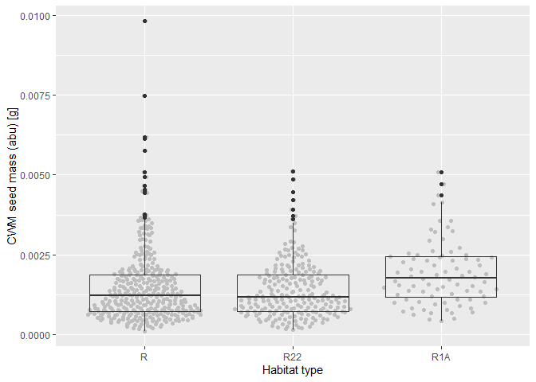<!-- -->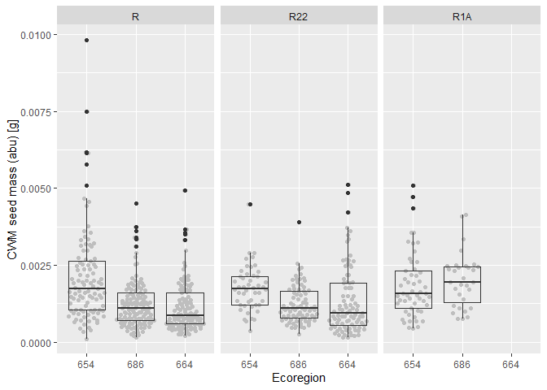<!-- -->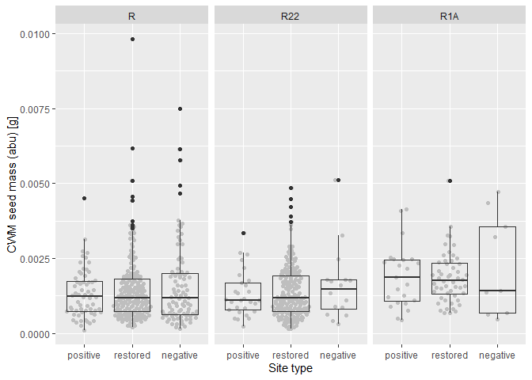<!-- -->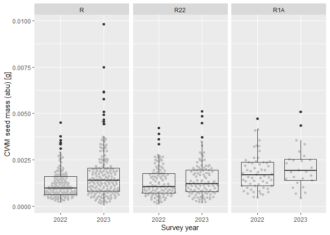<!-- -->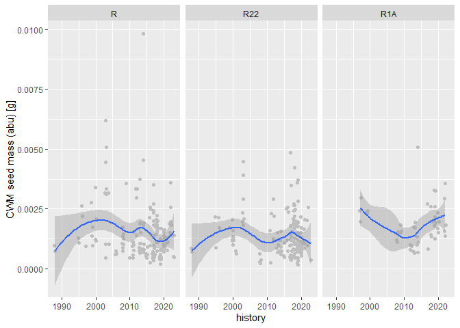<!-- -->

### Outliers, zero-inflation, transformations? (Step 1, 3, 4)

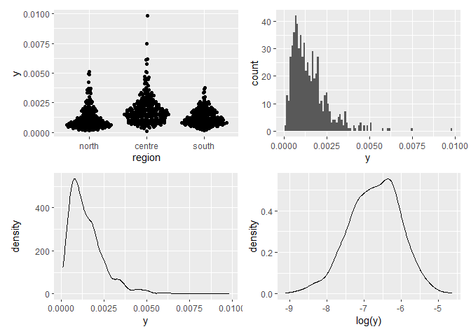<!-- -->

### Check collinearity part 1 (Step 5)

Exclude r \> 0.7 <br> Dormann et al. 2013 Ecography [DOI:
10.1111/j.1600-0587.2012.07348.x](https://doi.org/10.1111/j.1600-0587.2012.07348.x)

``` r
# sites %>%
#   select(where(is.numeric), -y, -starts_with("cwm.")) %>%
#   GGally::ggpairs(
#     lower = list(continuous = "smooth_loess")
#     ) +
#   theme(strip.text = element_text(size = 7))

# -> no continuous variables
```

## Models

> **NOTE:** Only here you have to modify the script to compare other
> models

``` r
load(file = here("outputs", "models", "model_seedmass_esy4_1.Rdata"))
load(file = here("outputs", "models", "model_seedmass_esy4_2.Rdata"))
m_1 <- m1
m_2 <- m2
```

``` r
m_1@call
## lmer(formula = log(y) ~ esy4 * (site.type + eco.id) + obs.year + 
##     (1 | id.site), data = sites, REML = FALSE)
m_2@call
## lmer(formula = log(y) ~ esy4 * site.type + eco.id + obs.year + 
##     (1 | id.site), data = sites, REML = FALSE)
```

## Model check

### DHARMa

``` r
simulation_output_1 <- simulateResiduals(m_1, plot = TRUE)
```

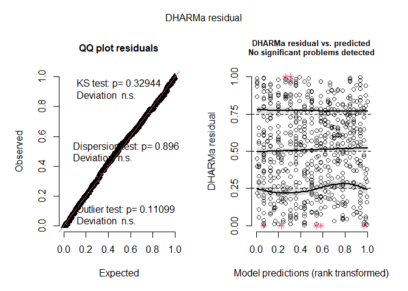<!-- -->

``` r
simulation_output_2 <- simulateResiduals(m_2, plot = TRUE)
```

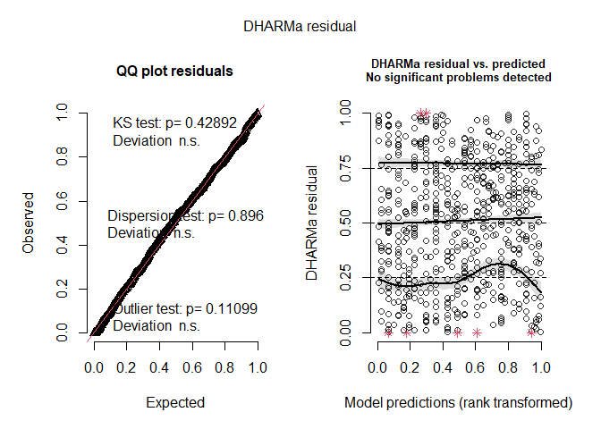<!-- -->

``` r
plotResiduals(simulation_output_1$scaledResiduals, sites$eco.id)
```

<!-- -->

``` r
plotResiduals(simulation_output_2$scaledResiduals, sites$eco.id)
```

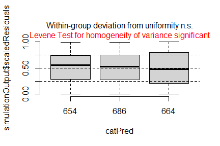<!-- -->

``` r
plotResiduals(simulation_output_1$scaledResiduals, sites$site.type)
```

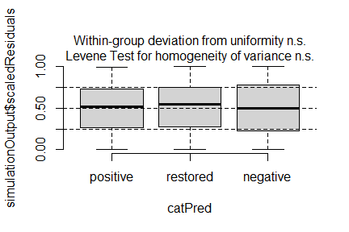<!-- -->

``` r
plotResiduals(simulation_output_2$scaledResiduals, sites$site.type)
```

<!-- -->

``` r
plotResiduals(simulation_output_1$scaledResiduals, sites$obs.year)
```

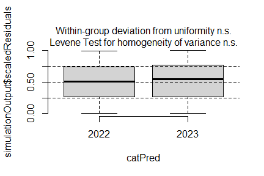<!-- -->

``` r
plotResiduals(simulation_output_2$scaledResiduals, sites$obs.year)
```

<!-- -->

``` r
plotResiduals(simulation_output_1$scaledResiduals, sites$history)
```

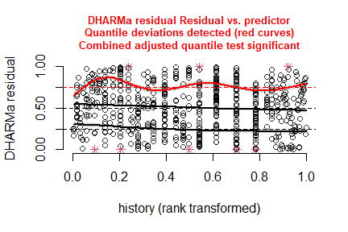<!-- -->

``` r
plotResiduals(simulation_output_2$scaledResiduals, sites$history)
```

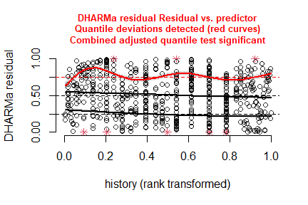<!-- -->

``` r
plotResiduals(simulation_output_1$scaledResiduals, sites$hydrology)
## Warning in ensurePredictor(simulationOutput, form): DHARMa:::ensurePredictor:
## character string was provided as predictor. DHARMa has converted to factor
## automatically. To remove this warning, please convert to factor before
## attempting to plot with DHARMa.
```

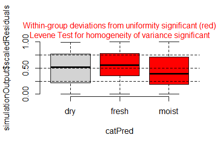<!-- -->

``` r
plotResiduals(simulation_output_2$scaledResiduals, sites$hydrology)
## Warning in ensurePredictor(simulationOutput, form): DHARMa:::ensurePredictor:
## character string was provided as predictor. DHARMa has converted to factor
## automatically. To remove this warning, please convert to factor before
## attempting to plot with DHARMa.
```

<!-- -->

``` r
plotResiduals(simulation_output_1$scaledResiduals, sites$land.use.hist)
## Warning in ensurePredictor(simulationOutput, form): DHARMa:::ensurePredictor:
## character string was provided as predictor. DHARMa has converted to factor
## automatically. To remove this warning, please convert to factor before
## attempting to plot with DHARMa.
```

<!-- -->

``` r
plotResiduals(simulation_output_2$scaledResiduals, sites$land.use.hist)
## Warning in ensurePredictor(simulationOutput, form): DHARMa:::ensurePredictor:
## character string was provided as predictor. DHARMa has converted to factor
## automatically. To remove this warning, please convert to factor before
## attempting to plot with DHARMa.
```

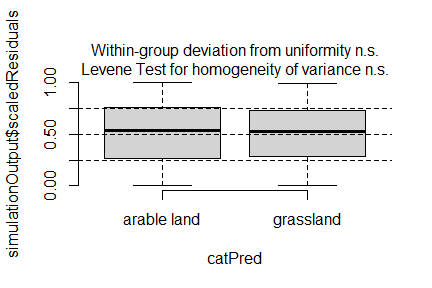<!-- -->

``` r
plotResiduals(simulation_output_1$scaledResiduals, sites$fertilized)
```

<!-- -->

``` r
plotResiduals(simulation_output_2$scaledResiduals, sites$fertilized)
```

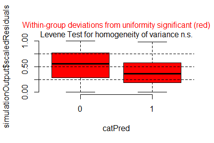<!-- -->

``` r
plotResiduals(simulation_output_1$scaledResiduals, sites$freq.mow)
```

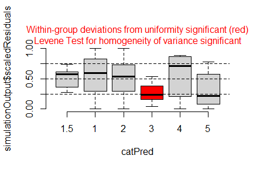<!-- -->

``` r
plotResiduals(simulation_output_2$scaledResiduals, sites$freq.mow)
```

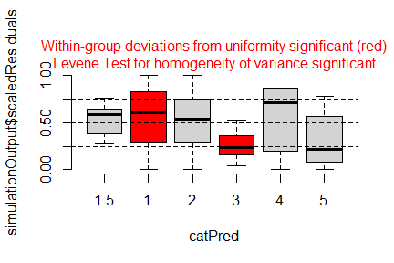<!-- -->

### Check collinearity part 2 (Step 5)

Remove VIF \> 3 or \> 10 <br> Zuur et al. 2010 Methods Ecol Evol [DOI:
10.1111/j.2041-210X.2009.00001.x](https://doi.org/10.1111/j.2041-210X.2009.00001.x)

``` r
car::vif(m_1)
```

    ##                     GVIF Df GVIF^(1/(2*Df))
    ## esy4           12.098961  2        1.865035
    ## site.type       1.413389  2        1.090349
    ## eco.id          1.578127  2        1.120819
    ## obs.year        1.019161  1        1.009535
    ## esy4:site.type  5.094832  4        1.225720
    ## esy4:eco.id     9.713098  3        1.460695

``` r
car::vif(m_2)
```

    ##                    GVIF Df GVIF^(1/(2*Df))
    ## esy4           3.657125  2        1.382881
    ## site.type      1.403941  2        1.088522
    ## eco.id         1.065502  2        1.015988
    ## obs.year       1.018405  1        1.009161
    ## esy4:site.type 4.684841  4        1.212933

## Model comparison

### <i>R</i><sup>2</sup> values

``` r
MuMIn::r.squaredGLMM(m_1)
##            R2m       R2c
## [1,] 0.1239411 0.6898262
MuMIn::r.squaredGLMM(m_2)
##           R2m       R2c
## [1,] 0.120883 0.6926789
```

### AICc

Use AICc and not AIC since ratio n/K \< 40 <br> Burnahm & Anderson 2002
p. 66 ISBN: 978-0-387-95364-9

``` r
MuMIn::AICc(m_1, m_2) %>%
  arrange(AICc)
##     df     AICc
## m_2 14 981.0276
## m_1 17 985.3667
```

## Predicted values

### Summary table

``` r
summary(m_1)
```

    ## Linear mixed model fit by maximum likelihood  ['lmerMod']
    ## Formula: log(y) ~ esy4 * (site.type + eco.id) + obs.year + (1 | id.site)
    ##    Data: sites
    ## 
    ##       AIC       BIC    logLik -2*log(L)  df.resid 
    ##     984.4    1060.3    -475.2     950.4       624 
    ## 
    ## Scaled residuals: 
    ##     Min      1Q  Median      3Q     Max 
    ## -4.0458 -0.4726  0.0098  0.4491  2.8922 
    ## 
    ## Random effects:
    ##  Groups   Name        Variance Std.Dev.
    ##  id.site  (Intercept) 0.2685   0.5182  
    ##  Residual             0.1472   0.3836  
    ## Number of obs: 641, groups:  id.site, 182
    ## 
    ## Fixed effects:
    ##                     Estimate Std. Error t value
    ## (Intercept)         -6.52204    0.09837 -66.302
    ## esy4R22             -0.03038    0.10120  -0.300
    ## esy4R1A              0.12386    0.13568   0.913
    ## site.type.L         -0.05604    0.10525  -0.532
    ## site.type.Q         -0.03163    0.07783  -0.406
    ## eco.id686           -0.36078    0.11286  -3.197
    ## eco.id664           -0.51518    0.11705  -4.401
    ## obs.year2023         0.15993    0.08388   1.907
    ## esy4R22:site.type.L  0.13539    0.12705   1.066
    ## esy4R1A:site.type.L  0.16894    0.24441   0.691
    ## esy4R22:site.type.Q  0.03052    0.08664   0.352
    ## esy4R1A:site.type.Q  0.15498    0.16617   0.933
    ## esy4R22:eco.id686   -0.04277    0.11503  -0.372
    ## esy4R1A:eco.id686    0.21104    0.17805   1.185
    ## esy4R22:eco.id664    0.02623    0.12535   0.209

    ## 
    ## Correlation matrix not shown by default, as p = 15 > 12.
    ## Use print(x, correlation=TRUE)  or
    ##     vcov(x)        if you need it

    ## fit warnings:
    ## fixed-effect model matrix is rank deficient so dropping 1 column / coefficient

### Forest plot

``` r
dotwhisker::dwplot(
  list(m_1, m_2),
  ci = 0.95,
  show_intercept = FALSE,
  vline = geom_vline(xintercept = 0, colour = "grey60", linetype = 2)) +
  theme_classic()
```

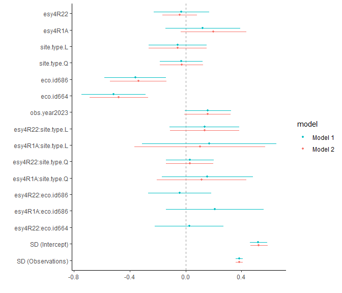<!-- -->

### Effect sizes

Effect sizes of chosen model just to get exact values of means etc. if
necessary.

#### Habiat type x Region

``` r
(emm <- emmeans(
  m_1,
  revpairwise ~ esy4 + eco.id,
  type = "response"
  ))
```

    ## $emmeans
    ##  esy4 eco.id response       SE  df lower.CL upper.CL
    ##  R    654    0.001593 1.42e-04 265 0.001337  0.00190
    ##  R22  654    0.001545 1.78e-04 475 0.001232  0.00194
    ##  R1A  654    0.001803 2.43e-04 395 0.001383  0.00235
    ##  R    686    0.001111 9.17e-05 242 0.000944  0.00131
    ##  R22  686    0.001032 1.01e-04 393 0.000851  0.00125
    ##  R1A  686    0.001552 2.66e-04 516 0.001109  0.00217
    ##  R    664    0.000952 8.46e-05 260 0.000799  0.00113
    ##  R22  664    0.000948 9.51e-05 361 0.000778  0.00115
    ##  R1A  664      nonEst       NA  NA       NA       NA
    ## 
    ## Results are averaged over the levels of: site.type, obs.year 
    ## Degrees-of-freedom method: kenward-roger 
    ## Confidence level used: 0.95 
    ## Intervals are back-transformed from the log scale 
    ## 
    ## $contrasts
    ##  contrast                       ratio     SE  df null t.ratio p.value
    ##  R22 eco.id654 / R eco.id654    0.970 0.0993 589    1  -0.297  1.0000
    ##  R1A eco.id654 / R eco.id654    1.132 0.1560 599    1   0.897  0.9863
    ##  R1A eco.id654 / R22 eco.id654  1.167 0.1880 624    1   0.959  0.9798
    ##  R eco.id686 / R eco.id654      0.697 0.0804 262    1  -3.129  0.0404
    ##  R eco.id686 / R22 eco.id654    0.719 0.0989 407    1  -2.402  0.2431
    ##  R eco.id686 / R1A eco.id654    0.616 0.0961 365    1  -3.106  0.0424
    ##  R22 eco.id686 / R eco.id654    0.648 0.0833 356    1  -3.374  0.0185
    ##  R22 eco.id686 / R22 eco.id654  0.668 0.0903 391    1  -2.987  0.0594
    ##  R22 eco.id686 / R1A eco.id654  0.572 0.0946 413    1  -3.377  0.0181
    ##  R22 eco.id686 / R eco.id686    0.929 0.0775 566    1  -0.877  0.9880
    ##  R1A eco.id686 / R eco.id654    0.974 0.1870 468    1  -0.135  1.0000
    ##  R1A eco.id686 / R22 eco.id654  1.004 0.2070 512    1   0.022  1.0000
    ##  R1A eco.id686 / R1A eco.id654  0.861 0.1560 493    1  -0.824  0.9917
    ##  R1A eco.id686 / R eco.id686    1.398 0.2360 630    1   1.979  0.4967
    ##  R1A eco.id686 / R22 eco.id686  1.504 0.2710 638    1   2.267  0.3138
    ##  R eco.id664 / R eco.id654      0.597 0.0714 269    1  -4.308  0.0006
    ##  R eco.id664 / R22 eco.id654    0.616 0.0871 409    1  -3.428  0.0153
    ##  R eco.id664 / R1A eco.id654    0.528 0.0840 366    1  -4.015  0.0018
    ##  R eco.id664 / R eco.id686      0.857 0.0987 261    1  -1.341  0.8822
    ##  R eco.id664 / R22 eco.id686    0.922 0.1180 353    1  -0.637  0.9983
    ##  R eco.id664 / R1A eco.id686    0.613 0.1170 469    1  -2.554  0.1758
    ##  R22 eco.id664 / R eco.id654    0.595 0.0774 340    1  -3.994  0.0020
    ##  R22 eco.id664 / R22 eco.id654  0.613 0.0846 382    1  -3.545  0.0104
    ##  R22 eco.id664 / R1A eco.id654  0.526 0.0874 400    1  -3.869  0.0032
    ##  R22 eco.id664 / R eco.id686    0.853 0.1060 330    1  -1.274  0.9080
    ##  R22 eco.id664 / R22 eco.id686  0.918 0.1140 321    1  -0.686  0.9973
    ##  R22 eco.id664 / R1A eco.id686  0.611 0.1200 489    1  -2.506  0.1952
    ##  R22 eco.id664 / R eco.id664    0.996 0.0956 639    1  -0.043  1.0000
    ##  R1A eco.id664 / R eco.id654   nonEst     NA  NA    1      NA      NA
    ##  R1A eco.id664 / R22 eco.id654 nonEst     NA  NA    1      NA      NA
    ##  R1A eco.id664 / R1A eco.id654 nonEst     NA  NA    1      NA      NA
    ##  R1A eco.id664 / R eco.id686   nonEst     NA  NA    1      NA      NA
    ##  R1A eco.id664 / R22 eco.id686 nonEst     NA  NA    1      NA      NA
    ##  R1A eco.id664 / R1A eco.id686 nonEst     NA  NA    1      NA      NA
    ##  R1A eco.id664 / R eco.id664   nonEst     NA  NA    1      NA      NA
    ##  R1A eco.id664 / R22 eco.id664 nonEst     NA  NA    1      NA      NA
    ## 
    ## Results are averaged over the levels of: site.type, obs.year 
    ## Degrees-of-freedom method: kenward-roger 
    ## P value adjustment: tukey method for comparing a family of 8 estimates 
    ## Tests are performed on the log scale

``` r
plot(emm, comparison = TRUE)
```

    ## Warning: Removed 1 row containing missing values or values outside the scale range
    ## (`geom_point()`).

    ## Warning: Removed 1 row containing missing values or values outside the scale range
    ## (`geom_segment()`).

    ## Warning: Removed 1 row containing missing values or values outside the scale range
    ## (`geom_point()`).

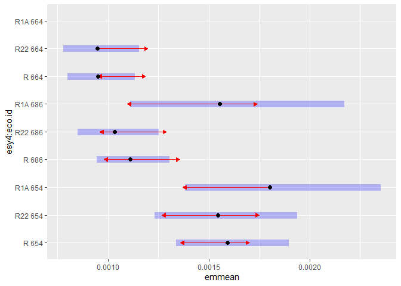<!-- -->

#### Habiat type x Site type

``` r
(emm <- emmeans(
  m_1,
  revpairwise ~ esy4 + site.type,
  type = "response"
  ))
```

    ## $emmeans
    ##  esy4 site.type response       SE  df lower.CL upper.CL
    ##  R    positive   0.00122 1.36e-04 263 0.000982  0.00152
    ##  R22  positive   0.00108 1.47e-04 424 0.000832  0.00141
    ##  R1A  positive    nonEst       NA  NA       NA       NA
    ##  R    restored   0.00122 7.43e-05 286 0.001083  0.00138
    ##  R22  restored   0.00115 7.31e-05 311 0.001014  0.00130
    ##  R1A  restored    nonEst       NA  NA       NA       NA
    ##  R    negative   0.00113 1.18e-04 211 0.000919  0.00139
    ##  R22  negative   0.00121 1.86e-04 538 0.000898  0.00164
    ##  R1A  negative    nonEst       NA  NA       NA       NA
    ## 
    ## Results are averaged over the levels of: eco.id, obs.year 
    ## Degrees-of-freedom method: kenward-roger 
    ## Confidence level used: 0.95 
    ## Intervals are back-transformed from the log scale 
    ## 
    ## $contrasts
    ##  contrast                     ratio     SE  df null t.ratio p.value
    ##  R22 positive / R positive    0.888 0.1070 594    1  -0.989  0.9420
    ##  R1A positive / R positive   nonEst     NA  NA    1      NA      NA
    ##  R1A positive / R22 positive nonEst     NA  NA    1      NA      NA
    ##  R restored / R positive      0.999 0.1260 268    1  -0.007  1.0000
    ##  R restored / R22 positive    1.126 0.1660 396    1   0.802  0.9779
    ##  R restored / R1A positive   nonEst     NA  NA    1      NA      NA
    ##  R22 restored / R positive    0.940 0.1200 274    1  -0.482  0.9983
    ##  R22 restored / R22 positive  1.059 0.1570 394    1   0.387  0.9995
    ##  R22 restored / R1A positive nonEst     NA  NA    1      NA      NA
    ##  R22 restored / R restored    0.941 0.0539 604    1  -1.061  0.9215
    ##  R1A restored / R positive   nonEst     NA  NA    1      NA      NA
    ##  R1A restored / R22 positive nonEst     NA  NA    1      NA      NA
    ##  R1A restored / R1A positive  0.931 0.1820 489    1  -0.365  0.9996
    ##  R1A restored / R restored   nonEst     NA  NA    1      NA      NA
    ##  R1A restored / R22 restored nonEst     NA  NA    1      NA      NA
    ##  R negative / R positive      0.924 0.1410 235    1  -0.521  0.9974
    ##  R negative / R22 positive    1.041 0.1780 325    1   0.234  1.0000
    ##  R negative / R1A positive   nonEst     NA  NA    1      NA      NA
    ##  R negative / R restored      0.925 0.1120 227    1  -0.648  0.9922
    ##  R negative / R22 restored    0.983 0.1200 233    1  -0.143  1.0000
    ##  R negative / R1A restored   nonEst     NA  NA    1      NA      NA
    ##  R22 negative / R positive    0.993 0.1880 430    1  -0.037  1.0000
    ##  R22 negative / R22 positive  1.119 0.2290 488    1   0.549  0.9967
    ##  R22 negative / R1A positive nonEst     NA  NA    1      NA      NA
    ##  R22 negative / R restored    0.994 0.1640 499    1  -0.037  1.0000
    ##  R22 negative / R22 restored  1.056 0.1750 501    1   0.330  0.9998
    ##  R22 negative / R1A restored nonEst     NA  NA    1      NA      NA
    ##  R22 negative / R negative    1.075 0.1470 590    1   0.528  0.9973
    ##  R1A negative / R positive   nonEst     NA  NA    1      NA      NA
    ##  R1A negative / R22 positive nonEst     NA  NA    1      NA      NA
    ##  R1A negative / R1A positive  1.173 0.4120 452    1   0.455  0.9987
    ##  R1A negative / R restored   nonEst     NA  NA    1      NA      NA
    ##  R1A negative / R22 restored nonEst     NA  NA    1      NA      NA
    ##  R1A negative / R1A restored  1.260 0.4140 443    1   0.702  0.9884
    ##  R1A negative / R negative   nonEst     NA  NA    1      NA      NA
    ##  R1A negative / R22 negative nonEst     NA  NA    1      NA      NA
    ## 
    ## Results are averaged over the levels of: eco.id, obs.year 
    ## Degrees-of-freedom method: kenward-roger 
    ## P value adjustment: tukey method for comparing a family of 6.52079728939615 estimates 
    ## Tests are performed on the log scale

``` r
plot(emm, comparison = TRUE)
```

    ## Warning: Removed 3 rows containing missing values or values outside the scale range
    ## (`geom_point()`).

    ## Warning: Removed 3 rows containing missing values or values outside the scale range
    ## (`geom_segment()`).

    ## Warning: Removed 3 rows containing missing values or values outside the scale range
    ## (`geom_point()`).

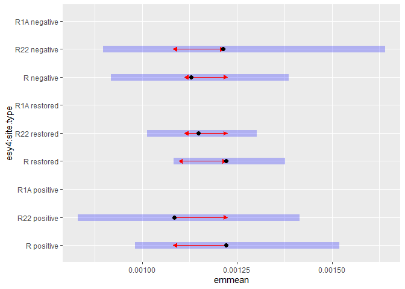<!-- -->

# Session info

    ## R version 4.4.2 (2024-10-31 ucrt)
    ## Platform: x86_64-w64-mingw32/x64
    ## Running under: Windows 11 x64 (build 26100)
    ## 
    ## Matrix products: default
    ## 
    ## 
    ## locale:
    ## [1] LC_COLLATE=German_Germany.utf8  LC_CTYPE=German_Germany.utf8   
    ## [3] LC_MONETARY=German_Germany.utf8 LC_NUMERIC=C                   
    ## [5] LC_TIME=German_Germany.utf8    
    ## 
    ## time zone: Europe/Berlin
    ## tzcode source: internal
    ## 
    ## attached base packages:
    ## [1] stats     graphics  grDevices utils     datasets  methods   base     
    ## 
    ## other attached packages:
    ##  [1] emmeans_1.11.0   DHARMa_0.4.7     patchwork_1.2.0  ggbeeswarm_0.7.2
    ##  [5] lubridate_1.9.3  forcats_1.0.0    stringr_1.5.1    dplyr_1.1.4     
    ##  [9] purrr_1.0.2      readr_2.1.5      tidyr_1.3.1      tibble_3.2.1    
    ## [13] ggplot2_3.5.1    tidyverse_2.0.0  here_1.0.1      
    ## 
    ## loaded via a namespace (and not attached):
    ##   [1] mnormt_2.1.1        Rdpack_2.6.3        gridExtra_2.3      
    ##   [4] sandwich_3.1-1      rlang_1.1.4         magrittr_2.0.3     
    ##   [7] compiler_4.4.2      mgcv_1.9-1          vctrs_0.6.5        
    ##  [10] quadprog_1.5-8      pkgconfig_2.0.3     crayon_1.5.3       
    ##  [13] fastmap_1.2.0       backports_1.5.0     labeling_0.4.3     
    ##  [16] pbivnorm_0.6.0      utf8_1.2.4          ggstance_0.3.7     
    ##  [19] promises_1.3.2      rmarkdown_2.27      tzdb_0.4.0         
    ##  [22] nloptr_2.2.1        bit_4.0.5           xfun_0.45          
    ##  [25] highr_0.11          later_1.4.1         broom_1.0.6        
    ##  [28] lavaan_0.6-19       parallel_4.4.2      R6_2.5.1           
    ##  [31] gap.datasets_0.0.6  stringi_1.8.4       qgam_1.3.4         
    ##  [34] car_3.1-3           boot_1.3-31         numDeriv_2016.8-1.1
    ##  [37] estimability_1.5.1  Rcpp_1.0.14         iterators_1.0.14   
    ##  [40] knitr_1.48          zoo_1.8-13          parameters_0.24.2  
    ##  [43] httpuv_1.6.15       Matrix_1.7-0        splines_4.4.2      
    ##  [46] timechange_0.3.0    tidyselect_1.2.1    rstudioapi_0.16.0  
    ##  [49] abind_1.4-8         yaml_2.3.9          MuMIn_1.48.11      
    ##  [52] doParallel_1.0.17   codetools_0.2-20    nonnest2_0.5-8     
    ##  [55] lattice_0.22-6      plyr_1.8.9          shiny_1.10.0       
    ##  [58] withr_3.0.0         bayestestR_0.15.2   evaluate_0.24.0    
    ##  [61] CompQuadForm_1.4.3  pillar_1.9.0        gap_1.6            
    ##  [64] carData_3.0-5       foreach_1.5.2       stats4_4.4.2       
    ##  [67] reformulas_0.4.0    insight_1.1.0       generics_0.1.3     
    ##  [70] vroom_1.6.5         rprojroot_2.0.4     hms_1.1.3          
    ##  [73] munsell_0.5.1       scales_1.3.0        minqa_1.2.8        
    ##  [76] xtable_1.8-4        glue_1.7.0          tools_4.4.2        
    ##  [79] lme4_1.1-37         mvtnorm_1.3-3       grid_4.4.2         
    ##  [82] rbibutils_2.3       datawizard_1.0.2    colorspace_2.1-0   
    ##  [85] nlme_3.1-164        Rmisc_1.5.1         performance_0.13.0 
    ##  [88] beeswarm_0.4.0      vipor_0.4.7         Formula_1.2-5      
    ##  [91] cli_3.6.3           fansi_1.0.6         gtable_0.3.5       
    ##  [94] digest_0.6.36       pbkrtest_0.5.3      farver_2.1.2       
    ##  [97] htmltools_0.5.8.1   lifecycle_1.0.4     mime_0.12          
    ## [100] bit64_4.0.5         dotwhisker_0.8.3    MASS_7.3-60.2
