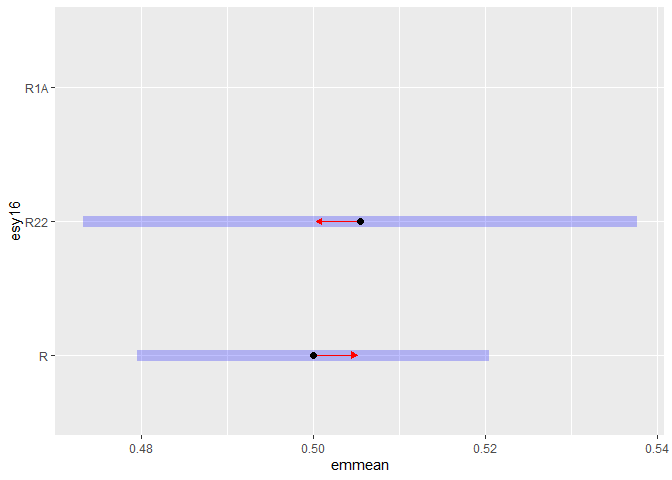
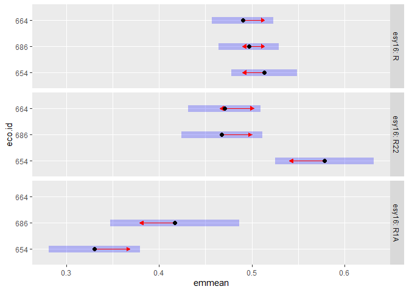

Analysis of Bauer et al. (submitted) Functional traits of grasslands:
<br> Average community weighted mean of canopy height per block (esy16)
================
<b>Markus Bauer</b> <br>
<b>2025-05-05</b>

- [Preparation](#preparation)
- [Statistics](#statistics)
  - [Data exploration](#data-exploration)
    - [Means and deviations](#means-and-deviations)
    - [Graphs of raw data (Step 2, 6,
      7)](#graphs-of-raw-data-step-2-6-7)
    - [Outliers, zero-inflation, transformations? (Step 1, 3,
      4)](#outliers-zero-inflation-transformations-step-1-3-4)
    - [Check collinearity part 1 (Step
      5)](#check-collinearity-part-1-step-5)
  - [Models](#models)
  - [Model check](#model-check)
    - [DHARMa](#dharma)
    - [Check collinearity part 2 (Step
      5)](#check-collinearity-part-2-step-5)
  - [Model comparison](#model-comparison)
    - [<i>R</i><sup>2</sup> values](#r2-values)
    - [AICc](#aicc)
  - [Predicted values](#predicted-values)
    - [Summary table](#summary-table)
    - [Forest plot](#forest-plot)
    - [Effect sizes](#effect-sizes)
- [Session info](#session-info)

<br/> <br/> <b>Markus Bauer</b>

Technichal University of Munich, TUM School of Life Sciences, Chair of
Restoration Ecology, Emil-Ramann-Straße 6, 85354 Freising, Germany

<markus1.bauer@tum.de>

ORCiD ID: [0000-0001-5372-4174](https://orcid.org/0000-0001-5372-4174)
<br> [Google
Scholar](https://scholar.google.de/citations?user=oHhmOkkAAAAJ&hl=de&oi=ao)
<br> GitHub: [markus1bauer](https://github.com/markus1bauer)

> **NOTE:** To compare different models, you only have to change the
> models in the section ‘Load models’

# Preparation

Protocol of data exploration (Steps 1-8) used from Zuur et al. (2010)
Methods Ecol Evol [DOI:
10.1111/2041-210X.12577](https://doi.org/10.1111/2041-210X.12577)

#### Packages

``` r
library(here)
library(tidyverse)
library(ggbeeswarm)
library(patchwork)
library(DHARMa)
library(emmeans)
```

#### Load data

``` r
sites <- read_csv(
  here("data", "processed", "data_processed_sites_esy16.csv"),
  col_names = TRUE, na = c("na", "NA", ""), col_types = cols(
    .default = "?",
    eco.id = "f",
    region = col_factor(levels = c("north", "centre", "south"), ordered = TRUE),
    site.type = col_factor(
      levels = c("positive", "restored", "negative"), ordered = TRUE
      ),
    fertilized = "f",
    freq.mow = "f",
    obs.year = "f"
  )
) %>%
  filter(esy16 %in% c("R", "R22", "R1A") & !(eco.id == 647)) %>%
  mutate(
    esy16 = fct_relevel(esy16, "R", "R22", "R1A"),
    eco.id = factor(eco.id)
    ) %>%
  rename(y = cwm.abu.height.mean) %>%
  filter(y < 1) # see section Outliers: Exclude site N_DAM (more or less only the tall grass Arrhenatherum elatius germinated at this young restoration site)
```

# Statistics

## Data exploration

### Means and deviations

``` r
Rmisc::CI(sites$y, ci = .95)
```

    ##     upper      mean     lower 
    ## 0.4906533 0.4742151 0.4577769

``` r
median(sites$y)
```

    ## [1] 0.4725

``` r
sd(sites$y)
```

    ## [1] 0.1092159

``` r
quantile(sites$y, probs = c(0.05, 0.95), na.rm = TRUE)
```

    ##       5%      95% 
    ## 0.301375 0.654750

``` r
sites %>% count(eco.id)
```

    ## # A tibble: 3 × 2
    ##   eco.id     n
    ##   <fct>  <int>
    ## 1 654       55
    ## 2 686       62
    ## 3 664       55

``` r
sites %>% count(site.type)
```

    ## # A tibble: 3 × 2
    ##   site.type     n
    ##   <ord>     <int>
    ## 1 positive     31
    ## 2 restored    108
    ## 3 negative     33

``` r
sites %>% count(esy16)
```

    ## # A tibble: 3 × 2
    ##   esy16     n
    ##   <fct> <int>
    ## 1 R        85
    ## 2 R22      63
    ## 3 R1A      24

``` r
sites %>% count(esy16, eco.id)
```

    ## # A tibble: 8 × 3
    ##   esy16 eco.id     n
    ##   <fct> <fct>  <int>
    ## 1 R     654       25
    ## 2 R     686       31
    ## 3 R     664       29
    ## 4 R22   654       15
    ## 5 R22   686       22
    ## 6 R22   664       26
    ## 7 R1A   654       15
    ## 8 R1A   686        9

``` r
sites %>% count(esy16, site.type)
```

    ## # A tibble: 9 × 3
    ##   esy16 site.type     n
    ##   <fct> <ord>     <int>
    ## 1 R     positive     17
    ## 2 R     restored     45
    ## 3 R     negative     23
    ## 4 R22   positive      8
    ## 5 R22   restored     48
    ## 6 R22   negative      7
    ## 7 R1A   positive      6
    ## 8 R1A   restored     15
    ## 9 R1A   negative      3

### Graphs of raw data (Step 2, 6, 7)

<!-- --><!-- --><!-- --><!-- --><!-- -->

### Outliers, zero-inflation, transformations? (Step 1, 3, 4)

<!-- -->

### Check collinearity part 1 (Step 5)

Exclude r \> 0.7 <br> Dormann et al. 2013 Ecography [DOI:
10.1111/j.1600-0587.2012.07348.x](https://doi.org/10.1111/j.1600-0587.2012.07348.x)

``` r
# sites %>%
#   select(where(is.numeric), -y, -starts_with("cwm.")) %>%
#   GGally::ggpairs(
#     lower = list(continuous = "smooth_loess")
#     ) +
#   theme(strip.text = element_text(size = 7))

# -> no continuous variables
```

## Models

> **NOTE:** Only here you have to modify the script to compare other
> models

``` r
load(file = here("outputs", "models", "model_height_esy16_1.Rdata"))
load(file = here("outputs", "models", "model_height_esy16_2.Rdata"))
m_1 <- m1
m_2 <- m2
```

``` r
m_1$call
## lm(formula = y ~ esy16 * (site.type + eco.id) + obs.year, data = sites)
m_2$call
## lm(formula = y ~ esy16 * site.type + eco.id + obs.year, data = sites)
```

## Model check

### DHARMa

``` r
simulation_output_1 <- simulateResiduals(m_1, plot = TRUE)
```

<!-- -->

``` r
simulation_output_2 <- simulateResiduals(m_2, plot = TRUE)
```

<!-- -->

``` r
plotResiduals(simulation_output_1$scaledResiduals, sites$eco.id)
```

<!-- -->

``` r
plotResiduals(simulation_output_2$scaledResiduals, sites$eco.id)
```

<!-- -->

``` r
plotResiduals(simulation_output_1$scaledResiduals, sites$site.type)
```

<!-- -->

``` r
plotResiduals(simulation_output_2$scaledResiduals, sites$site.type)
```

<!-- -->

``` r
plotResiduals(simulation_output_1$scaledResiduals, sites$obs.year)
```

<!-- -->

``` r
plotResiduals(simulation_output_2$scaledResiduals, sites$obs.year)
```

<!-- -->

``` r
plotResiduals(simulation_output_1$scaledResiduals, sites$history)
```

<!-- -->

``` r
plotResiduals(simulation_output_2$scaledResiduals, sites$history)
```

<!-- -->

``` r
plotResiduals(simulation_output_1$scaledResiduals, sites$hydrology)
## Warning in ensurePredictor(simulationOutput, form): DHARMa:::ensurePredictor:
## character string was provided as predictor. DHARMa has converted to factor
## automatically. To remove this warning, please convert to factor before
## attempting to plot with DHARMa.
```

<!-- -->

``` r
plotResiduals(simulation_output_2$scaledResiduals, sites$hydrology)
## Warning in ensurePredictor(simulationOutput, form): DHARMa:::ensurePredictor:
## character string was provided as predictor. DHARMa has converted to factor
## automatically. To remove this warning, please convert to factor before
## attempting to plot with DHARMa.
```

<!-- -->

``` r
plotResiduals(simulation_output_1$scaledResiduals, sites$land.use.hist)
## Warning in ensurePredictor(simulationOutput, form): DHARMa:::ensurePredictor:
## character string was provided as predictor. DHARMa has converted to factor
## automatically. To remove this warning, please convert to factor before
## attempting to plot with DHARMa.
```

<!-- -->

``` r
plotResiduals(simulation_output_2$scaledResiduals, sites$land.use.hist)
## Warning in ensurePredictor(simulationOutput, form): DHARMa:::ensurePredictor:
## character string was provided as predictor. DHARMa has converted to factor
## automatically. To remove this warning, please convert to factor before
## attempting to plot with DHARMa.
```

<!-- -->

``` r
plotResiduals(simulation_output_1$scaledResiduals, sites$fertilized)
```

<!-- -->

``` r
plotResiduals(simulation_output_2$scaledResiduals, sites$fertilized)
```

<!-- -->

``` r
plotResiduals(simulation_output_1$scaledResiduals, sites$freq.mow)
```

<!-- -->

``` r
plotResiduals(simulation_output_2$scaledResiduals, sites$freq.mow)
```

<!-- -->

### Check collinearity part 2 (Step 5)

Remove VIF \> 3 or \> 10 <br> Zuur et al. 2010 Methods Ecol Evol [DOI:
10.1111/j.2041-210X.2009.00001.x](https://doi.org/10.1111/j.2041-210X.2009.00001.x)

``` r
car::vif(m_1, type = "predictor")
```

    ## Warning in cor(X): Standardabweichung ist Null

    ## GVIFs computed for predictors

    ##           GVIF Df GVIF^(1/(2*Df))    Interacts With         Other Predictors
    ## esy16       NA 14              NA site.type, eco.id                 obs.year
    ## site.type   NA  8              NA             esy16         eco.id, obs.year
    ## eco.id      NA  8              NA             esy16      site.type, obs.year
    ## obs.year    NA  1              NA              --   esy16, site.type, eco.id

``` r
car::vif(m_2)
```

    ## there are higher-order terms (interactions) in this model
    ## consider setting type = 'predictor'; see ?vif

    ##                     GVIF Df GVIF^(1/(2*Df))
    ## esy16           2.822081  2        1.296111
    ## site.type       3.158648  2        1.333139
    ## eco.id          1.167461  2        1.039467
    ## obs.year        1.045982  1        1.022733
    ## esy16:site.type 7.137756  4        1.278484

## Model comparison

### <i>R</i><sup>2</sup> values

``` r
MuMIn::r.squaredGLMM(m_1)
##            R2m       R2c
## [1,] 0.3875565 0.3875565
MuMIn::r.squaredGLMM(m_2)
##            R2m       R2c
## [1,] 0.3273098 0.3273098
```

### AICc

Use AICc and not AIC since ratio n/K \< 40 <br> Burnahm & Anderson 2002
p. 66 ISBN: 978-0-387-95364-9

``` r
MuMIn::AICc(m_1, m_2) %>%
  arrange(AICc)
##     df      AICc
## m_1 16 -329.3170
## m_2 13 -318.3682
```

## Predicted values

### Summary table

``` r
car::Anova(m_1, type = 2)
```

    ## Note: model has aliased coefficients
    ##       sums of squares computed by model comparison

    ## Anova Table (Type II tests)
    ## 
    ## Response: y
    ##                  Sum Sq  Df F value    Pr(>F)    
    ## esy16           0.50252   2 32.6696 1.372e-12 ***
    ## site.type       0.11218   2  7.2930 0.0009361 ***
    ## eco.id          0.04100   2  2.6654 0.0727221 .  
    ## obs.year        0.02054   1  2.6706 0.1042239    
    ## esy16:site.type 0.03404   4  1.1064 0.3555627    
    ## esy16:eco.id    0.13442   3  5.8259 0.0008446 ***
    ## Residuals       1.20748 157                      
    ## ---
    ## Signif. codes:  0 '***' 0.001 '**' 0.01 '*' 0.05 '.' 0.1 ' ' 1

``` r
summary(m_1)
```

    ## 
    ## Call:
    ## lm(formula = y ~ esy16 * (site.type + eco.id) + obs.year, data = sites)
    ## 
    ## Residuals:
    ##       Min        1Q    Median        3Q       Max 
    ## -0.250271 -0.045108  0.004001  0.042858  0.252229 
    ## 
    ## Coefficients: (1 not defined because of singularities)
    ##                        Estimate Std. Error t value Pr(>|t|)    
    ## (Intercept)           0.5242963  0.0193777  27.057  < 2e-16 ***
    ## esy16R22              0.0650985  0.0321878   2.022  0.04483 *  
    ## esy16R1A             -0.1827583  0.0307219  -5.949  1.7e-08 ***
    ## site.type.L           0.0583200  0.0199760   2.920  0.00402 ** 
    ## site.type.Q           0.0082697  0.0157095   0.526  0.59934    
    ## eco.id686            -0.0162756  0.0236331  -0.689  0.49204    
    ## eco.id664            -0.0229433  0.0239966  -0.956  0.34049    
    ## obs.year2023         -0.0224221  0.0137206  -1.634  0.10422    
    ## esy16R22:site.type.L -0.0366930  0.0383479  -0.957  0.34012    
    ## esy16R1A:site.type.L  0.0804725  0.0500697   1.607  0.11002    
    ## esy16R22:site.type.Q -0.0001423  0.0266017  -0.005  0.99574    
    ## esy16R1A:site.type.Q  0.0271537  0.0353957   0.767  0.44415    
    ## esy16R22:eco.id686   -0.0943394  0.0380009  -2.483  0.01410 *  
    ## esy16R1A:eco.id686    0.1030066  0.0455874   2.260  0.02523 *  
    ## esy16R22:eco.id664   -0.0846226  0.0377930  -2.239  0.02655 *  
    ## esy16R1A:eco.id664           NA         NA      NA       NA    
    ## ---
    ## Signif. codes:  0 '***' 0.001 '**' 0.01 '*' 0.05 '.' 0.1 ' ' 1
    ## 
    ## Residual standard error: 0.0877 on 157 degrees of freedom
    ## Multiple R-squared:  0.408,  Adjusted R-squared:  0.3552 
    ## F-statistic: 7.729 on 14 and 157 DF,  p-value: 2.915e-12

### Forest plot

``` r
dotwhisker::dwplot(
  list(m_1, m_2),
  ci = 0.95,
  show_intercept = FALSE,
  vline = geom_vline(xintercept = 0, colour = "grey60", linetype = 2)) +
  xlim(-.3, .2) +
  theme_classic()
```

    ## Model matrix is rank deficient. Parameters `esy16R1A:eco.id664` were not
    ##   estimable.

<!-- -->

### Effect sizes

Effect sizes of chosen model just to get exact values of means etc. if
necessary.

#### ESY EUNIS Habitat type

``` r
(emm <- emmeans(
  m_1,
  revpairwise ~ esy16,
  type = "response"
  ))
```

    ## $emmeans
    ##  esy16 emmean     SE  df lower.CL upper.CL
    ##  R      0.500 0.0104 157    0.480    0.521
    ##  R22    0.505 0.0163 157    0.473    0.538
    ##  R1A   nonEst     NA  NA       NA       NA
    ## 
    ## Results are averaged over the levels of: site.type, eco.id, obs.year 
    ## Confidence level used: 0.95 
    ## 
    ## $contrasts
    ##  contrast  estimate     SE  df t.ratio p.value
    ##  R22 - R    0.00544 0.0193 157   0.282  0.7780
    ##  R1A - R     nonEst     NA  NA      NA      NA
    ##  R1A - R22   nonEst     NA  NA      NA      NA
    ## 
    ## Results are averaged over the levels of: site.type, eco.id, obs.year 
    ## P value adjustment: tukey method for comparing a family of 2 estimates

``` r
plot(emm, comparison = TRUE)
```

    ## Warning: Removed 1 row containing missing values or values outside the scale range
    ## (`geom_point()`).

    ## Warning: Removed 1 row containing missing values or values outside the scale range
    ## (`geom_segment()`).

    ## Warning: Removed 1 row containing missing values or values outside the scale range
    ## (`geom_point()`).

<!-- -->

#### Habiat type x Region

``` r
(emm <- emmeans(
  m_1,
  revpairwise ~ eco.id | esy16,
  type = "response"
  ))
```

    ## $emmeans
    ## esy16 = R:
    ##  eco.id emmean     SE  df lower.CL upper.CL
    ##  654     0.513 0.0179 157    0.478    0.548
    ##  686     0.497 0.0164 157    0.464    0.529
    ##  664     0.490 0.0168 157    0.457    0.523
    ## 
    ## esy16 = R22:
    ##  eco.id emmean     SE  df lower.CL upper.CL
    ##  654     0.578 0.0268 157    0.525    0.631
    ##  686     0.468 0.0220 157    0.424    0.511
    ##  664     0.471 0.0197 157    0.432    0.510
    ## 
    ## esy16 = R1A:
    ##  eco.id emmean     SE  df lower.CL upper.CL
    ##  654     0.330 0.0249 157    0.281    0.380
    ##  686     0.417 0.0352 157    0.347    0.487
    ##  664    nonEst     NA  NA       NA       NA
    ## 
    ## Results are averaged over the levels of: site.type, obs.year 
    ## Confidence level used: 0.95 
    ## 
    ## $contrasts
    ## esy16 = R:
    ##  contrast              estimate     SE  df t.ratio p.value
    ##  eco.id686 - eco.id654 -0.01628 0.0236 157  -0.689  0.7704
    ##  eco.id664 - eco.id654 -0.02294 0.0240 157  -0.956  0.6057
    ##  eco.id664 - eco.id686 -0.00667 0.0227 157  -0.294  0.9535
    ## 
    ## esy16 = R22:
    ##  contrast              estimate     SE  df t.ratio p.value
    ##  eco.id686 - eco.id654 -0.11062 0.0297 157  -3.719  0.0008
    ##  eco.id664 - eco.id654 -0.10757 0.0292 157  -3.684  0.0009
    ##  eco.id664 - eco.id686  0.00305 0.0255 157   0.120  0.9922
    ## 
    ## esy16 = R1A:
    ##  contrast              estimate     SE  df t.ratio p.value
    ##  eco.id686 - eco.id654  0.08673 0.0389 157   2.228  0.0273
    ##  eco.id664 - eco.id654   nonEst     NA  NA      NA      NA
    ##  eco.id664 - eco.id686   nonEst     NA  NA      NA      NA
    ## 
    ## Results are averaged over the levels of: site.type, obs.year 
    ## P value adjustment: tukey method for varying family sizes

``` r
plot(emm, comparison = TRUE)
```

    ## Warning: Removed 1 row containing missing values or values outside the scale range
    ## (`geom_point()`).

    ## Warning: Removed 1 row containing missing values or values outside the scale range
    ## (`geom_segment()`).

    ## Warning: Removed 1 row containing missing values or values outside the scale range
    ## (`geom_point()`).

<!-- -->

#### Habiat type x Site type

``` r
(emm <- emmeans(
  m_1,
  revpairwise ~ site.type | esy16,
  type = "response"
  ))
```

    ## $emmeans
    ## esy16 = R:
    ##  site.type emmean     SE  df lower.CL upper.CL
    ##  positive   0.462 0.0215 157    0.420    0.505
    ##  restored   0.493 0.0131 157    0.467    0.519
    ##  negative   0.545 0.0183 157    0.508    0.581
    ## 
    ## esy16 = R22:
    ##  site.type emmean     SE  df lower.CL upper.CL
    ##  positive   0.493 0.0324 157    0.430    0.557
    ##  restored   0.499 0.0128 157    0.474    0.524
    ##  negative   0.524 0.0334 157    0.458    0.590
    ## 
    ## esy16 = R1A:
    ##  site.type emmean     SE  df lower.CL upper.CL
    ##  positive  nonEst     NA  NA       NA       NA
    ##  restored  nonEst     NA  NA       NA       NA
    ##  negative  nonEst     NA  NA       NA       NA
    ## 
    ## Results are averaged over the levels of: eco.id, obs.year 
    ## Confidence level used: 0.95 
    ## 
    ## $contrasts
    ## esy16 = R:
    ##  contrast            estimate     SE  df t.ratio p.value
    ##  restored - positive  0.03111 0.0251 157   1.239  0.4324
    ##  negative - positive  0.08248 0.0283 157   2.920  0.0112
    ##  negative - restored  0.05137 0.0225 157   2.278  0.0619
    ## 
    ## esy16 = R22:
    ##  contrast            estimate     SE  df t.ratio p.value
    ##  restored - positive  0.00534 0.0344 157   0.155  0.9868
    ##  negative - positive  0.03059 0.0461 157   0.663  0.7851
    ##  negative - restored  0.02525 0.0357 157   0.707  0.7595
    ## 
    ## esy16 = R1A:
    ##  contrast            estimate     SE  df t.ratio p.value
    ##  restored - positive  0.05476 0.0425 157   1.287  0.4045
    ##  negative - positive  0.19628 0.0650 157   3.020  0.0083
    ##  negative - restored  0.14153 0.0576 157   2.457  0.0399
    ## 
    ## Results are averaged over the levels of: eco.id, obs.year 
    ## P value adjustment: tukey method for comparing a family of 3 estimates

``` r
plot(emm, comparison = TRUE)
```

    ## Warning: Removed 3 rows containing missing values or values outside the scale range
    ## (`geom_point()`).

    ## Warning: Removed 3 rows containing missing values or values outside the scale range
    ## (`geom_segment()`).

    ## Warning: Removed 3 rows containing missing values or values outside the scale range
    ## (`geom_point()`).

<!-- -->

# Session info

    ## R version 4.4.2 (2024-10-31 ucrt)
    ## Platform: x86_64-w64-mingw32/x64
    ## Running under: Windows 11 x64 (build 26100)
    ## 
    ## Matrix products: default
    ## 
    ## 
    ## locale:
    ## [1] LC_COLLATE=German_Germany.utf8  LC_CTYPE=German_Germany.utf8   
    ## [3] LC_MONETARY=German_Germany.utf8 LC_NUMERIC=C                   
    ## [5] LC_TIME=German_Germany.utf8    
    ## 
    ## time zone: Europe/Berlin
    ## tzcode source: internal
    ## 
    ## attached base packages:
    ## [1] stats     graphics  grDevices utils     datasets  methods   base     
    ## 
    ## other attached packages:
    ##  [1] emmeans_1.11.0   DHARMa_0.4.7     patchwork_1.2.0  ggbeeswarm_0.7.2
    ##  [5] lubridate_1.9.3  forcats_1.0.0    stringr_1.5.1    dplyr_1.1.4     
    ##  [9] purrr_1.0.2      readr_2.1.5      tidyr_1.3.1      tibble_3.2.1    
    ## [13] ggplot2_3.5.1    tidyverse_2.0.0  here_1.0.1      
    ## 
    ## loaded via a namespace (and not attached):
    ##  [1] tidyselect_1.2.1   vipor_0.4.7        farver_2.1.2       fastmap_1.2.0     
    ##  [5] bayestestR_0.15.2  promises_1.3.2     digest_0.6.36      estimability_1.5.1
    ##  [9] timechange_0.3.0   mime_0.12          lifecycle_1.0.4    magrittr_2.0.3    
    ## [13] compiler_4.4.2     rlang_1.1.4        tools_4.4.2        utf8_1.2.4        
    ## [17] yaml_2.3.9         knitr_1.48         labeling_0.4.3     bit_4.0.5         
    ## [21] ggstance_0.3.7     plyr_1.8.9         gap.datasets_0.0.6 abind_1.4-8       
    ## [25] withr_3.0.0        datawizard_1.0.2   stats4_4.4.2       grid_4.4.2        
    ## [29] fansi_1.0.6        xtable_1.8-4       colorspace_2.1-0   scales_1.3.0      
    ## [33] iterators_1.0.14   MASS_7.3-60.2      insight_1.1.0      cli_3.6.3         
    ## [37] mvtnorm_1.3-3      dotwhisker_0.8.3   rmarkdown_2.27     crayon_1.5.3      
    ## [41] reformulas_0.4.0   generics_0.1.3     performance_0.13.0 rstudioapi_0.16.0 
    ## [45] tzdb_0.4.0         parameters_0.24.2  minqa_1.2.8        splines_4.4.2     
    ## [49] parallel_4.4.2     vctrs_0.6.5        boot_1.3-31        Matrix_1.7-0      
    ## [53] carData_3.0-5      car_3.1-3          hms_1.1.3          bit64_4.0.5       
    ## [57] Formula_1.2-5      qgam_1.3.4         beeswarm_0.4.0     Rmisc_1.5.1       
    ## [61] foreach_1.5.2      gap_1.6            glue_1.7.0         nloptr_2.2.1      
    ## [65] codetools_0.2-20   stringi_1.8.4      gtable_0.3.5       later_1.4.1       
    ## [69] lme4_1.1-37        munsell_0.5.1      pillar_1.9.0       htmltools_0.5.8.1 
    ## [73] R6_2.5.1           Rdpack_2.6.3       doParallel_1.0.17  rprojroot_2.0.4   
    ## [77] vroom_1.6.5        evaluate_0.24.0    shiny_1.10.0       lattice_0.22-6    
    ## [81] highr_0.11         rbibutils_2.3      httpuv_1.6.15      Rcpp_1.0.14       
    ## [85] gridExtra_2.3      coda_0.19-4.1      nlme_3.1-164       MuMIn_1.48.11     
    ## [89] mgcv_1.9-1         xfun_0.45          pkgconfig_2.0.3
