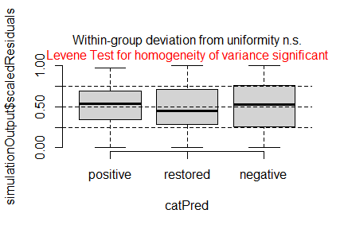
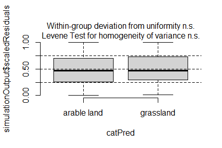
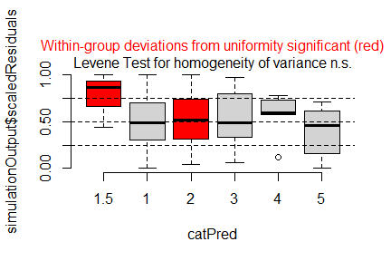
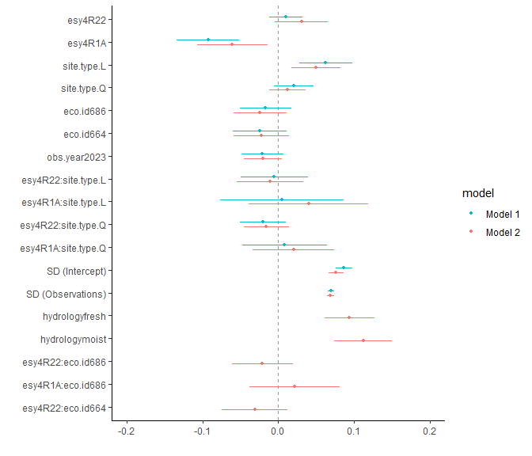
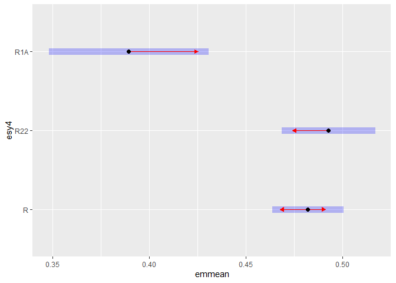
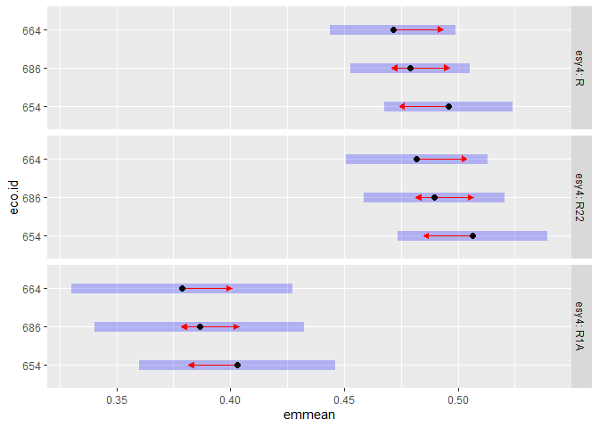

Analysis of Bauer et al. (submitted) Functional traits of grasslands:
<br> Community weighted mean of canopy height per plot (esy4)
================
<b>Markus Bauer</b> <br>
<b>2025-04-29</b>

- [Preparation](#preparation)
- [Statistics](#statistics)
  - [Data exploration](#data-exploration)
    - [Means and deviations](#means-and-deviations)
    - [Graphs of raw data (Step 2, 6,
      7)](#graphs-of-raw-data-step-2-6-7)
    - [Outliers, zero-inflation, transformations? (Step 1, 3,
      4)](#outliers-zero-inflation-transformations-step-1-3-4)
    - [Check collinearity part 1 (Step
      5)](#check-collinearity-part-1-step-5)
  - [Models](#models)
  - [Model check](#model-check)
    - [DHARMa](#dharma)
    - [Check collinearity part 2 (Step
      5)](#check-collinearity-part-2-step-5)
  - [Model comparison](#model-comparison)
    - [<i>R</i><sup>2</sup> values](#r2-values)
    - [AICc](#aicc)
  - [Predicted values](#predicted-values)
    - [Summary table](#summary-table)
    - [Forest plot](#forest-plot)
    - [Effect sizes](#effect-sizes)
- [Session info](#session-info)

<br/> <br/> <b>Markus Bauer</b>

Technichal University of Munich, TUM School of Life Sciences, Chair of
Restoration Ecology, Emil-Ramann-Straße 6, 85354 Freising, Germany

<markus1.bauer@tum.de>

ORCiD ID: [0000-0001-5372-4174](https://orcid.org/0000-0001-5372-4174)
<br> [Google
Scholar](https://scholar.google.de/citations?user=oHhmOkkAAAAJ&hl=de&oi=ao)
<br> GitHub: [markus1bauer](https://github.com/markus1bauer)

> **NOTE:** To compare different models, you only have to change the
> models in the section ‘Load models’

# Preparation

Protocol of data exploration (Steps 1-8) used from Zuur et al. (2010)
Methods Ecol Evol [DOI:
10.1111/2041-210X.12577](https://doi.org/10.1111/2041-210X.12577)

#### Packages

``` r
library(here)
library(tidyverse)
library(ggbeeswarm)
library(patchwork)
library(DHARMa)
library(emmeans)
```

#### Load data

``` r
sites <- read_csv(
  here("data", "processed", "data_processed_sites_esy4.csv"),
  col_names = TRUE, na = c("na", "NA", ""), col_types = cols(
    .default = "?",
    eco.id = "f",
    region = col_factor(levels = c("north", "centre", "south"), ordered = TRUE),
    site.type = col_factor(
      levels = c("positive", "restored", "negative"), ordered = TRUE
      ),
    fertilized = "f",
    freq.mow = "f",
    obs.year = "f"
  )
) %>%
  filter(esy4 %in% c("R", "R22", "R1A") & !(eco.id == 647)) %>%
  mutate(
    esy4 = fct_relevel(esy4, "R", "R22", "R1A"),
    eco.id = factor(eco.id)
    ) %>%
  rename(y = cwm.abu.height) %>%
  filter(y < 1) # see section Outliers: Exclude site N_DAM (more or less only the tall grass Arrhenatherum elatius germinated at this young restoration site)
```

# Statistics

## Data exploration

### Means and deviations

``` r
Rmisc::CI(sites$y, ci = .95)
```

    ##     upper      mean     lower 
    ## 0.4803880 0.4706761 0.4609642

``` r
median(sites$y)
```

    ## [1] 0.46

``` r
sd(sites$y)
```

    ## [1] 0.1247259

``` r
quantile(sites$y, probs = c(0.05, 0.95), na.rm = TRUE)
```

    ##   5%  95% 
    ## 0.27 0.68

``` r
sites %>% count(eco.id)
```

    ## # A tibble: 3 × 2
    ##   eco.id     n
    ##   <fct>  <int>
    ## 1 654      202
    ## 2 686      235
    ## 3 664      199

``` r
sites %>% count(site.type)
```

    ## # A tibble: 3 × 2
    ##   site.type     n
    ##   <ord>     <int>
    ## 1 positive    114
    ## 2 restored    404
    ## 3 negative    118

``` r
sites %>% count(esy4)
```

    ## # A tibble: 3 × 2
    ##   esy4      n
    ##   <fct> <int>
    ## 1 R       334
    ## 2 R22     218
    ## 3 R1A      84

``` r
sites %>% count(esy4, eco.id)
```

    ## # A tibble: 8 × 3
    ##   esy4  eco.id     n
    ##   <fct> <fct>  <int>
    ## 1 R     654      101
    ## 2 R     686      123
    ## 3 R     664      110
    ## 4 R22   654       48
    ## 5 R22   686       81
    ## 6 R22   664       89
    ## 7 R1A   654       53
    ## 8 R1A   686       31

``` r
sites %>% count(esy4, site.type)
```

    ## # A tibble: 9 × 3
    ##   esy4  site.type     n
    ##   <fct> <ord>     <int>
    ## 1 R     positive     62
    ## 2 R     restored    179
    ## 3 R     negative     93
    ## 4 R22   positive     29
    ## 5 R22   restored    173
    ## 6 R22   negative     16
    ## 7 R1A   positive     23
    ## 8 R1A   restored     52
    ## 9 R1A   negative      9

### Graphs of raw data (Step 2, 6, 7)

<!-- --><!-- --><!-- --><!-- --><!-- -->

### Outliers, zero-inflation, transformations? (Step 1, 3, 4)

<!-- -->

### Check collinearity part 1 (Step 5)

Exclude r \> 0.7 <br> Dormann et al. 2013 Ecography [DOI:
10.1111/j.1600-0587.2012.07348.x](https://doi.org/10.1111/j.1600-0587.2012.07348.x)

``` r
# sites %>%
#   select(where(is.numeric), -y, -starts_with("cwm.")) %>%
#   GGally::ggpairs(
#     lower = list(continuous = "smooth_loess")
#     ) +
#   theme(strip.text = element_text(size = 7))

# -> no continuous variables
```

## Models

> **NOTE:** Only here you have to modify the script to compare other
> models

``` r
load(file = here("outputs", "models", "model_height_esy4_1.Rdata"))
load(file = here("outputs", "models", "model_height_esy4_3.Rdata"))
m_1 <- m1
m_2 <- m3
```

``` r
m_1@call
## lmer(formula = y ~ esy4 * (site.type + eco.id) + obs.year + (1 | 
##     id.site), data = sites, REML = FALSE)
m_2@call
## lmer(formula = y ~ esy4 * (site.type + eco.id) + obs.year + hydrology + 
##     (1 | id.site), data = sites, REML = FALSE)
```

## Model check

### DHARMa

``` r
simulation_output_1 <- simulateResiduals(m_1, plot = TRUE)
```

<!-- -->

``` r
simulation_output_2 <- simulateResiduals(m_2, plot = TRUE)
```

<!-- -->

``` r
plotResiduals(simulation_output_1$scaledResiduals, sites$eco.id)
```

<!-- -->

``` r
plotResiduals(simulation_output_2$scaledResiduals, sites$eco.id)
```

<!-- -->

``` r
plotResiduals(simulation_output_1$scaledResiduals, sites$site.type)
```

<!-- -->

``` r
plotResiduals(simulation_output_2$scaledResiduals, sites$site.type)
```

<!-- -->

``` r
plotResiduals(simulation_output_1$scaledResiduals, sites$obs.year)
```

<!-- -->

``` r
plotResiduals(simulation_output_2$scaledResiduals, sites$obs.year)
```

<!-- -->

``` r
plotResiduals(simulation_output_1$scaledResiduals, sites$history)
```

<!-- -->

``` r
plotResiduals(simulation_output_2$scaledResiduals, sites$history)
```

<!-- -->

``` r
plotResiduals(simulation_output_1$scaledResiduals, sites$hydrology)
## Warning in ensurePredictor(simulationOutput, form): DHARMa:::ensurePredictor:
## character string was provided as predictor. DHARMa has converted to factor
## automatically. To remove this warning, please convert to factor before
## attempting to plot with DHARMa.
```

<!-- -->

``` r
plotResiduals(simulation_output_2$scaledResiduals, sites$hydrology)
## Warning in ensurePredictor(simulationOutput, form): DHARMa:::ensurePredictor:
## character string was provided as predictor. DHARMa has converted to factor
## automatically. To remove this warning, please convert to factor before
## attempting to plot with DHARMa.
```

<!-- -->

``` r
plotResiduals(simulation_output_1$scaledResiduals, sites$land.use.hist)
## Warning in ensurePredictor(simulationOutput, form): DHARMa:::ensurePredictor:
## character string was provided as predictor. DHARMa has converted to factor
## automatically. To remove this warning, please convert to factor before
## attempting to plot with DHARMa.
```

<!-- -->

``` r
plotResiduals(simulation_output_2$scaledResiduals, sites$land.use.hist)
## Warning in ensurePredictor(simulationOutput, form): DHARMa:::ensurePredictor:
## character string was provided as predictor. DHARMa has converted to factor
## automatically. To remove this warning, please convert to factor before
## attempting to plot with DHARMa.
```

<!-- -->

``` r
plotResiduals(simulation_output_1$scaledResiduals, sites$fertilized)
```

<!-- -->

``` r
plotResiduals(simulation_output_2$scaledResiduals, sites$fertilized)
```

<!-- -->

``` r
plotResiduals(simulation_output_1$scaledResiduals, sites$freq.mow)
```

<!-- -->

``` r
plotResiduals(simulation_output_2$scaledResiduals, sites$freq.mow)
```

<!-- -->

### Check collinearity part 2 (Step 5)

Remove VIF \> 3 or \> 10 <br> Zuur et al. 2010 Methods Ecol Evol [DOI:
10.1111/j.2041-210X.2009.00001.x](https://doi.org/10.1111/j.2041-210X.2009.00001.x)

``` r
car::vif(m_1)
```

    ##                     GVIF Df GVIF^(1/(2*Df))
    ## esy4           11.864594  2        1.855937
    ## site.type       1.490355  2        1.104899
    ## eco.id          1.697649  2        1.141463
    ## obs.year        1.020805  1        1.010349
    ## esy4:site.type  5.153993  4        1.227490
    ## esy4:eco.id    10.133575  3        1.471049

``` r
car::vif(m_2)
```

    ##                     GVIF Df GVIF^(1/(2*Df))
    ## esy4           13.322909  2        1.910512
    ## site.type       1.634174  2        1.130641
    ## eco.id          1.826024  2        1.162456
    ## obs.year        1.025861  1        1.012848
    ## hydrology       1.336791  2        1.075266
    ## esy4:site.type  5.349112  4        1.233205
    ## esy4:eco.id    10.736559  3        1.485289

## Model comparison

### <i>R</i><sup>2</sup> values

``` r
MuMIn::r.squaredGLMM(m_1)
##            R2m       R2c
## [1,] 0.1666915 0.6593747
MuMIn::r.squaredGLMM(m_2)
##            R2m      R2c
## [1,] 0.3105558 0.687387
```

### AICc

Use AICc and not AIC since ratio n/K \< 40 <br> Burnahm & Anderson 2002
p. 66 ISBN: 978-0-387-95364-9

``` r
MuMIn::AICc(m_1, m_2) %>%
  arrange(AICc)
##     df      AICc
## m_2 19 -1259.429
## m_1 17 -1226.279
```

## Predicted values

### Summary table

``` r
summary(m_2)
```

    ## Linear mixed model fit by maximum likelihood  ['lmerMod']
    ## Formula: y ~ esy4 * (site.type + eco.id) + obs.year + hydrology + (1 |  
    ##     id.site)
    ##    Data: sites
    ## 
    ##       AIC       BIC    logLik -2*log(L)  df.resid 
    ##   -1260.7   -1176.0     649.3   -1298.7       617 
    ## 
    ## Scaled residuals: 
    ##     Min      1Q  Median      3Q     Max 
    ## -3.2542 -0.5231  0.0175  0.4627  5.4698 
    ## 
    ## Random effects:
    ##  Groups   Name        Variance Std.Dev.
    ##  id.site  (Intercept) 0.005759 0.07589 
    ##  Residual             0.004778 0.06912 
    ## Number of obs: 636, groups:  id.site, 181
    ## 
    ## Fixed effects:
    ##                     Estimate Std. Error t value
    ## (Intercept)          0.42872    0.01965  21.814
    ## esy4R22              0.03076    0.01789   1.719
    ## esy4R1A             -0.06059    0.02380  -2.546
    ## site.type.L          0.04966    0.01660   2.991
    ## site.type.Q          0.01250    0.01223   1.022
    ## eco.id686           -0.02409    0.01770  -1.361
    ## eco.id664           -0.02214    0.01859  -1.190
    ## obs.year2023        -0.02066    0.01280  -1.614
    ## hydrologyfresh       0.09428    0.01693   5.568
    ## hydrologymoist       0.11216    0.01955   5.737
    ## esy4R22:site.type.L -0.01112    0.02229  -0.499
    ## esy4R1A:site.type.L  0.03997    0.04034   0.991
    ## esy4R22:site.type.Q -0.01573    0.01524  -1.032
    ## esy4R1A:site.type.Q  0.02044    0.02746   0.744
    ## esy4R22:eco.id686   -0.02098    0.02039  -1.029
    ## esy4R1A:eco.id686    0.02151    0.03030   0.710
    ## esy4R22:eco.id664   -0.03115    0.02232  -1.396

    ## 
    ## Correlation matrix not shown by default, as p = 17 > 12.
    ## Use print(x, correlation=TRUE)  or
    ##     vcov(x)        if you need it

    ## fit warnings:
    ## fixed-effect model matrix is rank deficient so dropping 1 column / coefficient

### Forest plot

``` r
dotwhisker::dwplot(
  list(m_1, m_2),
  ci = 0.95,
  show_intercept = FALSE,
  vline = geom_vline(xintercept = 0, colour = "grey60", linetype = 2)) +
  xlim(-0.2, 0.2) +
  theme_classic()
```

    ## Package 'merDeriv' needs to be installed to compute confidence intervals
    ##   for random effect parameters.
    ## Package 'merDeriv' needs to be installed to compute confidence intervals
    ##   for random effect parameters.

<!-- -->

### Effect sizes

Effect sizes of chosen model just to get exact values of means etc. if
necessary.

#### Habiat type x Region

``` r
(emm <- emmeans(
  m_2,
  revpairwise ~ esy4 + eco.id,
  type = "response"
  ))
```

    ## $emmeans
    ##  esy4 eco.id emmean     SE  df lower.CL upper.CL
    ##  R    654     0.487 0.0143 287    0.459    0.515
    ##  R22  654     0.518 0.0193 513    0.480    0.556
    ##  R1A  654     0.427 0.0227 413    0.382    0.471
    ##  R    686     0.463 0.0133 260    0.437    0.489
    ##  R22  686     0.473 0.0164 433    0.441    0.505
    ##  R1A  686     0.424 0.0284 487    0.368    0.480
    ##  R    664     0.465 0.0143 277    0.437    0.493
    ##  R22  664     0.465 0.0164 385    0.432    0.497
    ##  R1A  664    nonEst     NA  NA       NA       NA
    ## 
    ## Results are averaged over the levels of: site.type, obs.year, hydrology 
    ## Degrees-of-freedom method: kenward-roger 
    ## Confidence level used: 0.95 
    ## 
    ## $contrasts
    ##  contrast                       estimate     SE  df t.ratio p.value
    ##  R22 eco.id654 - R eco.id654    0.030761 0.0181 613   1.697  0.6894
    ##  R1A eco.id654 - R eco.id654   -0.060594 0.0243 588  -2.492  0.2009
    ##  R1A eco.id654 - R22 eco.id654 -0.091356 0.0285 620  -3.203  0.0308
    ##  R eco.id686 - R eco.id654     -0.024088 0.0182 280  -1.324  0.8892
    ##  R eco.id686 - R22 eco.id654   -0.054849 0.0224 441  -2.451  0.2198
    ##  R eco.id686 - R1A eco.id654    0.036507 0.0266 405   1.373  0.8690
    ##  R22 eco.id686 - R eco.id654   -0.014310 0.0208 387  -0.689  0.9972
    ##  R22 eco.id686 - R22 eco.id654 -0.045071 0.0219 423  -2.057  0.4447
    ##  R22 eco.id686 - R1A eco.id654  0.046285 0.0282 448   1.640  0.7259
    ##  R22 eco.id686 - R eco.id686    0.009778 0.0148 589   0.662  0.9979
    ##  R1A eco.id686 - R eco.id654   -0.063168 0.0317 464  -1.993  0.4877
    ##  R1A eco.id686 - R22 eco.id654 -0.093929 0.0344 519  -2.728  0.1166
    ##  R1A eco.id686 - R1A eco.id654 -0.002574 0.0301 468  -0.086  1.0000
    ##  R1A eco.id686 - R eco.id686   -0.039080 0.0290 601  -1.350  0.8792
    ##  R1A eco.id686 - R22 eco.id686 -0.048858 0.0309 611  -1.584  0.7602
    ##  R eco.id664 - R eco.id654     -0.022135 0.0191 285  -1.158  0.9429
    ##  R eco.id664 - R22 eco.id654   -0.052896 0.0232 438  -2.285  0.3043
    ##  R eco.id664 - R1A eco.id654    0.038459 0.0271 403   1.419  0.8484
    ##  R eco.id664 - R eco.id686      0.001953 0.0183 277   0.107  1.0000
    ##  R eco.id664 - R22 eco.id686   -0.007826 0.0207 390  -0.377  0.9999
    ##  R eco.id664 - R1A eco.id686    0.041033 0.0318 463   1.290  0.9024
    ##  R22 eco.id664 - R eco.id654   -0.022522 0.0210 364  -1.075  0.9617
    ##  R22 eco.id664 - R22 eco.id654 -0.053283 0.0225 410  -2.368  0.2601
    ##  R22 eco.id664 - R1A eco.id654  0.038072 0.0281 418   1.357  0.8760
    ##  R22 eco.id664 - R eco.id686    0.001566 0.0200 361   0.078  1.0000
    ##  R22 eco.id664 - R22 eco.id686 -0.008212 0.0201 344  -0.409  0.9999
    ##  R22 eco.id664 - R1A eco.id686  0.040646 0.0326 476   1.245  0.9179
    ##  R22 eco.id664 - R eco.id664   -0.000387 0.0170 653  -0.023  1.0000
    ##  R1A eco.id664 - R eco.id654      nonEst     NA  NA      NA      NA
    ##  R1A eco.id664 - R22 eco.id654    nonEst     NA  NA      NA      NA
    ##  R1A eco.id664 - R1A eco.id654    nonEst     NA  NA      NA      NA
    ##  R1A eco.id664 - R eco.id686      nonEst     NA  NA      NA      NA
    ##  R1A eco.id664 - R22 eco.id686    nonEst     NA  NA      NA      NA
    ##  R1A eco.id664 - R1A eco.id686    nonEst     NA  NA      NA      NA
    ##  R1A eco.id664 - R eco.id664      nonEst     NA  NA      NA      NA
    ##  R1A eco.id664 - R22 eco.id664    nonEst     NA  NA      NA      NA
    ## 
    ## Results are averaged over the levels of: site.type, obs.year, hydrology 
    ## Degrees-of-freedom method: kenward-roger 
    ## P value adjustment: tukey method for comparing a family of 8 estimates

``` r
plot(emm, comparison = TRUE)
```

    ## Warning: Removed 1 row containing missing values or values outside the scale range
    ## (`geom_point()`).

    ## Warning: Removed 1 row containing missing values or values outside the scale range
    ## (`geom_segment()`).

    ## Warning: Removed 1 row containing missing values or values outside the scale range
    ## (`geom_point()`).

<!-- -->

#### Habiat type x Site type

``` r
(emm <- emmeans(
  m_2,
  revpairwise ~ esy4 + site.type,
  type = "response"
  ))
```

    ## $emmeans
    ##  esy4 site.type emmean     SE  df lower.CL upper.CL
    ##  R    positive   0.442 0.0175 287    0.407    0.476
    ##  R22  positive   0.457 0.0221 459    0.413    0.500
    ##  R1A  positive  nonEst     NA  NA       NA       NA
    ##  R    restored   0.462 0.0101 305    0.442    0.481
    ##  R22  restored   0.488 0.0108 345    0.467    0.509
    ##  R1A  restored  nonEst     NA  NA       NA       NA
    ##  R    negative   0.512 0.0168 220    0.479    0.545
    ##  R22  negative   0.511 0.0260 560    0.460    0.562
    ##  R1A  negative  nonEst     NA  NA       NA       NA
    ## 
    ## Results are averaged over the levels of: eco.id, obs.year, hydrology 
    ## Degrees-of-freedom method: kenward-roger 
    ## Confidence level used: 0.95 
    ## 
    ## $contrasts
    ##  contrast                     estimate     SE  df t.ratio p.value
    ##  R22 positive - R positive    0.014821 0.0212 618   0.700  0.9886
    ##  R1A positive - R positive      nonEst     NA  NA      NA      NA
    ##  R1A positive - R22 positive    nonEst     NA  NA      NA      NA
    ##  R restored - R positive      0.019803 0.0201 289   0.983  0.9434
    ##  R restored - R22 positive    0.004982 0.0240 423   0.207  1.0000
    ##  R restored - R1A positive      nonEst     NA  NA      NA      NA
    ##  R22 restored - R positive    0.046034 0.0206 301   2.235  0.2538
    ##  R22 restored - R22 positive  0.031213 0.0243 419   1.285  0.8303
    ##  R22 restored - R1A positive    nonEst     NA  NA      NA      NA
    ##  R22 restored - R restored    0.026231 0.0103 631   2.559  0.1255
    ##  R1A restored - R positive      nonEst     NA  NA      NA      NA
    ##  R1A restored - R22 positive    nonEst     NA  NA      NA      NA
    ##  R1A restored - R1A positive  0.023031 0.0321 467   0.718  0.9871
    ##  R1A restored - R restored      nonEst     NA  NA      NA      NA
    ##  R1A restored - R22 restored    nonEst     NA  NA      NA      NA
    ##  R negative - R positive      0.070225 0.0242 246   2.905  0.0531
    ##  R negative - R22 positive    0.055404 0.0276 343   2.009  0.3769
    ##  R negative - R1A positive      nonEst     NA  NA      NA      NA
    ##  R negative - R restored      0.050421 0.0190 235   2.655  0.1021
    ##  R negative - R22 restored    0.024191 0.0193 240   1.256  0.8437
    ##  R negative - R1A restored      nonEst     NA  NA      NA      NA
    ##  R22 negative - R positive    0.069326 0.0314 464   2.209  0.2652
    ##  R22 negative - R22 positive  0.054505 0.0339 514   1.606  0.6409
    ##  R22 negative - R1A positive    nonEst     NA  NA      NA      NA
    ##  R22 negative - R restored    0.049522 0.0275 533   1.801  0.5096
    ##  R22 negative - R22 restored  0.023292 0.0276 534   0.845  0.9717
    ##  R22 negative - R1A restored    nonEst     NA  NA      NA      NA
    ##  R22 negative - R negative   -0.000899 0.0241 612  -0.037  1.0000
    ##  R1A negative - R positive      nonEst     NA  NA      NA      NA
    ##  R1A negative - R22 positive    nonEst     NA  NA      NA      NA
    ##  R1A negative - R1A positive  0.126744 0.0571 398   2.219  0.2609
    ##  R1A negative - R restored      nonEst     NA  NA      NA      NA
    ##  R1A negative - R22 restored    nonEst     NA  NA      NA      NA
    ##  R1A negative - R1A restored  0.103713 0.0534 380   1.942  0.4182
    ##  R1A negative - R negative      nonEst     NA  NA      NA      NA
    ##  R1A negative - R22 negative    nonEst     NA  NA      NA      NA
    ## 
    ## Results are averaged over the levels of: eco.id, obs.year, hydrology 
    ## Degrees-of-freedom method: kenward-roger 
    ## P value adjustment: tukey method for comparing a family of 6.52079728939615 estimates

``` r
plot(emm, comparison = TRUE)
```

    ## Warning: Removed 3 rows containing missing values or values outside the scale range
    ## (`geom_point()`).

    ## Warning: Removed 3 rows containing missing values or values outside the scale range
    ## (`geom_segment()`).

    ## Warning: Removed 3 rows containing missing values or values outside the scale range
    ## (`geom_point()`).

<!-- -->

# Session info

    ## R version 4.4.2 (2024-10-31 ucrt)
    ## Platform: x86_64-w64-mingw32/x64
    ## Running under: Windows 11 x64 (build 26100)
    ## 
    ## Matrix products: default
    ## 
    ## 
    ## locale:
    ## [1] LC_COLLATE=German_Germany.utf8  LC_CTYPE=German_Germany.utf8   
    ## [3] LC_MONETARY=German_Germany.utf8 LC_NUMERIC=C                   
    ## [5] LC_TIME=German_Germany.utf8    
    ## 
    ## time zone: Europe/Berlin
    ## tzcode source: internal
    ## 
    ## attached base packages:
    ## [1] stats     graphics  grDevices utils     datasets  methods   base     
    ## 
    ## other attached packages:
    ##  [1] emmeans_1.11.0   DHARMa_0.4.7     patchwork_1.2.0  ggbeeswarm_0.7.2
    ##  [5] lubridate_1.9.3  forcats_1.0.0    stringr_1.5.1    dplyr_1.1.4     
    ##  [9] purrr_1.0.2      readr_2.1.5      tidyr_1.3.1      tibble_3.2.1    
    ## [13] ggplot2_3.5.1    tidyverse_2.0.0  here_1.0.1      
    ## 
    ## loaded via a namespace (and not attached):
    ##  [1] Rdpack_2.6.3       gridExtra_2.3      rlang_1.1.4        magrittr_2.0.3    
    ##  [5] compiler_4.4.2     mgcv_1.9-1         vctrs_0.6.5        pkgconfig_2.0.3   
    ##  [9] crayon_1.5.3       fastmap_1.2.0      backports_1.5.0    labeling_0.4.3    
    ## [13] utf8_1.2.4         ggstance_0.3.7     promises_1.3.2     rmarkdown_2.27    
    ## [17] tzdb_0.4.0         nloptr_2.2.1       bit_4.0.5          xfun_0.45         
    ## [21] highr_0.11         later_1.4.1        broom_1.0.6        parallel_4.4.2    
    ## [25] R6_2.5.1           gap.datasets_0.0.6 stringi_1.8.4      qgam_1.3.4        
    ## [29] car_3.1-3          boot_1.3-31        estimability_1.5.1 Rcpp_1.0.14       
    ## [33] iterators_1.0.14   knitr_1.48         parameters_0.24.2  httpuv_1.6.15     
    ## [37] Matrix_1.7-0       splines_4.4.2      timechange_0.3.0   tidyselect_1.2.1  
    ## [41] rstudioapi_0.16.0  abind_1.4-8        yaml_2.3.9         MuMIn_1.48.11     
    ## [45] doParallel_1.0.17  codetools_0.2-20   lattice_0.22-6     plyr_1.8.9        
    ## [49] shiny_1.10.0       withr_3.0.0        bayestestR_0.15.2  evaluate_0.24.0   
    ## [53] pillar_1.9.0       gap_1.6            carData_3.0-5      foreach_1.5.2     
    ## [57] stats4_4.4.2       reformulas_0.4.0   insight_1.1.0      generics_0.1.3    
    ## [61] vroom_1.6.5        rprojroot_2.0.4    hms_1.1.3          munsell_0.5.1     
    ## [65] scales_1.3.0       minqa_1.2.8        xtable_1.8-4       glue_1.7.0        
    ## [69] tools_4.4.2        lme4_1.1-37        mvtnorm_1.3-3      grid_4.4.2        
    ## [73] rbibutils_2.3      datawizard_1.0.2   colorspace_2.1-0   nlme_3.1-164      
    ## [77] Rmisc_1.5.1        performance_0.13.0 beeswarm_0.4.0     vipor_0.4.7       
    ## [81] Formula_1.2-5      cli_3.6.3          fansi_1.0.6        gtable_0.3.5      
    ## [85] digest_0.6.36      pbkrtest_0.5.3     farver_2.1.2       htmltools_0.5.8.1 
    ## [89] lifecycle_1.0.4    mime_0.12          bit64_4.0.5        dotwhisker_0.8.3  
    ## [93] MASS_7.3-60.2
