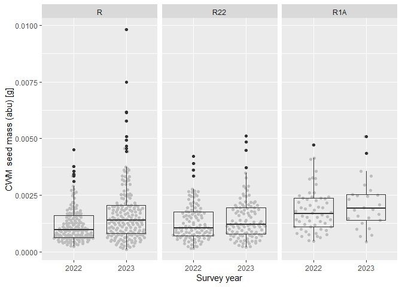
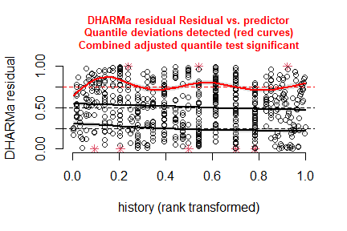
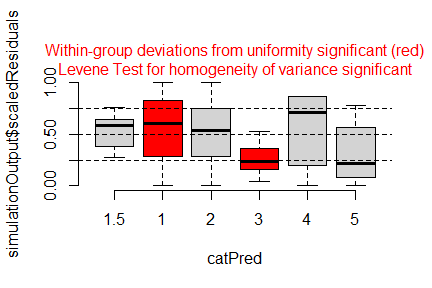
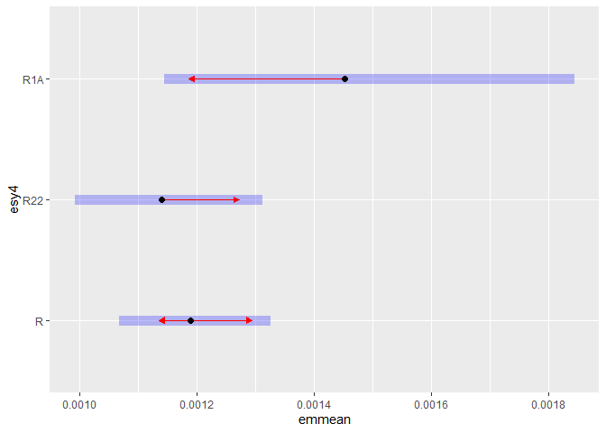
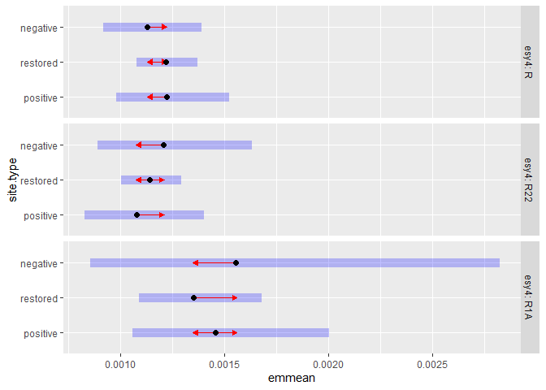

Analysis of Bauer et al. (submitted) Functional traits of grasslands:
<br> Community weighted mean of seed mass per plot (esy4)
================
<b>Markus Bauer</b> <br>
<b>2025-05-05</b>

- [Preparation](#preparation)
- [Statistics](#statistics)
  - [Data exploration](#data-exploration)
    - [Means and deviations](#means-and-deviations)
    - [Graphs of raw data (Step 2, 6,
      7)](#graphs-of-raw-data-step-2-6-7)
    - [Outliers, zero-inflation, transformations? (Step 1, 3,
      4)](#outliers-zero-inflation-transformations-step-1-3-4)
    - [Check collinearity part 1 (Step
      5)](#check-collinearity-part-1-step-5)
  - [Models](#models)
  - [Model check](#model-check)
    - [DHARMa](#dharma)
    - [Check collinearity part 2 (Step
      5)](#check-collinearity-part-2-step-5)
  - [Model comparison](#model-comparison)
    - [<i>R</i><sup>2</sup> values](#r2-values)
    - [AICc](#aicc)
  - [Predicted values](#predicted-values)
    - [Summary table](#summary-table)
    - [Forest plot](#forest-plot)
    - [Effect sizes](#effect-sizes)
- [Session info](#session-info)

<br/> <br/> <b>Markus Bauer</b>

Technichal University of Munich, TUM School of Life Sciences, Chair of
Restoration Ecology, Emil-Ramann-Straße 6, 85354 Freising, Germany

<markus1.bauer@tum.de>

ORCiD ID: [0000-0001-5372-4174](https://orcid.org/0000-0001-5372-4174)
<br> [Google
Scholar](https://scholar.google.de/citations?user=oHhmOkkAAAAJ&hl=de&oi=ao)
<br> GitHub: [markus1bauer](https://github.com/markus1bauer)

> **NOTE:** To compare different models, you only have to change the
> models in the section ‘Load models’

# Preparation

Protocol of data exploration (Steps 1-8) used from Zuur et al. (2010)
Methods Ecol Evol [DOI:
10.1111/2041-210X.12577](https://doi.org/10.1111/2041-210X.12577)

#### Packages

``` r
library(here)
library(tidyverse)
library(ggbeeswarm)
library(patchwork)
library(DHARMa)
library(emmeans)
```

#### Load data

``` r
sites <- read_csv(
  here("data", "processed", "data_processed_sites_esy4.csv"),
  col_names = TRUE, na = c("na", "NA", ""), col_types = cols(
    .default = "?",
    eco.id = "f",
    region = col_factor(levels = c("north", "centre", "south"), ordered = TRUE),
    site.type = col_factor(
      levels = c("positive", "restored", "negative"), ordered = TRUE
      ),
    fertilized = "f",
    freq.mow = "f",
    obs.year = "f"
  )
) %>%
  filter(esy4 %in% c("R", "R22", "R1A") & !(eco.id == 647)) %>%
  mutate(
    esy4 = fct_relevel(esy4, "R", "R22", "R1A"),
    eco.id = factor(eco.id)
    ) %>%
  rename(y = cwm.abu.seedmass)
```

# Statistics

## Data exploration

### Means and deviations

``` r
Rmisc::CI(sites$y, ci = .95)
```

    ##       upper        mean       lower 
    ## 0.001590479 0.001507379 0.001424279

``` r
median(sites$y)
```

    ## [1] 0.00125

``` r
sd(sites$y)
```

    ## [1] 0.001071421

``` r
quantile(sites$y, probs = c(0.05, 0.95), na.rm = TRUE)
```

    ##      5%     95% 
    ## 0.00038 0.00350

``` r
sites %>% count(eco.id)
```

    ## # A tibble: 3 × 2
    ##   eco.id     n
    ##   <fct>  <int>
    ## 1 654      203
    ## 2 686      235
    ## 3 664      203

``` r
sites %>% count(site.type)
```

    ## # A tibble: 3 × 2
    ##   site.type     n
    ##   <ord>     <int>
    ## 1 positive    114
    ## 2 restored    409
    ## 3 negative    118

``` r
sites %>% count(esy4)
```

    ## # A tibble: 3 × 2
    ##   esy4      n
    ##   <fct> <int>
    ## 1 R       337
    ## 2 R22     220
    ## 3 R1A      84

``` r
sites %>% count(esy4, eco.id)
```

    ## # A tibble: 8 × 3
    ##   esy4  eco.id     n
    ##   <fct> <fct>  <int>
    ## 1 R     654      102
    ## 2 R     686      123
    ## 3 R     664      112
    ## 4 R22   654       48
    ## 5 R22   686       81
    ## 6 R22   664       91
    ## 7 R1A   654       53
    ## 8 R1A   686       31

``` r
sites %>% count(esy4, site.type)
```

    ## # A tibble: 9 × 3
    ##   esy4  site.type     n
    ##   <fct> <ord>     <int>
    ## 1 R     positive     62
    ## 2 R     restored    182
    ## 3 R     negative     93
    ## 4 R22   positive     29
    ## 5 R22   restored    175
    ## 6 R22   negative     16
    ## 7 R1A   positive     23
    ## 8 R1A   restored     52
    ## 9 R1A   negative      9

### Graphs of raw data (Step 2, 6, 7)

<!-- --><!-- --><!-- --><!-- --><!-- -->

### Outliers, zero-inflation, transformations? (Step 1, 3, 4)

<!-- -->

### Check collinearity part 1 (Step 5)

Exclude r \> 0.7 <br> Dormann et al. 2013 Ecography [DOI:
10.1111/j.1600-0587.2012.07348.x](https://doi.org/10.1111/j.1600-0587.2012.07348.x)

``` r
# sites %>%
#   select(where(is.numeric), -y, -starts_with("cwm.")) %>%
#   GGally::ggpairs(
#     lower = list(continuous = "smooth_loess")
#     ) +
#   theme(strip.text = element_text(size = 7))

# -> no continuous variables
```

## Models

> **NOTE:** Only here you have to modify the script to compare other
> models

``` r
load(file = here("outputs", "models", "model_seedmass_esy4_1.Rdata"))
load(file = here("outputs", "models", "model_seedmass_esy4_2.Rdata"))
m_1 <- m1
m_2 <- m2
```

``` r
m_1@call
## lmer(formula = log(y) ~ esy4 * (site.type + eco.id) + obs.year + 
##     (1 | id.site), data = sites, REML = FALSE)
m_2@call
## lmer(formula = log(y) ~ esy4 * site.type + eco.id + obs.year + 
##     (1 | id.site), data = sites, REML = FALSE)
```

## Model check

### DHARMa

``` r
simulation_output_1 <- simulateResiduals(m_1, plot = TRUE)
```

<!-- -->

``` r
simulation_output_2 <- simulateResiduals(m_2, plot = TRUE)
```

<!-- -->

``` r
plotResiduals(simulation_output_1$scaledResiduals, sites$eco.id)
```

<!-- -->

``` r
plotResiduals(simulation_output_2$scaledResiduals, sites$eco.id)
```

<!-- -->

``` r
plotResiduals(simulation_output_1$scaledResiduals, sites$site.type)
```

<!-- -->

``` r
plotResiduals(simulation_output_2$scaledResiduals, sites$site.type)
```

<!-- -->

``` r
plotResiduals(simulation_output_1$scaledResiduals, sites$obs.year)
```

<!-- -->

``` r
plotResiduals(simulation_output_2$scaledResiduals, sites$obs.year)
```

<!-- -->

``` r
plotResiduals(simulation_output_1$scaledResiduals, sites$history)
```

<!-- -->

``` r
plotResiduals(simulation_output_2$scaledResiduals, sites$history)
```

<!-- -->

``` r
plotResiduals(simulation_output_1$scaledResiduals, sites$hydrology)
## Warning in ensurePredictor(simulationOutput, form): DHARMa:::ensurePredictor:
## character string was provided as predictor. DHARMa has converted to factor
## automatically. To remove this warning, please convert to factor before
## attempting to plot with DHARMa.
```

<!-- -->

``` r
plotResiduals(simulation_output_2$scaledResiduals, sites$hydrology)
## Warning in ensurePredictor(simulationOutput, form): DHARMa:::ensurePredictor:
## character string was provided as predictor. DHARMa has converted to factor
## automatically. To remove this warning, please convert to factor before
## attempting to plot with DHARMa.
```

<!-- -->

``` r
plotResiduals(simulation_output_1$scaledResiduals, sites$land.use.hist)
## Warning in ensurePredictor(simulationOutput, form): DHARMa:::ensurePredictor:
## character string was provided as predictor. DHARMa has converted to factor
## automatically. To remove this warning, please convert to factor before
## attempting to plot with DHARMa.
```

<!-- -->

``` r
plotResiduals(simulation_output_2$scaledResiduals, sites$land.use.hist)
## Warning in ensurePredictor(simulationOutput, form): DHARMa:::ensurePredictor:
## character string was provided as predictor. DHARMa has converted to factor
## automatically. To remove this warning, please convert to factor before
## attempting to plot with DHARMa.
```

<!-- -->

``` r
plotResiduals(simulation_output_1$scaledResiduals, sites$fertilized)
```

<!-- -->

``` r
plotResiduals(simulation_output_2$scaledResiduals, sites$fertilized)
```

<!-- -->

``` r
plotResiduals(simulation_output_1$scaledResiduals, sites$freq.mow)
```

<!-- -->

``` r
plotResiduals(simulation_output_2$scaledResiduals, sites$freq.mow)
```

<!-- -->

### Check collinearity part 2 (Step 5)

Remove VIF \> 3 or \> 10 <br> Zuur et al. 2010 Methods Ecol Evol [DOI:
10.1111/j.2041-210X.2009.00001.x](https://doi.org/10.1111/j.2041-210X.2009.00001.x)

``` r
car::vif(m_1)
```

    ##                     GVIF Df GVIF^(1/(2*Df))
    ## esy4           12.098961  2        1.865035
    ## site.type       1.413389  2        1.090349
    ## eco.id          1.578127  2        1.120819
    ## obs.year        1.019161  1        1.009535
    ## esy4:site.type  5.094832  4        1.225720
    ## esy4:eco.id     9.713098  3        1.460695

``` r
car::vif(m_2)
```

    ##                    GVIF Df GVIF^(1/(2*Df))
    ## esy4           3.657125  2        1.382881
    ## site.type      1.403941  2        1.088522
    ## eco.id         1.065502  2        1.015988
    ## obs.year       1.018405  1        1.009161
    ## esy4:site.type 4.684841  4        1.212933

## Model comparison

### <i>R</i><sup>2</sup> values

``` r
MuMIn::r.squaredGLMM(m_1)
##            R2m       R2c
## [1,] 0.1239411 0.6898262
MuMIn::r.squaredGLMM(m_2)
##           R2m       R2c
## [1,] 0.120883 0.6926789
```

### AICc

Use AICc and not AIC since ratio n/K \< 40 <br> Burnahm & Anderson 2002
p. 66 ISBN: 978-0-387-95364-9

``` r
MuMIn::AICc(m_1, m_2) %>%
  arrange(AICc)
##     df     AICc
## m_2 14 981.0276
## m_1 17 985.3667
```

## Predicted values

### Summary table

``` r
car::Anova(m_2, type = 3)
```

    ## Analysis of Deviance Table (Type III Wald chisquare tests)
    ## 
    ## Response: log(y)
    ##                    Chisq Df Pr(>Chisq)    
    ## (Intercept)    4734.1921  1  < 2.2e-16 ***
    ## esy4              3.4230  2    0.18060    
    ## site.type         0.4292  2    0.80685    
    ## eco.id           21.0676  2  2.662e-05 ***
    ## obs.year          3.5200  1    0.06063 .  
    ## esy4:site.type    1.6945  4    0.79172    
    ## ---
    ## Signif. codes:  0 '***' 0.001 '**' 0.01 '*' 0.05 '.' 0.1 ' ' 1

``` r
summary(m_2)
```

    ## Linear mixed model fit by maximum likelihood  ['lmerMod']
    ## Formula: log(y) ~ esy4 * site.type + eco.id + obs.year + (1 | id.site)
    ##    Data: sites
    ## 
    ##       AIC       BIC    logLik -2*log(L)  df.resid 
    ##     980.4    1042.8    -476.2     952.4       627 
    ## 
    ## Scaled residuals: 
    ##     Min      1Q  Median      3Q     Max 
    ## -3.9841 -0.4787  0.0065  0.4760  2.9436 
    ## 
    ## Random effects:
    ##  Groups   Name        Variance Std.Dev.
    ##  id.site  (Intercept) 0.2734   0.5229  
    ##  Residual             0.1469   0.3833  
    ## Number of obs: 641, groups:  id.site, 182
    ## 
    ## Fixed effects:
    ##                     Estimate Std. Error t value
    ## (Intercept)         -6.54090    0.09506 -68.805
    ## esy4R22             -0.04229    0.06261  -0.675
    ## esy4R1A              0.19970    0.12022   1.661
    ## site.type.L         -0.05518    0.10591  -0.521
    ## site.type.Q         -0.02915    0.07827  -0.372
    ## eco.id686           -0.33799    0.10318  -3.276
    ## eco.id664           -0.47788    0.10722  -4.457
    ## obs.year2023         0.15851    0.08448   1.876
    ## esy4R22:site.type.L  0.13571    0.12659   1.072
    ## esy4R1A:site.type.L  0.10215    0.23903   0.427
    ## esy4R22:site.type.Q  0.02918    0.08623   0.338
    ## esy4R1A:site.type.Q  0.11581    0.16342   0.709
    ## 
    ## Correlation of Fixed Effects:
    ##             (Intr) es4R22 es4R1A st.t.L st.t.Q ec.686 ec.664 o.2023 e4R22:..L
    ## esy4R22     -0.148                                                           
    ## esy4R1A     -0.293  0.082                                                    
    ## site.type.L -0.077  0.043 -0.011                                             
    ## site.type.Q  0.311 -0.123 -0.124 -0.047                                      
    ## eco.id686   -0.591 -0.020  0.124  0.062 -0.006                               
    ## eco.id664   -0.588 -0.056  0.171  0.040  0.008  0.526                        
    ## obs.yer2023 -0.491  0.035  0.104  0.016 -0.070  0.014  0.029                 
    ## esy4R22:..L -0.006  0.130 -0.011 -0.265  0.036  0.016  0.045  0.015          
    ## esy4R1A:..L -0.089 -0.021  0.550 -0.228 -0.022  0.079  0.058  0.052  0.084   
    ## esy4R22:..Q -0.088  0.650  0.040  0.040 -0.319  0.011 -0.011  0.035  0.117   
    ## esy4R1A:..Q -0.121  0.038  0.634 -0.016 -0.253  0.054  0.031  0.036 -0.016   
    ##             e4R1A:..L e4R22:..Q
    ## esy4R22                        
    ## esy4R1A                        
    ## site.type.L                    
    ## site.type.Q                    
    ## eco.id686                      
    ## eco.id664                      
    ## obs.yer2023                    
    ## esy4R22:..L                    
    ## esy4R1A:..L                    
    ## esy4R22:..Q -0.015             
    ## esy4R1A:..Q  0.486     0.108

### Forest plot

``` r
dotwhisker::dwplot(
  list(m_1, m_2),
  ci = 0.95,
  show_intercept = FALSE,
  vline = geom_vline(xintercept = 0, colour = "grey60", linetype = 2)) +
  theme_classic()
```

<!-- -->

### Effect sizes

Effect sizes of chosen model just to get exact values of means etc. if
necessary.

#### ESy EUNIS Habitat type

``` r
(emm <- emmeans(
  m_2,
  revpairwise ~ esy4,
  type = "response"
  ))
```

    ## $emmeans
    ##  esy4 response       SE  df lower.CL upper.CL
    ##  R     0.00119 6.53e-05 243 0.001068  0.00133
    ##  R22   0.00114 8.11e-05 466 0.000992  0.00131
    ##  R1A   0.00145 1.76e-04 474 0.001145  0.00184
    ## 
    ## Results are averaged over the levels of: site.type, eco.id, obs.year 
    ## Degrees-of-freedom method: kenward-roger 
    ## Confidence level used: 0.95 
    ## Intervals are back-transformed from the log scale 
    ## 
    ## $contrasts
    ##  contrast  ratio     SE  df null t.ratio p.value
    ##  R22 / R   0.959 0.0605 586    1  -0.669  0.7813
    ##  R1A / R   1.221 0.1490 577    1   1.635  0.2319
    ##  R1A / R22 1.274 0.1690 601    1   1.820  0.1638
    ## 
    ## Results are averaged over the levels of: site.type, eco.id, obs.year 
    ## Degrees-of-freedom method: kenward-roger 
    ## P value adjustment: tukey method for comparing a family of 3 estimates 
    ## Tests are performed on the log scale

``` r
plot(emm, comparison = TRUE)
```

<!-- -->
\#### Habiat type x Region

``` r
(emm <- emmeans(
  m_2,
  revpairwise ~ esy4 + eco.id,
  type = "response"
  ))
```

    ## $emmeans
    ##  esy4 eco.id response       SE  df lower.CL upper.CL
    ##  R    654    0.001562 1.32e-04 224 0.001322  0.00185
    ##  R22  654    0.001498 1.46e-04 341 0.001236  0.00181
    ##  R1A  654    0.001908 2.43e-04 367 0.001484  0.00245
    ##  R    686    0.001114 8.85e-05 207 0.000953  0.00130
    ##  R22  686    0.001068 9.80e-05 323 0.000892  0.00128
    ##  R1A  686    0.001360 1.85e-04 402 0.001041  0.00178
    ##  R    664    0.000969 8.06e-05 214 0.000822  0.00114
    ##  R22  664    0.000929 8.58e-05 301 0.000774  0.00111
    ##  R1A  664    0.001183 1.70e-04 419 0.000892  0.00157
    ## 
    ## Results are averaged over the levels of: site.type, obs.year 
    ## Degrees-of-freedom method: kenward-roger 
    ## Confidence level used: 0.95 
    ## Intervals are back-transformed from the log scale 
    ## 
    ## $contrasts
    ##  contrast                      ratio     SE  df null t.ratio p.value
    ##  R22 eco.id654 / R eco.id654   0.959 0.0605 586    1  -0.669  0.9991
    ##  R1A eco.id654 / R eco.id654   1.221 0.1490 577    1   1.635  0.7854
    ##  R1A eco.id654 / R22 eco.id654 1.274 0.1690 601    1   1.820  0.6686
    ##  R eco.id686 / R eco.id654     0.713 0.0752 192    1  -3.206  0.0410
    ##  R eco.id686 / R22 eco.id654   0.744 0.0922 321    1  -2.386  0.2954
    ##  R eco.id686 / R1A eco.id654   0.584 0.0883 346    1  -3.556  0.0126
    ##  R22 eco.id686 / R eco.id654   0.684 0.0833 307    1  -3.122  0.0503
    ##  R22 eco.id686 / R22 eco.id654 0.713 0.0752 192    1  -3.206  0.0410
    ##  R22 eco.id686 / R1A eco.id654 0.560 0.0892 382    1  -3.643  0.0093
    ##  R22 eco.id686 / R eco.id686   0.959 0.0605 586    1  -0.669  0.9991
    ##  R1A eco.id686 / R eco.id654   0.871 0.1490 396    1  -0.809  0.9966
    ##  R1A eco.id686 / R22 eco.id654 0.908 0.1630 430    1  -0.535  0.9998
    ##  R1A eco.id686 / R1A eco.id654 0.713 0.0752 192    1  -3.206  0.0410
    ##  R1A eco.id686 / R eco.id686   1.221 0.1490 577    1   1.635  0.7854
    ##  R1A eco.id686 / R22 eco.id686 1.274 0.1690 601    1   1.820  0.6686
    ##  R eco.id664 / R eco.id654     0.620 0.0679 204    1  -4.364  0.0007
    ##  R eco.id664 / R22 eco.id654   0.647 0.0837 337    1  -3.366  0.0237
    ##  R eco.id664 / R1A eco.id654   0.508 0.0760 330    1  -4.529  0.0003
    ##  R eco.id664 / R eco.id686     0.869 0.0911 191    1  -1.335  0.9194
    ##  R eco.id664 / R22 eco.id686   0.907 0.1130 326    1  -0.785  0.9972
    ##  R eco.id664 / R1A eco.id686   0.712 0.1120 356    1  -2.168  0.4290
    ##  R22 eco.id664 / R eco.id654   0.594 0.0733 302    1  -4.217  0.0011
    ##  R22 eco.id664 / R22 eco.id654 0.620 0.0679 204    1  -4.364  0.0007
    ##  R22 eco.id664 / R1A eco.id654 0.487 0.0760 359    1  -4.612  0.0002
    ##  R22 eco.id664 / R eco.id686   0.833 0.1000 302    1  -1.515  0.8480
    ##  R22 eco.id664 / R22 eco.id686 0.869 0.0911 191    1  -1.335  0.9194
    ##  R22 eco.id664 / R1A eco.id686 0.683 0.1120 387    1  -2.334  0.3246
    ##  R22 eco.id664 / R eco.id664   0.959 0.0605 586    1  -0.669  0.9991
    ##  R1A eco.id664 / R eco.id654   0.757 0.1340 411    1  -1.569  0.8213
    ##  R1A eco.id664 / R22 eco.id654 0.790 0.1480 446    1  -1.262  0.9417
    ##  R1A eco.id664 / R1A eco.id654 0.620 0.0679 204    1  -4.364  0.0007
    ##  R1A eco.id664 / R eco.id686   1.062 0.1750 390    1   0.362  1.0000
    ##  R1A eco.id664 / R22 eco.id686 1.107 0.1930 429    1   0.584  0.9997
    ##  R1A eco.id664 / R1A eco.id686 0.869 0.0911 191    1  -1.335  0.9194
    ##  R1A eco.id664 / R eco.id664   1.221 0.1490 577    1   1.635  0.7854
    ##  R1A eco.id664 / R22 eco.id664 1.274 0.1690 601    1   1.820  0.6686
    ## 
    ## Results are averaged over the levels of: site.type, obs.year 
    ## Degrees-of-freedom method: kenward-roger 
    ## P value adjustment: tukey method for comparing a family of 9 estimates 
    ## Tests are performed on the log scale

``` r
plot(emm, comparison = TRUE)
```

    ## Warning: Comparison discrepancy in group "1", R eco.id654 - R eco.id686:
    ##     Target overlap = -0.0219, overlap on graph = 0.0428

    ## Warning: Comparison discrepancy in group "1", R eco.id654 - R22 eco.id686:
    ##     Target overlap = 8e-04, overlap on graph = -0.0396

    ## Warning: Comparison discrepancy in group "1", R eco.id654 - R1A eco.id664:
    ##     Target overlap = 0.497, overlap on graph = -0.0336

    ## Warning: Comparison discrepancy in group "1", R22 eco.id654 - R22 eco.id686:
    ##     Target overlap = -0.0219, overlap on graph = 0.0707

<!-- -->

#### Habiat type x Site type

``` r
(emm <- emmeans(
  m_2,
  revpairwise ~ esy4 + site.type,
  type = "response"
  ))
```

    ## $emmeans
    ##  esy4 site.type response       SE  df lower.CL upper.CL
    ##  R    positive   0.00122 1.36e-04 261 0.000982  0.00152
    ##  R22  positive   0.00108 1.44e-04 411 0.000828  0.00140
    ##  R1A  positive   0.00146 2.36e-04 481 0.001059  0.00200
    ##  R    restored   0.00122 7.41e-05 284 0.001081  0.00137
    ##  R22  restored   0.00114 7.25e-05 307 0.001007  0.00129
    ##  R1A  restored   0.00135 1.49e-04 534 0.001090  0.00168
    ##  R    negative   0.00113 1.19e-04 210 0.000920  0.00139
    ##  R22  negative   0.00121 1.85e-04 534 0.000894  0.00163
    ##  R1A  negative   0.00156 4.72e-04 444 0.000858  0.00282
    ## 
    ## Results are averaged over the levels of: eco.id, obs.year 
    ## Degrees-of-freedom method: kenward-roger 
    ## Confidence level used: 0.95 
    ## Intervals are back-transformed from the log scale 
    ## 
    ## $contrasts
    ##  contrast                    ratio    SE  df null t.ratio p.value
    ##  R22 positive / R positive   0.881 0.105 592    1  -1.064  0.9790
    ##  R1A positive / R positive   1.191 0.188 651    1   1.106  0.9732
    ##  R1A positive / R22 positive 1.351 0.245 652    1   1.658  0.7721
    ##  R restored / R positive     0.997 0.126 266    1  -0.026  1.0000
    ##  R restored / R22 positive   1.131 0.166 386    1   0.837  0.9957
    ##  R restored / R1A positive   0.837 0.145 453    1  -1.028  0.9831
    ##  R22 restored / R positive   0.933 0.119 271    1  -0.543  0.9998
    ##  R22 restored / R22 positive 1.059 0.157 387    1   0.385  1.0000
    ##  R22 restored / R1A positive 0.783 0.137 457    1  -1.401  0.8973
    ##  R22 restored / R restored   0.936 0.053 591    1  -1.168  0.9629
    ##  R1A restored / R positive   1.107 0.174 382    1   0.648  0.9993
    ##  R1A restored / R22 positive 1.256 0.219 470    1   1.307  0.9291
    ##  R1A restored / R1A positive 0.930 0.182 488    1  -0.373  1.0000
    ##  R1A restored / R restored   1.111 0.123 649    1   0.951  0.9898
    ##  R1A restored / R22 restored 1.187 0.138 644    1   1.475  0.8668
    ##  R negative / R positive     0.925 0.141 234    1  -0.511  0.9999
    ##  R negative / R22 positive   1.049 0.179 317    1   0.284  1.0000
    ##  R negative / R1A positive   0.777 0.150 379    1  -1.310  0.9282
    ##  R negative / R restored     0.928 0.113 226    1  -0.616  0.9995
    ##  R negative / R22 restored   0.991 0.122 232    1  -0.070  1.0000
    ##  R negative / R1A restored   0.835 0.127 350    1  -1.182  0.9598
    ##  R22 negative / R positive   0.988 0.187 426    1  -0.066  1.0000
    ##  R22 negative / R22 positive 1.121 0.228 480    1   0.559  0.9998
    ##  R22 negative / R1A positive 0.829 0.185 506    1  -0.839  0.9956
    ##  R22 negative / R restored   0.991 0.163 496    1  -0.055  1.0000
    ##  R22 negative / R22 restored 1.059 0.176 498    1   0.343  1.0000
    ##  R22 negative / R1A restored 0.892 0.168 534    1  -0.606  0.9996
    ##  R22 negative / R negative   1.068 0.145 582    1   0.482  0.9999
    ##  R1A negative / R positive   1.273 0.412 419    1   0.744  0.9981
    ##  R1A negative / R22 positive 1.444 0.481 442    1   1.104  0.9735
    ##  R1A negative / R1A positive 1.069 0.367 447    1   0.193  1.0000
    ##  R1A negative / R restored   1.277 0.395 437    1   0.791  0.9971
    ##  R1A negative / R22 restored 1.364 0.423 439    1   1.002  0.9857
    ##  R1A negative / R1A restored 1.150 0.368 446    1   0.435  1.0000
    ##  R1A negative / R negative   1.376 0.422 496    1   1.040  0.9818
    ##  R1A negative / R22 negative 1.289 0.425 534    1   0.768  0.9976
    ## 
    ## Results are averaged over the levels of: eco.id, obs.year 
    ## Degrees-of-freedom method: kenward-roger 
    ## P value adjustment: tukey method for comparing a family of 9 estimates 
    ## Tests are performed on the log scale

``` r
plot(emm, comparison = TRUE)
```

<!-- -->

# Session info

    ## R version 4.4.2 (2024-10-31 ucrt)
    ## Platform: x86_64-w64-mingw32/x64
    ## Running under: Windows 11 x64 (build 26100)
    ## 
    ## Matrix products: default
    ## 
    ## 
    ## locale:
    ## [1] LC_COLLATE=German_Germany.utf8  LC_CTYPE=German_Germany.utf8   
    ## [3] LC_MONETARY=German_Germany.utf8 LC_NUMERIC=C                   
    ## [5] LC_TIME=German_Germany.utf8    
    ## 
    ## time zone: Europe/Berlin
    ## tzcode source: internal
    ## 
    ## attached base packages:
    ## [1] stats     graphics  grDevices utils     datasets  methods   base     
    ## 
    ## other attached packages:
    ##  [1] emmeans_1.11.0   DHARMa_0.4.7     patchwork_1.2.0  ggbeeswarm_0.7.2
    ##  [5] lubridate_1.9.3  forcats_1.0.0    stringr_1.5.1    dplyr_1.1.4     
    ##  [9] purrr_1.0.2      readr_2.1.5      tidyr_1.3.1      tibble_3.2.1    
    ## [13] ggplot2_3.5.1    tidyverse_2.0.0  here_1.0.1      
    ## 
    ## loaded via a namespace (and not attached):
    ##   [1] mnormt_2.1.1        Rdpack_2.6.3        gridExtra_2.3      
    ##   [4] sandwich_3.1-1      rlang_1.1.4         magrittr_2.0.3     
    ##   [7] compiler_4.4.2      mgcv_1.9-1          vctrs_0.6.5        
    ##  [10] quadprog_1.5-8      pkgconfig_2.0.3     crayon_1.5.3       
    ##  [13] fastmap_1.2.0       backports_1.5.0     labeling_0.4.3     
    ##  [16] pbivnorm_0.6.0      utf8_1.2.4          ggstance_0.3.7     
    ##  [19] promises_1.3.2      rmarkdown_2.27      tzdb_0.4.0         
    ##  [22] nloptr_2.2.1        bit_4.0.5           xfun_0.45          
    ##  [25] highr_0.11          later_1.4.1         broom_1.0.6        
    ##  [28] lavaan_0.6-19       parallel_4.4.2      R6_2.5.1           
    ##  [31] gap.datasets_0.0.6  stringi_1.8.4       qgam_1.3.4         
    ##  [34] car_3.1-3           boot_1.3-31         numDeriv_2016.8-1.1
    ##  [37] estimability_1.5.1  Rcpp_1.0.14         iterators_1.0.14   
    ##  [40] knitr_1.48          zoo_1.8-13          parameters_0.24.2  
    ##  [43] httpuv_1.6.15       Matrix_1.7-0        splines_4.4.2      
    ##  [46] timechange_0.3.0    tidyselect_1.2.1    rstudioapi_0.16.0  
    ##  [49] abind_1.4-8         yaml_2.3.9          MuMIn_1.48.11      
    ##  [52] doParallel_1.0.17   codetools_0.2-20    nonnest2_0.5-8     
    ##  [55] lattice_0.22-6      plyr_1.8.9          shiny_1.10.0       
    ##  [58] withr_3.0.0         bayestestR_0.15.2   coda_0.19-4.1      
    ##  [61] evaluate_0.24.0     CompQuadForm_1.4.3  pillar_1.9.0       
    ##  [64] gap_1.6             carData_3.0-5       foreach_1.5.2      
    ##  [67] stats4_4.4.2        reformulas_0.4.0    insight_1.1.0      
    ##  [70] generics_0.1.3      vroom_1.6.5         rprojroot_2.0.4    
    ##  [73] hms_1.1.3           munsell_0.5.1       scales_1.3.0       
    ##  [76] minqa_1.2.8         xtable_1.8-4        glue_1.7.0         
    ##  [79] tools_4.4.2         lme4_1.1-37         mvtnorm_1.3-3      
    ##  [82] grid_4.4.2          rbibutils_2.3       datawizard_1.0.2   
    ##  [85] colorspace_2.1-0    nlme_3.1-164        Rmisc_1.5.1        
    ##  [88] performance_0.13.0  beeswarm_0.4.0      vipor_0.4.7        
    ##  [91] Formula_1.2-5       cli_3.6.3           fansi_1.0.6        
    ##  [94] gtable_0.3.5        digest_0.6.36       pbkrtest_0.5.3     
    ##  [97] farver_2.1.2        htmltools_0.5.8.1   lifecycle_1.0.4    
    ## [100] mime_0.12           bit64_4.0.5         dotwhisker_0.8.3   
    ## [103] MASS_7.3-60.2
