Analysis of Bauer et al. (submitted) Functional traits of grasslands:
<br> Average community weighted mean of specific leaf area (SLA) per
plot (esy4)
================
<b>Markus Bauer</b> <br>
<b>2025-04-29</b>

- [Preparation](#preparation)
- [Statistics](#statistics)
  - [Data exploration](#data-exploration)
    - [Means and deviations](#means-and-deviations)
    - [Graphs of raw data (Step 2, 6,
      7)](#graphs-of-raw-data-step-2-6-7)
    - [Outliers, zero-inflation, transformations? (Step 1, 3,
      4)](#outliers-zero-inflation-transformations-step-1-3-4)
    - [Check collinearity part 1 (Step
      5)](#check-collinearity-part-1-step-5)
  - [Models](#models)
  - [Model check](#model-check)
    - [DHARMa](#dharma)
    - [Check collinearity part 2 (Step
      5)](#check-collinearity-part-2-step-5)
  - [Model comparison](#model-comparison)
    - [<i>R</i><sup>2</sup> values](#r2-values)
    - [AICc](#aicc)
  - [Predicted values](#predicted-values)
    - [Summary table](#summary-table)
    - [Forest plot](#forest-plot)
    - [Effect sizes](#effect-sizes)
- [Session info](#session-info)

<br/> <br/> <b>Markus Bauer</b>

Technichal University of Munich, TUM School of Life Sciences, Chair of
Restoration Ecology, Emil-Ramann-Straße 6, 85354 Freising, Germany

<markus1.bauer@tum.de>

ORCiD ID: [0000-0001-5372-4174](https://orcid.org/0000-0001-5372-4174)
<br> [Google
Scholar](https://scholar.google.de/citations?user=oHhmOkkAAAAJ&hl=de&oi=ao)
<br> GitHub: [markus1bauer](https://github.com/markus1bauer)

> **NOTE:** To compare different models, you only have to change the
> models in the section ‘Load models’

# Preparation

Protocol of data exploration (Steps 1-8) used from Zuur et al. (2010)
Methods Ecol Evol [DOI:
10.1111/2041-210X.12577](https://doi.org/10.1111/2041-210X.12577)

#### Packages

``` r
library(here)
library(tidyverse)
library(ggbeeswarm)
library(patchwork)
library(DHARMa)
library(emmeans)
```

#### Load data

``` r
sites <- read_csv(
  here("data", "processed", "data_processed_sites_esy4.csv"),
  col_names = TRUE, na = c("na", "NA", ""), col_types = cols(
    .default = "?",
    eco.id = "f",
    region = col_factor(levels = c("north", "centre", "south"), ordered = TRUE),
    site.type = col_factor(
      levels = c("positive", "restored", "negative"), ordered = TRUE
      ),
    fertilized = "f",
    freq.mow = "f",
    obs.year = "f"
  )
) %>%
  filter(esy4 %in% c("R", "R22", "R1A") & !(eco.id == 647)) %>%
  mutate(
    esy4 = fct_relevel(esy4, "R", "R22", "R1A"),
    eco.id = factor(eco.id)
    ) %>%
  rename(y = cwm.abu.sla)
```

# Statistics

## Data exploration

### Means and deviations

``` r
Rmisc::CI(sites$y, ci = .95)
```

    ##    upper     mean    lower 
    ## 240.5516 237.9620 235.3723

``` r
median(sites$y)
```

    ## [1] 237.8

``` r
sd(sites$y)
```

    ## [1] 33.38862

``` r
quantile(sites$y, probs = c(0.05, 0.95), na.rm = TRUE)
```

    ##     5%    95% 
    ## 179.77 292.87

``` r
sites %>% count(eco.id)
```

    ## # A tibble: 3 × 2
    ##   eco.id     n
    ##   <fct>  <int>
    ## 1 654      203
    ## 2 686      235
    ## 3 664      203

``` r
sites %>% count(site.type)
```

    ## # A tibble: 3 × 2
    ##   site.type     n
    ##   <ord>     <int>
    ## 1 positive    114
    ## 2 restored    409
    ## 3 negative    118

``` r
sites %>% count(esy4)
```

    ## # A tibble: 3 × 2
    ##   esy4      n
    ##   <fct> <int>
    ## 1 R       337
    ## 2 R22     220
    ## 3 R1A      84

``` r
sites %>% count(esy4, eco.id)
```

    ## # A tibble: 8 × 3
    ##   esy4  eco.id     n
    ##   <fct> <fct>  <int>
    ## 1 R     654      102
    ## 2 R     686      123
    ## 3 R     664      112
    ## 4 R22   654       48
    ## 5 R22   686       81
    ## 6 R22   664       91
    ## 7 R1A   654       53
    ## 8 R1A   686       31

``` r
sites %>% count(esy4, site.type)
```

    ## # A tibble: 9 × 3
    ##   esy4  site.type     n
    ##   <fct> <ord>     <int>
    ## 1 R     positive     62
    ## 2 R     restored    182
    ## 3 R     negative     93
    ## 4 R22   positive     29
    ## 5 R22   restored    175
    ## 6 R22   negative     16
    ## 7 R1A   positive     23
    ## 8 R1A   restored     52
    ## 9 R1A   negative      9

### Graphs of raw data (Step 2, 6, 7)

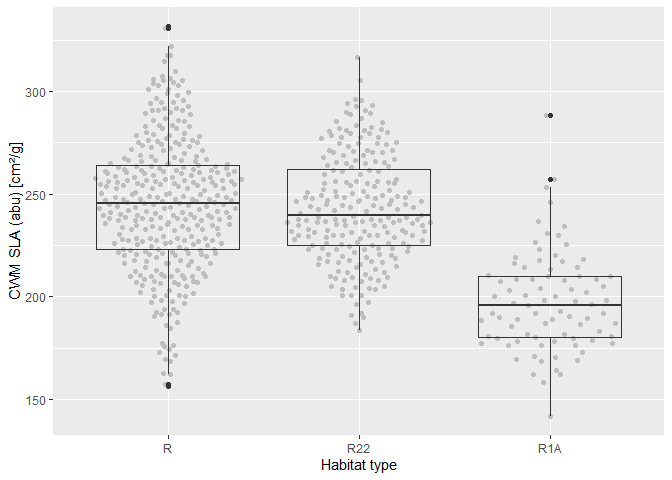<!-- --><!-- -->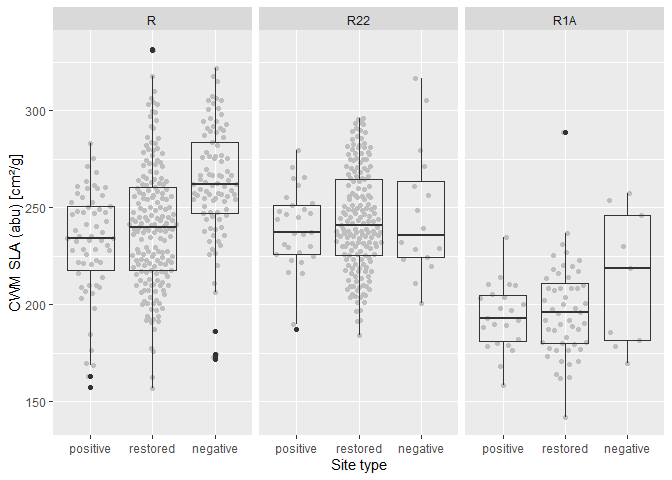<!-- -->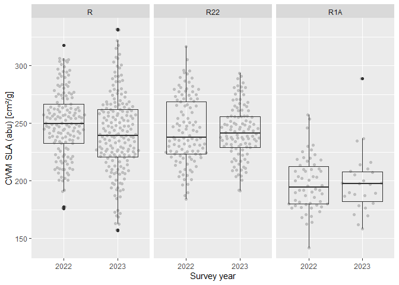<!-- -->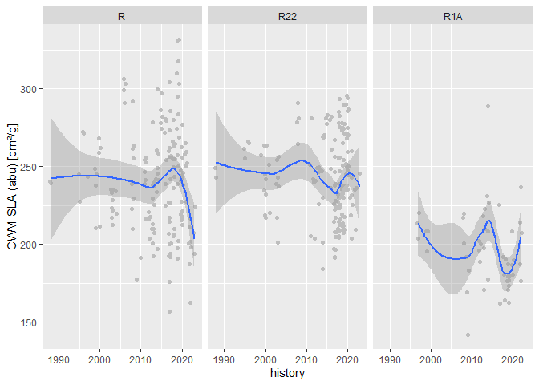<!-- -->

### Outliers, zero-inflation, transformations? (Step 1, 3, 4)

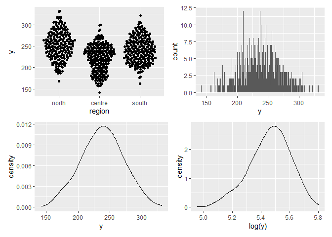<!-- -->

### Check collinearity part 1 (Step 5)

Exclude r \> 0.7 <br> Dormann et al. 2013 Ecography [DOI:
10.1111/j.1600-0587.2012.07348.x](https://doi.org/10.1111/j.1600-0587.2012.07348.x)

``` r
# sites %>%
#   select(where(is.numeric), -y, -starts_with("cwm.")) %>%
#   GGally::ggpairs(
#     lower = list(continuous = "smooth_loess")
#     ) +
#   theme(strip.text = element_text(size = 7))

# -> no continuous variables
```

## Models

> **NOTE:** Only here you have to modify the script to compare other
> models

``` r
load(file = here("outputs", "models", "model_sla_esy4_1.Rdata"))
load(file = here("outputs", "models", "model_sla_esy4_2.Rdata"))
m_1 <- m1
m_2 <- m2
```

``` r
m_1@call
## lmer(formula = y ~ esy4 * (site.type + eco.id) + obs.year + (1 | 
##     id.site), data = sites, REML = FALSE)
m_2@call
## lmer(formula = y ~ esy4 * site.type + eco.id + obs.year + (1 | 
##     id.site), data = sites, REML = FALSE)
```

## Model check

### DHARMa

``` r
simulation_output_1 <- simulateResiduals(m_1, plot = TRUE)
```

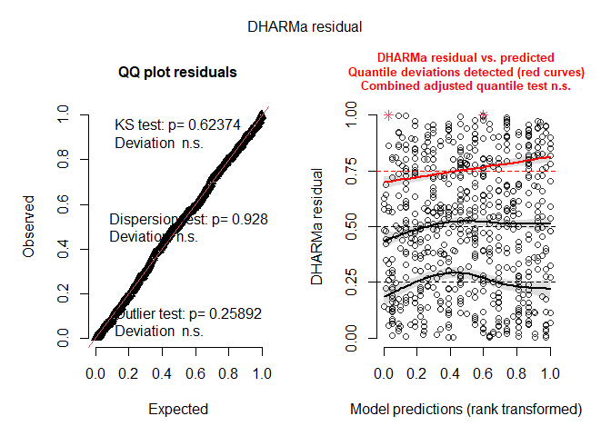<!-- -->

``` r
simulation_output_2 <- simulateResiduals(m_2, plot = TRUE)
```

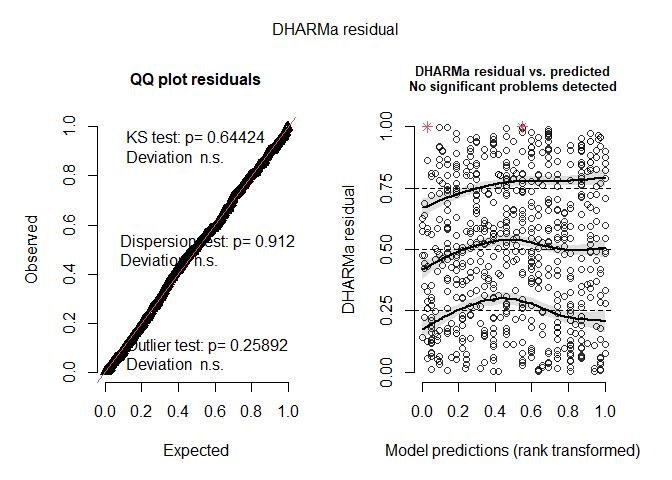<!-- -->

``` r
plotResiduals(simulation_output_1$scaledResiduals, sites$eco.id)
```

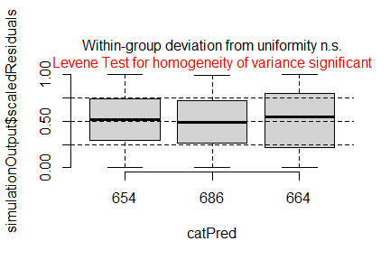<!-- -->

``` r
plotResiduals(simulation_output_2$scaledResiduals, sites$eco.id)
```

<!-- -->

``` r
plotResiduals(simulation_output_1$scaledResiduals, sites$site.type)
```

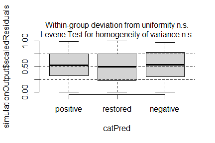<!-- -->

``` r
plotResiduals(simulation_output_2$scaledResiduals, sites$site.type)
```

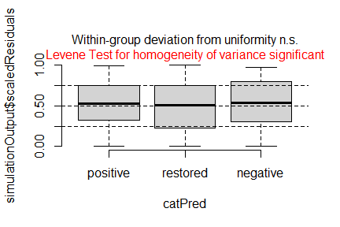<!-- -->

``` r
plotResiduals(simulation_output_1$scaledResiduals, sites$obs.year)
```

<!-- -->

``` r
plotResiduals(simulation_output_2$scaledResiduals, sites$obs.year)
```

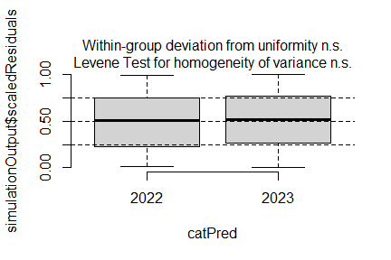<!-- -->

``` r
plotResiduals(simulation_output_1$scaledResiduals, sites$history)
```

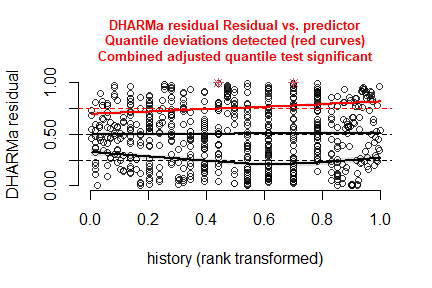<!-- -->

``` r
plotResiduals(simulation_output_2$scaledResiduals, sites$history)
```

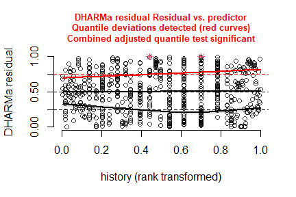<!-- -->

``` r
plotResiduals(simulation_output_1$scaledResiduals, sites$hydrology)
## Warning in ensurePredictor(simulationOutput, form): DHARMa:::ensurePredictor:
## character string was provided as predictor. DHARMa has converted to factor
## automatically. To remove this warning, please convert to factor before
## attempting to plot with DHARMa.
```

<!-- -->

``` r
plotResiduals(simulation_output_2$scaledResiduals, sites$hydrology)
## Warning in ensurePredictor(simulationOutput, form): DHARMa:::ensurePredictor:
## character string was provided as predictor. DHARMa has converted to factor
## automatically. To remove this warning, please convert to factor before
## attempting to plot with DHARMa.
```

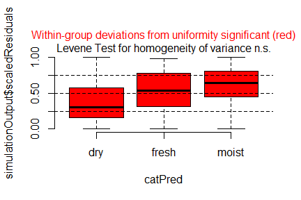<!-- -->

``` r
plotResiduals(simulation_output_1$scaledResiduals, sites$land.use.hist)
## Warning in ensurePredictor(simulationOutput, form): DHARMa:::ensurePredictor:
## character string was provided as predictor. DHARMa has converted to factor
## automatically. To remove this warning, please convert to factor before
## attempting to plot with DHARMa.
```

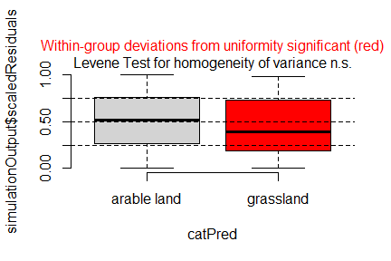<!-- -->

``` r
plotResiduals(simulation_output_2$scaledResiduals, sites$land.use.hist)
## Warning in ensurePredictor(simulationOutput, form): DHARMa:::ensurePredictor:
## character string was provided as predictor. DHARMa has converted to factor
## automatically. To remove this warning, please convert to factor before
## attempting to plot with DHARMa.
```

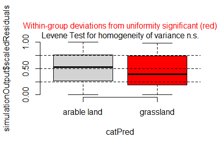<!-- -->

``` r
plotResiduals(simulation_output_1$scaledResiduals, sites$fertilized)
```

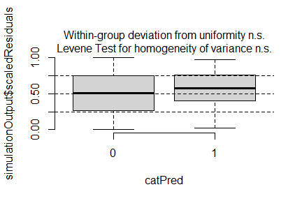<!-- -->

``` r
plotResiduals(simulation_output_2$scaledResiduals, sites$fertilized)
```

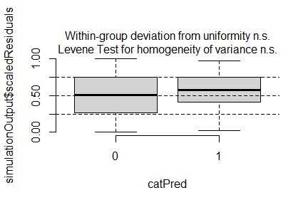<!-- -->

``` r
plotResiduals(simulation_output_1$scaledResiduals, sites$freq.mow)
```

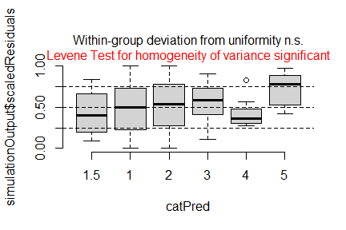<!-- -->

``` r
plotResiduals(simulation_output_2$scaledResiduals, sites$freq.mow)
```

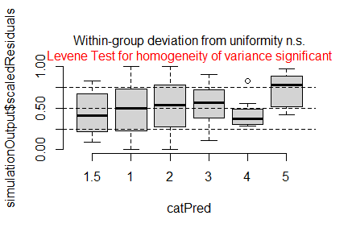<!-- -->

### Check collinearity part 2 (Step 5)

Remove VIF \> 3 or \> 10 <br> Zuur et al. 2010 Methods Ecol Evol [DOI:
10.1111/j.2041-210X.2009.00001.x](https://doi.org/10.1111/j.2041-210X.2009.00001.x)

``` r
car::vif(m_1)
```

    ##                     GVIF Df GVIF^(1/(2*Df))
    ## esy4           12.145295  2        1.866818
    ## site.type       1.391072  2        1.086019
    ## eco.id          1.546003  2        1.115071
    ## obs.year        1.018456  1        1.009186
    ## esy4:site.type  5.061337  4        1.224710
    ## esy4:eco.id     9.598443  3        1.457807

``` r
car::vif(m_2)
```

    ##                    GVIF Df GVIF^(1/(2*Df))
    ## esy4           3.673219  2        1.384400
    ## site.type      1.385353  2        1.084901
    ## eco.id         1.063342  2        1.015473
    ## obs.year       1.017826  1        1.008874
    ## esy4:site.type 4.657640  4        1.212051

## Model comparison

### <i>R</i><sup>2</sup> values

``` r
MuMIn::r.squaredGLMM(m_1)
##            R2m       R2c
## [1,] 0.2922781 0.7615157
MuMIn::r.squaredGLMM(m_2)
##           R2m       R2c
## [1,] 0.291642 0.7625188
```

### AICc

Use AICc and not AIC since ratio n/K \< 40 <br> Burnahm & Anderson 2002
p. 66 ISBN: 978-0-387-95364-9

``` r
MuMIn::AICc(m_1, m_2) %>%
  arrange(AICc)
##     df     AICc
## m_2 14 5772.620
## m_1 17 5778.482
```

## Predicted values

### Summary table

``` r
summary(m_1)
```

    ## Linear mixed model fit by maximum likelihood  ['lmerMod']
    ## Formula: y ~ esy4 * (site.type + eco.id) + obs.year + (1 | id.site)
    ##    Data: sites
    ## 
    ##       AIC       BIC    logLik -2*log(L)  df.resid 
    ##    5777.5    5853.4   -2871.7    5743.5       624 
    ## 
    ## Scaled residuals: 
    ##     Min      1Q  Median      3Q     Max 
    ## -3.6928 -0.5345  0.0068  0.4872  3.0424 
    ## 
    ## Random effects:
    ##  Groups   Name        Variance Std.Dev.
    ##  id.site  (Intercept) 502.6    22.42   
    ##  Residual             255.5    15.98   
    ## Number of obs: 641, groups:  id.site, 182
    ## 
    ## Fixed effects:
    ##                     Estimate Std. Error t value
    ## (Intercept)         227.6264     4.2135  54.023
    ## esy4R22               4.3427     4.2344   1.026
    ## esy4R1A             -19.2575     5.7309  -3.360
    ## site.type.L          24.2126     4.5143   5.364
    ## site.type.Q           7.5498     3.3344   2.264
    ## eco.id686            16.7447     4.8330   3.465
    ## eco.id664            26.2875     5.0106   5.246
    ## obs.year2023         -3.0880     3.6089  -0.856
    ## esy4R22:site.type.L -10.9172     5.3162  -2.054
    ## esy4R1A:site.type.L  -1.6584    10.3451  -0.160
    ## esy4R22:site.type.Q  -7.3472     3.6263  -2.026
    ## esy4R1A:site.type.Q  -4.0051     7.0276  -0.570
    ## esy4R22:eco.id686    -1.6401     4.8107  -0.341
    ## esy4R1A:eco.id686    -0.1068     7.4929  -0.014
    ## esy4R22:eco.id664    -3.5242     5.2531  -0.671

    ## 
    ## Correlation matrix not shown by default, as p = 15 > 12.
    ## Use print(x, correlation=TRUE)  or
    ##     vcov(x)        if you need it

    ## fit warnings:
    ## fixed-effect model matrix is rank deficient so dropping 1 column / coefficient

### Forest plot

``` r
dotwhisker::dwplot(
  list(m_1, m_2),
  ci = 0.95,
  show_intercept = FALSE,
  vline = geom_vline(xintercept = 0, colour = "grey60", linetype = 2)) +
  xlim(-35, 40) +
  theme_classic()
```

    ## Package 'merDeriv' needs to be installed to compute confidence intervals
    ##   for random effect parameters.
    ## Package 'merDeriv' needs to be installed to compute confidence intervals
    ##   for random effect parameters.

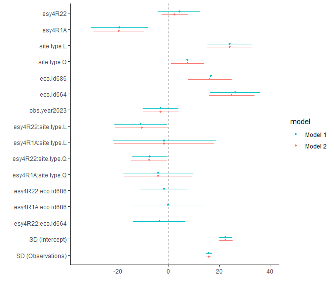<!-- -->

### Effect sizes

Effect sizes of chosen model just to get exact values of means etc. if
necessary.

#### Habiat type x Region

``` r
(emm <- emmeans(
  m_1,
  revpairwise ~ esy4 + eco.id,
  type = "response"
  ))
```

    ## $emmeans
    ##  esy4 eco.id emmean   SE  df lower.CL upper.CL
    ##  R    654       226 3.81 263      219      234
    ##  R22  654       230 4.89 470      221      240
    ##  R1A  654       207 5.74 401      196      218
    ##  R    686       243 3.54 240      236      250
    ##  R22  686       246 4.18 386      237      254
    ##  R1A  686       223 7.25 524      209      238
    ##  R    664       252 3.81 258      245      260
    ##  R22  664       253 4.28 356      245      262
    ##  R1A  664    nonEst   NA  NA       NA       NA
    ## 
    ## Results are averaged over the levels of: site.type, obs.year 
    ## Degrees-of-freedom method: kenward-roger 
    ## Confidence level used: 0.95 
    ## 
    ## $contrasts
    ##  contrast                      estimate   SE  df t.ratio p.value
    ##  R22 eco.id654 - R eco.id654      4.343 4.28 583   1.014  0.9723
    ##  R1A eco.id654 - R eco.id654    -19.257 5.83 610  -3.301  0.0226
    ##  R1A eco.id654 - R22 eco.id654  -23.600 6.78 632  -3.480  0.0125
    ##  R eco.id686 - R eco.id654       16.745 4.94 260   3.390  0.0181
    ##  R eco.id686 - R22 eco.id654     12.402 5.85 401   2.119  0.4047
    ##  R eco.id686 - R1A eco.id654     36.002 6.65 368   5.414  <.0001
    ##  R22 eco.id686 - R eco.id654     19.447 5.48 350   3.546  0.0104
    ##  R22 eco.id686 - R22 eco.id654   15.105 5.75 386   2.625  0.1501
    ##  R22 eco.id686 - R1A eco.id654   38.705 7.03 415   5.509  <.0001
    ##  R22 eco.id686 - R eco.id686      2.703 3.49 560   0.775  0.9943
    ##  R1A eco.id686 - R eco.id654     -2.620 8.16 474  -0.321  1.0000
    ##  R1A eco.id686 - R22 eco.id654   -6.962 8.74 517  -0.796  0.9933
    ##  R1A eco.id686 - R1A eco.id654   16.638 7.70 497   2.160  0.3781
    ##  R1A eco.id686 - R eco.id686    -19.364 7.13 637  -2.714  0.1201
    ##  R1A eco.id686 - R22 eco.id686  -22.067 7.59 644  -2.909  0.0725
    ##  R eco.id664 - R eco.id654       26.288 5.12 267   5.134  <.0001
    ##  R eco.id664 - R22 eco.id654     21.945 6.02 403   3.647  0.0072
    ##  R eco.id664 - R1A eco.id654     45.545 6.78 370   6.715  <.0001
    ##  R eco.id664 - R eco.id686        9.543 4.93 259   1.935  0.5283
    ##  R eco.id664 - R22 eco.id686      6.840 5.44 347   1.258  0.9136
    ##  R eco.id664 - R1A eco.id686     28.907 8.13 475   3.555  0.0098
    ##  R22 eco.id664 - R eco.id654     27.106 5.55 335   4.885  <.0001
    ##  R22 eco.id664 - R22 eco.id654   22.763 5.88 377   3.874  0.0031
    ##  R22 eco.id664 - R1A eco.id654   46.363 7.07 403   6.553  <.0001
    ##  R22 eco.id664 - R eco.id686     10.361 5.31 325   1.950  0.5178
    ##  R22 eco.id664 - R22 eco.id686    7.659 5.31 317   1.441  0.8373
    ##  R22 eco.id664 - R1A eco.id686   29.725 8.35 494   3.560  0.0096
    ##  R22 eco.id664 - R eco.id664      0.818 4.03 634   0.203  1.0000
    ##  R1A eco.id664 - R eco.id654     nonEst   NA  NA      NA      NA
    ##  R1A eco.id664 - R22 eco.id654   nonEst   NA  NA      NA      NA
    ##  R1A eco.id664 - R1A eco.id654   nonEst   NA  NA      NA      NA
    ##  R1A eco.id664 - R eco.id686     nonEst   NA  NA      NA      NA
    ##  R1A eco.id664 - R22 eco.id686   nonEst   NA  NA      NA      NA
    ##  R1A eco.id664 - R1A eco.id686   nonEst   NA  NA      NA      NA
    ##  R1A eco.id664 - R eco.id664     nonEst   NA  NA      NA      NA
    ##  R1A eco.id664 - R22 eco.id664   nonEst   NA  NA      NA      NA
    ## 
    ## Results are averaged over the levels of: site.type, obs.year 
    ## Degrees-of-freedom method: kenward-roger 
    ## P value adjustment: tukey method for comparing a family of 8 estimates

``` r
plot(emm, comparison = TRUE)
```

    ## Warning: Removed 1 row containing missing values or values outside the scale range
    ## (`geom_point()`).

    ## Warning: Removed 1 row containing missing values or values outside the scale range
    ## (`geom_segment()`).

    ## Warning: Removed 1 row containing missing values or values outside the scale range
    ## (`geom_point()`).

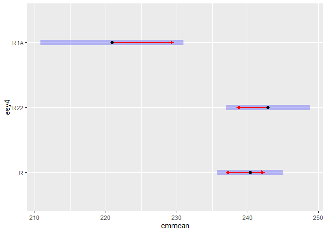<!-- -->

#### Habiat type x Site type

``` r
(emm <- emmeans(
  m_1,
  revpairwise ~ esy4 + site.type,
  type = "response"
  ))
```

    ## $emmeans
    ##  esy4 site.type emmean   SE  df lower.CL upper.CL
    ##  R    positive     226 4.75 261      217      236
    ##  R22  positive     234 5.75 418      222      245
    ##  R1A  positive  nonEst   NA  NA       NA       NA
    ##  R    restored     234 2.61 282      229      239
    ##  R22  restored     243 2.72 308      238      248
    ##  R1A  restored  nonEst   NA  NA       NA       NA
    ##  R    negative     261 4.48 211      252      269
    ##  R22  negative     253 6.50 530      240      265
    ##  R1A  negative  nonEst   NA  NA       NA       NA
    ## 
    ## Results are averaged over the levels of: eco.id, obs.year 
    ## Degrees-of-freedom method: kenward-roger 
    ## Confidence level used: 0.95 
    ## 
    ## $contrasts
    ##  contrast                    estimate    SE  df t.ratio p.value
    ##  R22 positive - R positive      7.341  5.04 588   1.457  0.7354
    ##  R1A positive - R positive     nonEst    NA  NA      NA      NA
    ##  R1A positive - R22 positive   nonEst    NA  NA      NA      NA
    ##  R restored - R positive        7.874  5.41 265   1.456  0.7357
    ##  R restored - R22 positive      0.533  6.28 390   0.085  1.0000
    ##  R restored - R1A positive     nonEst    NA  NA      NA      NA
    ##  R22 restored - R positive     16.494  5.47 271   3.014  0.0389
    ##  R22 restored - R22 positive    9.153  6.32 389   1.448  0.7403
    ##  R22 restored - R1A positive   nonEst    NA  NA      NA      NA
    ##  R22 restored - R restored      8.620  2.40 597   3.593  0.0056
    ##  R1A restored - R positive     nonEst    NA  NA      NA      NA
    ##  R1A restored - R22 positive   nonEst    NA  NA      NA      NA
    ##  R1A restored - R1A positive   11.607  8.27 492   1.403  0.7671
    ##  R1A restored - R restored     nonEst    NA  NA      NA      NA
    ##  R1A restored - R22 restored   nonEst    NA  NA      NA      NA
    ##  R negative - R positive       34.242  6.53 234   5.244  <.0001
    ##  R negative - R22 positive     26.900  7.29 321   3.688  0.0042
    ##  R negative - R1A positive     nonEst    NA  NA      NA      NA
    ##  R negative - R restored       26.367  5.19 226   5.082  <.0001
    ##  R negative - R22 restored     17.747  5.26 233   3.377  0.0129
    ##  R negative - R1A restored     nonEst    NA  NA      NA      NA
    ##  R22 negative - R positive     26.144  8.07 422   3.241  0.0189
    ##  R22 negative - R22 positive   18.803  8.67 480   2.169  0.2857
    ##  R22 negative - R1A positive   nonEst    NA  NA      NA      NA
    ##  R22 negative - R restored     18.270  7.01 491   2.607  0.1121
    ##  R22 negative - R22 restored    9.649  7.03 494   1.372  0.7845
    ##  R22 negative - R1A restored   nonEst    NA  NA      NA      NA
    ##  R22 negative - R negative     -8.098  5.73 584  -1.412  0.7616
    ##  R1A negative - R positive     nonEst    NA  NA      NA      NA
    ##  R1A negative - R22 positive   nonEst    NA  NA      NA      NA
    ##  R1A negative - R1A positive   31.896 14.90 463   2.141  0.3009
    ##  R1A negative - R restored     nonEst    NA  NA      NA      NA
    ##  R1A negative - R22 restored   nonEst    NA  NA      NA      NA
    ##  R1A negative - R1A restored   20.290 14.00 456   1.452  0.7379
    ##  R1A negative - R negative     nonEst    NA  NA      NA      NA
    ##  R1A negative - R22 negative   nonEst    NA  NA      NA      NA
    ## 
    ## Results are averaged over the levels of: eco.id, obs.year 
    ## Degrees-of-freedom method: kenward-roger 
    ## P value adjustment: tukey method for comparing a family of 6.52079728939615 estimates

``` r
plot(emm, comparison = TRUE)
```

    ## Warning: Removed 3 rows containing missing values or values outside the scale range
    ## (`geom_point()`).

    ## Warning: Removed 3 rows containing missing values or values outside the scale range
    ## (`geom_segment()`).

    ## Warning: Removed 3 rows containing missing values or values outside the scale range
    ## (`geom_point()`).

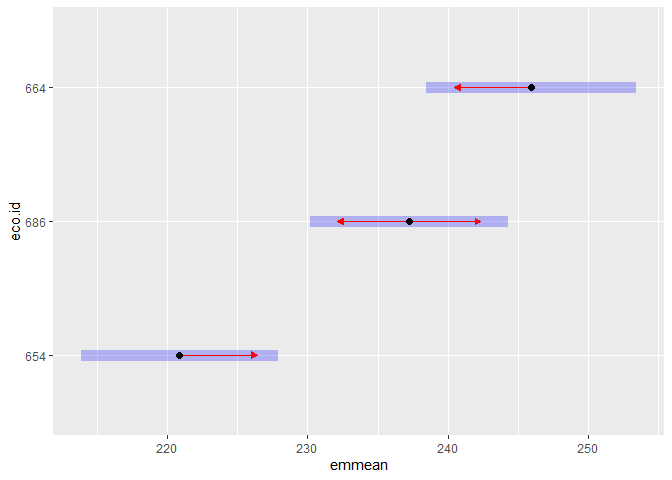<!-- -->

# Session info

    ## R version 4.4.2 (2024-10-31 ucrt)
    ## Platform: x86_64-w64-mingw32/x64
    ## Running under: Windows 11 x64 (build 26100)
    ## 
    ## Matrix products: default
    ## 
    ## 
    ## locale:
    ## [1] LC_COLLATE=German_Germany.utf8  LC_CTYPE=German_Germany.utf8   
    ## [3] LC_MONETARY=German_Germany.utf8 LC_NUMERIC=C                   
    ## [5] LC_TIME=German_Germany.utf8    
    ## 
    ## time zone: Europe/Berlin
    ## tzcode source: internal
    ## 
    ## attached base packages:
    ## [1] stats     graphics  grDevices utils     datasets  methods   base     
    ## 
    ## other attached packages:
    ##  [1] emmeans_1.11.0   DHARMa_0.4.7     patchwork_1.2.0  ggbeeswarm_0.7.2
    ##  [5] lubridate_1.9.3  forcats_1.0.0    stringr_1.5.1    dplyr_1.1.4     
    ##  [9] purrr_1.0.2      readr_2.1.5      tidyr_1.3.1      tibble_3.2.1    
    ## [13] ggplot2_3.5.1    tidyverse_2.0.0  here_1.0.1      
    ## 
    ## loaded via a namespace (and not attached):
    ##  [1] Rdpack_2.6.3       gridExtra_2.3      rlang_1.1.4        magrittr_2.0.3    
    ##  [5] compiler_4.4.2     mgcv_1.9-1         vctrs_0.6.5        pkgconfig_2.0.3   
    ##  [9] crayon_1.5.3       fastmap_1.2.0      backports_1.5.0    labeling_0.4.3    
    ## [13] utf8_1.2.4         ggstance_0.3.7     promises_1.3.2     rmarkdown_2.27    
    ## [17] tzdb_0.4.0         nloptr_2.2.1       bit_4.0.5          xfun_0.45         
    ## [21] highr_0.11         later_1.4.1        broom_1.0.6        parallel_4.4.2    
    ## [25] R6_2.5.1           gap.datasets_0.0.6 stringi_1.8.4      qgam_1.3.4        
    ## [29] car_3.1-3          boot_1.3-31        estimability_1.5.1 Rcpp_1.0.14       
    ## [33] iterators_1.0.14   knitr_1.48         parameters_0.24.2  httpuv_1.6.15     
    ## [37] Matrix_1.7-0       splines_4.4.2      timechange_0.3.0   tidyselect_1.2.1  
    ## [41] rstudioapi_0.16.0  abind_1.4-8        yaml_2.3.9         MuMIn_1.48.11     
    ## [45] doParallel_1.0.17  codetools_0.2-20   lattice_0.22-6     plyr_1.8.9        
    ## [49] shiny_1.10.0       withr_3.0.0        bayestestR_0.15.2  evaluate_0.24.0   
    ## [53] pillar_1.9.0       gap_1.6            carData_3.0-5      foreach_1.5.2     
    ## [57] stats4_4.4.2       reformulas_0.4.0   insight_1.1.0      generics_0.1.3    
    ## [61] vroom_1.6.5        rprojroot_2.0.4    hms_1.1.3          munsell_0.5.1     
    ## [65] scales_1.3.0       minqa_1.2.8        xtable_1.8-4       glue_1.7.0        
    ## [69] tools_4.4.2        lme4_1.1-37        mvtnorm_1.3-3      grid_4.4.2        
    ## [73] rbibutils_2.3      datawizard_1.0.2   colorspace_2.1-0   nlme_3.1-164      
    ## [77] Rmisc_1.5.1        performance_0.13.0 beeswarm_0.4.0     vipor_0.4.7       
    ## [81] Formula_1.2-5      cli_3.6.3          fansi_1.0.6        gtable_0.3.5      
    ## [85] digest_0.6.36      pbkrtest_0.5.3     farver_2.1.2       htmltools_0.5.8.1 
    ## [89] lifecycle_1.0.4    mime_0.12          bit64_4.0.5        dotwhisker_0.8.3  
    ## [93] MASS_7.3-60.2
