Analysis of Bauer et al. (submitted) Functional traits of grasslands:
<br> Community weighted mean of canopy height per plot (esy4)
================
<b>Markus Bauer</b> <br>
<b>2025-06-20</b>

- [Preparation](#preparation)
- [Statistics](#statistics)
  - [Data exploration](#data-exploration)
    - [Means and deviations](#means-and-deviations)
    - [Graphs of raw data (Step 2, 6,
      7)](#graphs-of-raw-data-step-2-6-7)
    - [Outliers, zero-inflation, transformations? (Step 1, 3,
      4)](#outliers-zero-inflation-transformations-step-1-3-4)
    - [Check collinearity part 1 (Step
      5)](#check-collinearity-part-1-step-5)
  - [Models](#models)
  - [Model check](#model-check)
    - [DHARMa](#dharma)
    - [Check collinearity part 2 (Step
      5)](#check-collinearity-part-2-step-5)
  - [Model comparison](#model-comparison)
    - [<i>R</i><sup>2</sup> values](#r2-values)
    - [AICc](#aicc)
  - [Predicted values](#predicted-values)
    - [Summary table](#summary-table)
    - [Forest plot](#forest-plot)
    - [Effect sizes](#effect-sizes)
- [Session info](#session-info)

<br/> <br/> <b>Markus Bauer</b>

Technichal University of Munich, TUM School of Life Sciences, Chair of
Restoration Ecology, Emil-Ramann-Straße 6, 85354 Freising, Germany

<markus1.bauer@tum.de>

ORCiD ID: [0000-0001-5372-4174](https://orcid.org/0000-0001-5372-4174)
<br> [Google
Scholar](https://scholar.google.de/citations?user=oHhmOkkAAAAJ&hl=de&oi=ao)
<br> GitHub: [markus1bauer](https://github.com/markus1bauer)

> **NOTE:** To compare different models, you only have to change the
> models in the section ‘Load models’

# Preparation

Protocol of data exploration (Steps 1-8) used from Zuur et al. (2010)
Methods Ecol Evol [DOI:
10.1111/2041-210X.12577](https://doi.org/10.1111/2041-210X.12577)

#### Packages

``` r
library(here)
library(tidyverse)
library(ggbeeswarm)
library(patchwork)
library(DHARMa)
library(emmeans)
```

#### Load data

``` r
sites <- read_csv(
  here("data", "processed", "data_processed_sites_esy4.csv"),
  col_names = TRUE, na = c("na", "NA", ""), col_types = cols(
    .default = "?",
    eco.id = "f",
    region = col_factor(levels = c("north", "centre", "south"), ordered = TRUE),
    site.type = col_factor(
      levels = c("positive", "restored", "negative"), ordered = TRUE
      ),
    fertilized = "f",
    obs.year = "f",
    hydrology = "f",
    mngm.type = "f"
  )
) %>%
  mutate(
    esy4 = fct_relevel(esy4, "R", "R22", "R1A"),
    eco.id = factor(eco.id)
    ) %>%
  rename(y = cwm.abu.height) %>%
  filter(y < 1) # see section Outliers: Exclude site N_DAM (more or less only the tall grass Arrhenatherum elatius germinated at this young restoration site)
```

# Statistics

## Data exploration

### Means and deviations

``` r
Rmisc::CI(sites$y, ci = .95)
```

    ##     upper      mean     lower 
    ## 0.4776193 0.4676948 0.4577703

``` r
median(sites$y)
```

    ## [1] 0.47

``` r
sd(sites$y)
```

    ## [1] 0.1254282

``` r
quantile(sites$y, probs = c(0.05, 0.95), na.rm = TRUE)
```

    ##   5%  95% 
    ## 0.27 0.68

``` r
sites %>% count(eco.id)
```

    ## # A tibble: 3 × 2
    ##   eco.id     n
    ##   <fct>  <int>
    ## 1 654      202
    ## 2 664      199
    ## 3 686      215

``` r
sites %>% count(site.type)
```

    ## # A tibble: 3 × 2
    ##   site.type     n
    ##   <ord>     <int>
    ## 1 positive    102
    ## 2 restored    396
    ## 3 negative    118

``` r
sites %>% count(esy4)
```

    ## # A tibble: 3 × 2
    ##   esy4      n
    ##   <fct> <int>
    ## 1 R       327
    ## 2 R22     208
    ## 3 R1A      81

``` r
sites %>% count(esy4, eco.id)
```

    ## # A tibble: 8 × 3
    ##   esy4  eco.id     n
    ##   <fct> <fct>  <int>
    ## 1 R     654      101
    ## 2 R     664      110
    ## 3 R     686      116
    ## 4 R22   654       48
    ## 5 R22   664       89
    ## 6 R22   686       71
    ## 7 R1A   654       53
    ## 8 R1A   686       28

``` r
sites %>% count(esy4, site.type)
```

    ## # A tibble: 9 × 3
    ##   esy4  site.type     n
    ##   <fct> <ord>     <int>
    ## 1 R     positive     57
    ## 2 R     restored    177
    ## 3 R     negative     93
    ## 4 R22   positive     25
    ## 5 R22   restored    167
    ## 6 R22   negative     16
    ## 7 R1A   positive     20
    ## 8 R1A   restored     52
    ## 9 R1A   negative      9

### Graphs of raw data (Step 2, 6, 7)

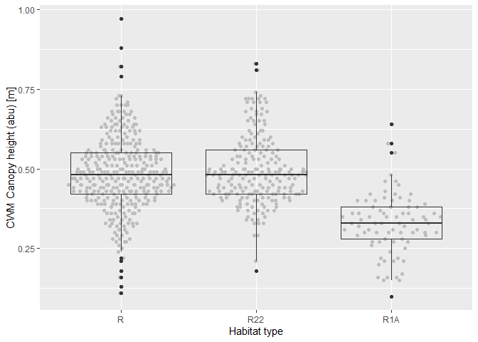<!-- -->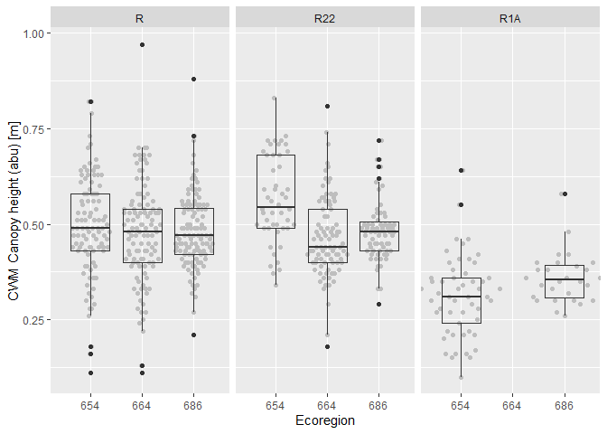<!-- -->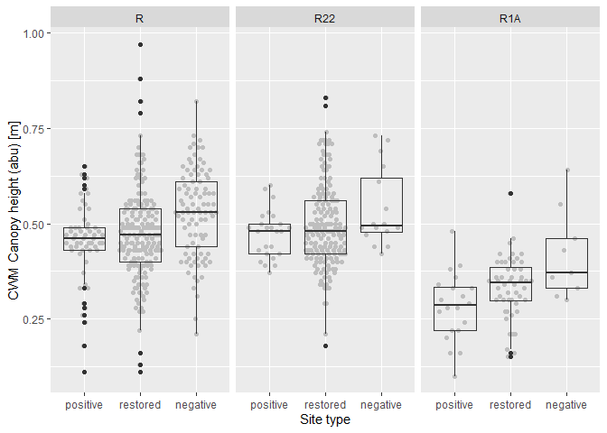<!-- --><!-- -->

### Outliers, zero-inflation, transformations? (Step 1, 3, 4)

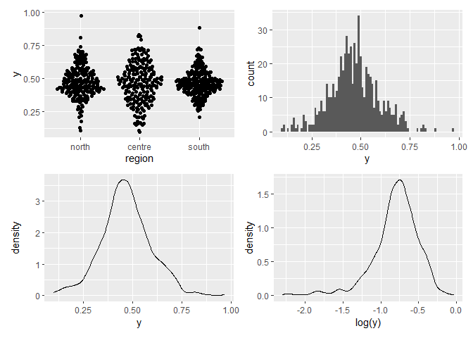<!-- -->

### Check collinearity part 1 (Step 5)

Exclude r \> 0.7 <br> Dormann et al. 2013 Ecography [DOI:
10.1111/j.1600-0587.2012.07348.x](https://doi.org/10.1111/j.1600-0587.2012.07348.x)

``` r
# sites %>%
#   select(where(is.numeric), -y, -starts_with("cwm.")) %>%
#   GGally::ggpairs(
#     lower = list(continuous = "smooth_loess")
#     ) +
#   theme(strip.text = element_text(size = 7))

# -> no continuous variables
```

## Models

> **NOTE:** Only here you have to modify the script to compare other
> models

``` r
load(file = here("outputs", "models", "model_height_esy4_2.Rdata"))
load(file = here("outputs", "models", "model_height_esy4_3.Rdata"))
m_1 <- m2
m_2 <- m3
```

``` r
m_1@call
## lmer(formula = y ~ esy4 * site.type + eco.id + obs.year + (1 | 
##     id.site), data = sites, REML = FALSE)
m_2@call
## lmer(formula = y ~ esy4 * (site.type + eco.id) + obs.year + hydrology + 
##     (1 | id.site), data = sites, REML = FALSE)
```

## Model check

### DHARMa

``` r
simulation_output_1 <- simulateResiduals(m_1, plot = TRUE)
```

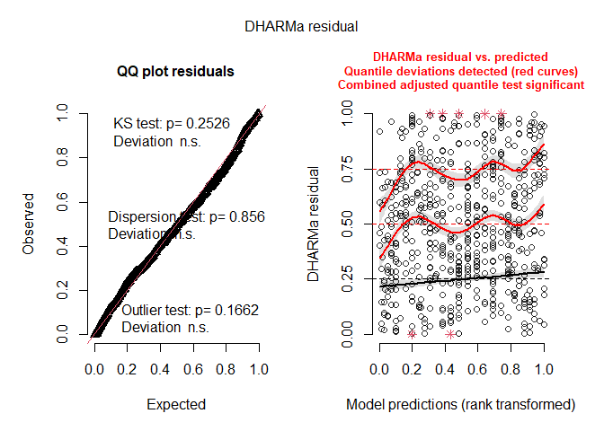<!-- -->

``` r
simulation_output_2 <- simulateResiduals(m_2, plot = TRUE)
```

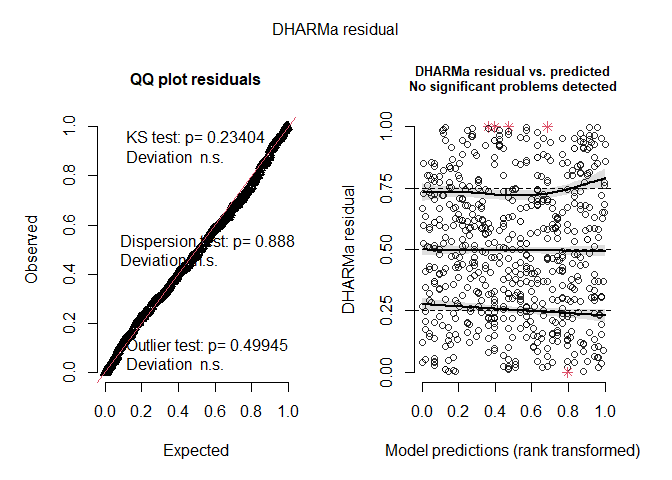<!-- -->

``` r
plotResiduals(simulation_output_1$scaledResiduals, sites$esy4)
```

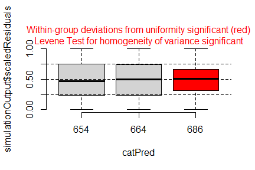<!-- -->

``` r
plotResiduals(simulation_output_2$scaledResiduals, sites$esy4)
```

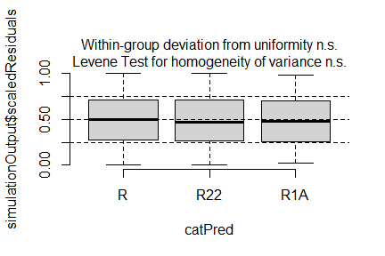<!-- -->

``` r
plotResiduals(simulation_output_1$scaledResiduals, sites$eco.id)
```

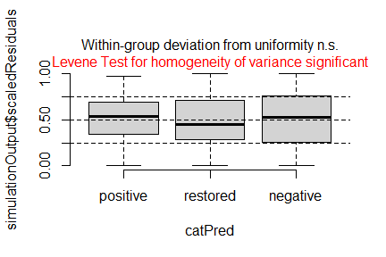<!-- -->

``` r
plotResiduals(simulation_output_2$scaledResiduals, sites$eco.id)
```

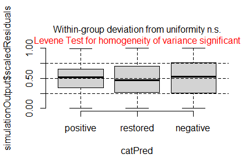<!-- -->

``` r
plotResiduals(simulation_output_1$scaledResiduals, sites$site.type)
```

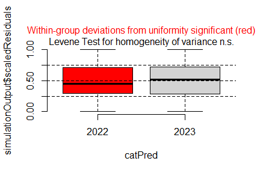<!-- -->

``` r
plotResiduals(simulation_output_2$scaledResiduals, sites$site.type)
```

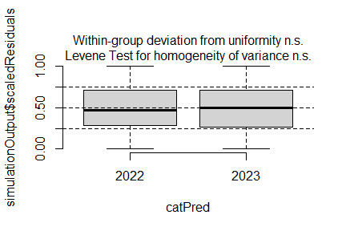<!-- -->

``` r
plotResiduals(simulation_output_1$scaledResiduals, sites$obs.year)
```

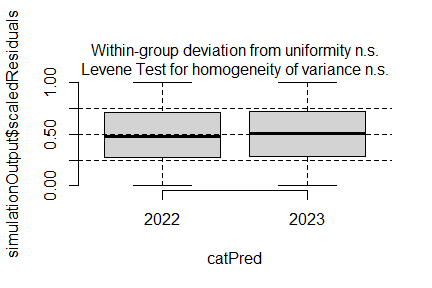<!-- -->

``` r
plotResiduals(simulation_output_2$scaledResiduals, sites$obs.year)
```

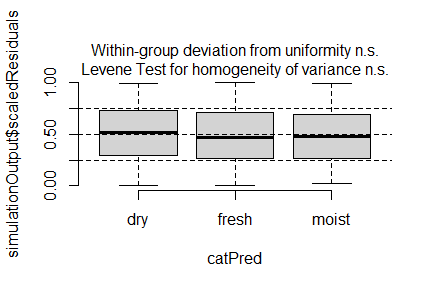<!-- -->

``` r
plotResiduals(simulation_output_1$scaledResiduals, sites$hydrology)
```

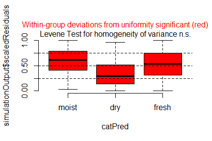<!-- -->

``` r
plotResiduals(simulation_output_2$scaledResiduals, sites$hydrology)
```

<!-- -->

``` r
plotResiduals(simulation_output_1$scaledResiduals, sites$fertilized)
```

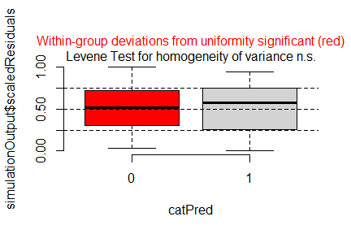<!-- -->

``` r
plotResiduals(simulation_output_2$scaledResiduals, sites$fertilized)
```

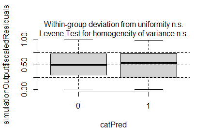<!-- -->

``` r
plotResiduals(simulation_output_1$scaledResiduals, sites$mngm.type)
```

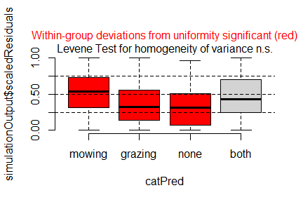<!-- -->

``` r
plotResiduals(simulation_output_2$scaledResiduals, sites$mngm.type)
```

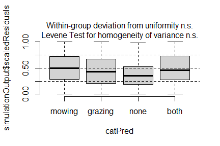<!-- -->

### Check collinearity part 2 (Step 5)

Remove VIF \> 3 or \> 10 <br> Zuur et al. 2010 Methods Ecol Evol [DOI:
10.1111/j.2041-210X.2009.00001.x](https://doi.org/10.1111/j.2041-210X.2009.00001.x)

``` r
car::vif(m_1)
```

    ##                    GVIF Df GVIF^(1/(2*Df))
    ## esy4           3.487008  2        1.366511
    ## site.type      1.433677  2        1.094241
    ## eco.id         1.070092  2        1.017080
    ## obs.year       1.020821  1        1.010357
    ## esy4:site.type 4.545232  4        1.208355

``` r
car::vif(m_2)
```

    ##                     GVIF Df GVIF^(1/(2*Df))
    ## esy4           12.555214  2        1.882374
    ## site.type       1.596349  2        1.124040
    ## eco.id          1.775060  2        1.154259
    ## obs.year        1.032335  1        1.016039
    ## hydrology       1.341390  2        1.076190
    ## esy4:site.type  5.158284  4        1.227618
    ## esy4:eco.id     9.836240  3        1.463766

## Model comparison

### <i>R</i><sup>2</sup> values

``` r
MuMIn::r.squaredGLMM(m_1)
##            R2m       R2c
## [1,] 0.1519338 0.6740039
MuMIn::r.squaredGLMM(m_2)
##            R2m       R2c
## [1,] 0.3118902 0.6957894
```

### AICc

Use AICc and not AIC since ratio n/K \< 40 <br> Burnahm & Anderson 2002
p. 66 ISBN: 978-0-387-95364-9

``` r
MuMIn::AICc(m_1, m_2) %>%
  arrange(AICc)
##     df      AICc
## m_2 19 -1220.935
## m_1 14 -1190.718
```

## Predicted values

### Summary table

``` r
car::Anova(m_2, type = 3)
```

    ## Analysis of Deviance Table (Type III Wald chisquare tests)
    ## 
    ## Response: y
    ##                   Chisq Df Pr(>Chisq)    
    ## (Intercept)    454.2336  1  < 2.2e-16 ***
    ## esy4            12.9914  2    0.00151 ** 
    ## site.type        8.4332  2    0.01475 *  
    ## eco.id           1.2761  2    0.52832    
    ## obs.year         2.6442  1    0.10393    
    ## hydrology       39.1188  2  3.202e-09 ***
    ## esy4:site.type   2.0074  4    0.73439    
    ## esy4:eco.id      2.2107  3    0.52985    
    ## ---
    ## Signif. codes:  0 '***' 0.001 '**' 0.01 '*' 0.05 '.' 0.1 ' ' 1

``` r
summary(m_2)
```

    ## Linear mixed model fit by maximum likelihood  ['lmerMod']
    ## Formula: y ~ esy4 * (site.type + eco.id) + obs.year + hydrology + (1 |  
    ##     id.site)
    ##    Data: sites
    ## 
    ##       AIC       BIC    logLik -2*log(L)  df.resid 
    ##   -1222.2   -1138.2     630.1   -1260.2       597 
    ## 
    ## Scaled residuals: 
    ##     Min      1Q  Median      3Q     Max 
    ## -3.2199 -0.5504  0.0267  0.4701  5.5476 
    ## 
    ## Random effects:
    ##  Groups   Name        Variance Std.Dev.
    ##  id.site  (Intercept) 0.005939 0.07706 
    ##  Residual             0.004706 0.06860 
    ## Number of obs: 616, groups:  id.site, 176
    ## 
    ## Fixed effects:
    ##                      Estimate Std. Error t value
    ## (Intercept)          0.422513   0.019824  21.313
    ## esy4R22              0.030833   0.017862   1.726
    ## esy4R1A             -0.070045   0.023888  -2.932
    ## site.type.L          0.044359   0.017162   2.585
    ## site.type.Q          0.013490   0.012528   1.077
    ## eco.id664           -0.020491   0.018736  -1.094
    ## eco.id686           -0.014544   0.018088  -0.804
    ## obs.year2023        -0.021419   0.013172  -1.626
    ## hydrologyfresh       0.094613   0.017296   5.470
    ## hydrologymoist       0.113187   0.019863   5.698
    ## esy4R22:site.type.L -0.011640   0.022400  -0.520
    ## esy4R1A:site.type.L  0.034487   0.040824   0.845
    ## esy4R22:site.type.Q -0.015240   0.015333  -0.994
    ## esy4R1A:site.type.Q  0.001186   0.028152   0.042
    ## esy4R22:eco.id664   -0.027419   0.022264  -1.232
    ## esy4R22:eco.id686   -0.021702   0.020536  -1.057
    ## esy4R1A:eco.id686    0.016524   0.031184   0.530

    ## 
    ## Correlation matrix not shown by default, as p = 17 > 12.
    ## Use print(x, correlation=TRUE)  or
    ##     vcov(x)        if you need it

    ## fit warnings:
    ## fixed-effect model matrix is rank deficient so dropping 1 column / coefficient

### Forest plot

``` r
dotwhisker::dwplot(
  list(m_1, m_2),
  ci = 0.95,
  show_intercept = FALSE,
  vline = geom_vline(xintercept = 0, colour = "grey60", linetype = 2)) +
  xlim(-0.2, 0.2) +
  theme_classic()
```

    ## Package 'merDeriv' needs to be installed to compute confidence intervals
    ##   for random effect parameters.
    ## Package 'merDeriv' needs to be installed to compute confidence intervals
    ##   for random effect parameters.

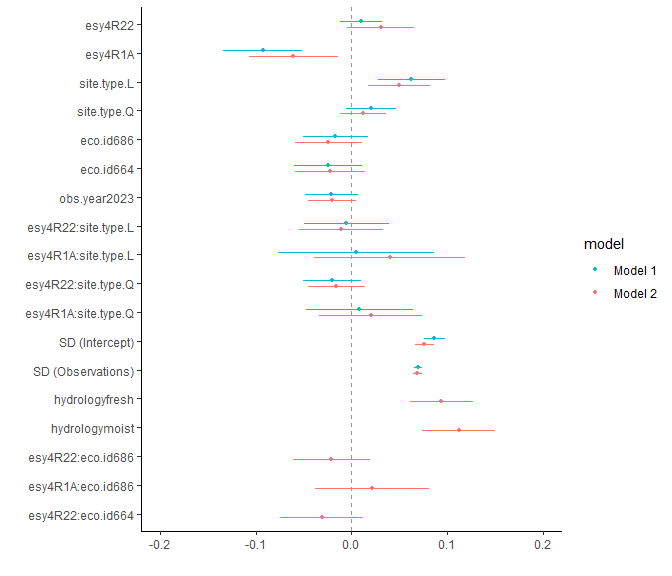<!-- -->

### Effect sizes

Effect sizes of chosen model just to get exact values of means etc. if
necessary.

#### ESY EUNIS Habitat type

``` r
(emm <- emmeans(
  m_2,
  revpairwise ~ esy4,
  type = "response"
  ))
```

    ## $emmeans
    ##  esy4 emmean      SE  df lower.CL upper.CL
    ##  R     0.469 0.00918 157    0.451    0.488
    ##  R22   0.484 0.01240 299    0.459    0.508
    ##  R1A  nonEst      NA  NA       NA       NA
    ## 
    ## Results are averaged over the levels of: site.type, eco.id, obs.year, hydrology 
    ## Degrees-of-freedom method: kenward-roger 
    ## Confidence level used: 0.95 
    ## 
    ## $contrasts
    ##  contrast  estimate     SE  df t.ratio p.value
    ##  R22 - R     0.0145 0.0113 580   1.275  0.2028
    ##  R1A - R     nonEst     NA  NA      NA      NA
    ##  R1A - R22   nonEst     NA  NA      NA      NA
    ## 
    ## Results are averaged over the levels of: site.type, eco.id, obs.year, hydrology 
    ## Degrees-of-freedom method: kenward-roger 
    ## P value adjustment: tukey method for comparing a family of 2 estimates

``` r
plot(emm, comparison = TRUE)
```

    ## Warning: Removed 1 row containing missing values or values outside the scale range
    ## (`geom_point()`).

    ## Warning: Removed 1 row containing missing values or values outside the scale range
    ## (`geom_segment()`).

    ## Warning: Removed 1 row containing missing values or values outside the scale range
    ## (`geom_point()`).

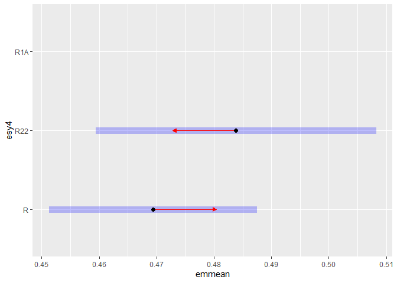<!-- -->

#### Habiat type x Region

``` r
(emm <- emmeans(
  m_2,
  revpairwise ~ eco.id | esy4,
  type = "response"
  ))
```

    ## $emmeans
    ## esy4 = R:
    ##  eco.id emmean     SE  df lower.CL upper.CL
    ##  654     0.481 0.0144 204    0.453    0.510
    ##  664     0.461 0.0144 219    0.432    0.489
    ##  686     0.467 0.0139 185    0.439    0.494
    ## 
    ## esy4 = R22:
    ##  eco.id emmean     SE  df lower.CL upper.CL
    ##  654     0.512 0.0194 376    0.474    0.550
    ##  664     0.464 0.0166 311    0.431    0.497
    ##  686     0.476 0.0170 310    0.442    0.509
    ## 
    ## esy4 = R1A:
    ##  eco.id emmean     SE  df lower.CL upper.CL
    ##  654     0.411 0.0229 194    0.366    0.456
    ##  664    nonEst     NA  NA       NA       NA
    ##  686     0.413 0.0298 414    0.354    0.472
    ## 
    ## Results are averaged over the levels of: site.type, obs.year, hydrology 
    ## Degrees-of-freedom method: kenward-roger 
    ## Confidence level used: 0.95 
    ## 
    ## $contrasts
    ## esy4 = R:
    ##  contrast              estimate     SE  df t.ratio p.value
    ##  eco.id664 - eco.id654 -0.02049 0.0193 236  -1.063  0.5378
    ##  eco.id686 - eco.id654 -0.01454 0.0186 257  -0.782  0.7146
    ##  eco.id686 - eco.id664  0.00595 0.0187 251   0.318  0.9458
    ## 
    ## esy4 = R22:
    ##  contrast              estimate     SE  df t.ratio p.value
    ##  eco.id664 - eco.id654 -0.04791 0.0226 387  -2.118  0.0876
    ##  eco.id686 - eco.id654 -0.03625 0.0224 408  -1.619  0.2386
    ##  eco.id686 - eco.id664  0.01166 0.0207 335   0.565  0.8390
    ## 
    ## esy4 = R1A:
    ##  contrast              estimate     SE  df t.ratio p.value
    ##  eco.id664 - eco.id654   nonEst     NA  NA      NA      NA
    ##  eco.id686 - eco.id654  0.00198 0.0310 413   0.064  0.9491
    ##  eco.id686 - eco.id664   nonEst     NA  NA      NA      NA
    ## 
    ## Results are averaged over the levels of: site.type, obs.year, hydrology 
    ## Degrees-of-freedom method: kenward-roger 
    ## P value adjustment: tukey method for varying family sizes

``` r
plot(emm, comparison = TRUE)
```

    ## Warning: Comparison discrepancy in group "R1A", eco.id654 - eco.id686:
    ##     Target overlap = 0.9675, overlap on graph = -0.7438

    ## Warning: Removed 1 row containing missing values or values outside the scale range
    ## (`geom_point()`).

    ## Warning: Removed 1 row containing missing values or values outside the scale range
    ## (`geom_segment()`).

    ## Warning: Removed 1 row containing missing values or values outside the scale range
    ## (`geom_point()`).

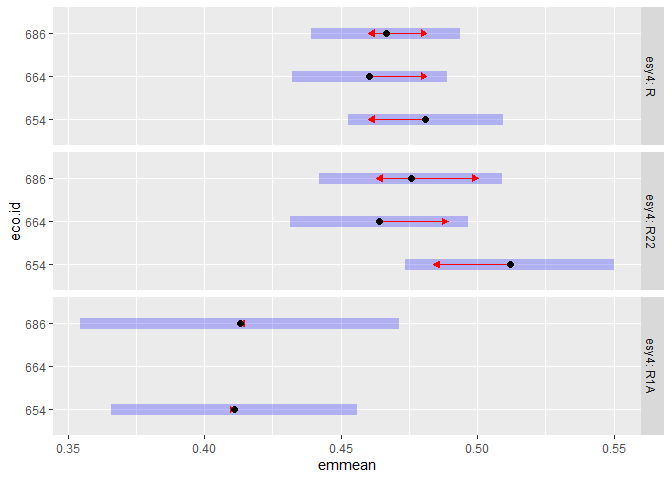<!-- -->

#### Habiat type x Site type

``` r
(emm <- emmeans(
  m_2,
  revpairwise ~ site.type | esy4,
  type = "response"
  ))
```

    ## $emmeans
    ## esy4 = R:
    ##  site.type emmean     SE  df lower.CL upper.CL
    ##  positive   0.444 0.0184 262    0.407    0.480
    ##  restored   0.458 0.0102 173    0.438    0.479
    ##  negative   0.506 0.0170 127    0.473    0.540
    ## 
    ## esy4 = R22:
    ##  site.type emmean     SE  df lower.CL upper.CL
    ##  positive   0.460 0.0230 449    0.415    0.505
    ##  restored   0.485 0.0110 143    0.464    0.507
    ##  negative   0.506 0.0261 381    0.455    0.558
    ## 
    ## esy4 = R1A:
    ##  site.type emmean     SE  df lower.CL upper.CL
    ##  positive  nonEst     NA  NA       NA       NA
    ##  restored  nonEst     NA  NA       NA       NA
    ##  negative  nonEst     NA  NA       NA       NA
    ## 
    ## Results are averaged over the levels of: eco.id, obs.year, hydrology 
    ## Degrees-of-freedom method: kenward-roger 
    ## Confidence level used: 0.95 
    ## 
    ## $contrasts
    ## esy4 = R:
    ##  contrast            estimate     SE  df t.ratio p.value
    ##  restored - positive   0.0148 0.0210 223   0.706  0.7599
    ##  negative - positive   0.0627 0.0250 177   2.509  0.0346
    ##  negative - restored   0.0479 0.0192 198   2.491  0.0360
    ## 
    ## esy4 = R22:
    ##  contrast            estimate     SE  df t.ratio p.value
    ##  restored - positive   0.0253 0.0254 339   0.996  0.5797
    ##  negative - positive   0.0463 0.0348 417   1.331  0.3786
    ##  negative - restored   0.0210 0.0277 472   0.758  0.7288
    ## 
    ## esy4 = R1A:
    ##  contrast            estimate     SE  df t.ratio p.value
    ##  restored - positive   0.0378 0.0340 446   1.113  0.5068
    ##  negative - positive   0.1115 0.0579 390   1.925  0.1329
    ##  negative - restored   0.0737 0.0538 375   1.371  0.3574
    ## 
    ## Results are averaged over the levels of: eco.id, obs.year, hydrology 
    ## Degrees-of-freedom method: kenward-roger 
    ## P value adjustment: tukey method for comparing a family of 3 estimates

``` r
plot(emm, comparison = TRUE)
```

    ## Warning: Removed 3 rows containing missing values or values outside the scale range
    ## (`geom_point()`).

    ## Warning: Removed 3 rows containing missing values or values outside the scale range
    ## (`geom_segment()`).

    ## Warning: Removed 3 rows containing missing values or values outside the scale range
    ## (`geom_point()`).

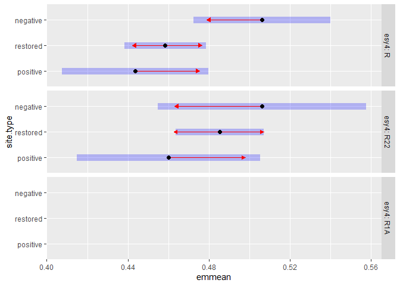<!-- -->

# Session info

    ## R version 4.5.0 (2025-04-11 ucrt)
    ## Platform: x86_64-w64-mingw32/x64
    ## Running under: Windows 11 x64 (build 26100)
    ## 
    ## Matrix products: default
    ##   LAPACK version 3.12.1
    ## 
    ## locale:
    ## [1] LC_COLLATE=German_Germany.utf8  LC_CTYPE=German_Germany.utf8   
    ## [3] LC_MONETARY=German_Germany.utf8 LC_NUMERIC=C                   
    ## [5] LC_TIME=German_Germany.utf8    
    ## 
    ## time zone: America/New_York
    ## tzcode source: internal
    ## 
    ## attached base packages:
    ## [1] stats     graphics  grDevices utils     datasets  methods   base     
    ## 
    ## other attached packages:
    ##  [1] emmeans_1.11.1   DHARMa_0.4.7     patchwork_1.3.0  ggbeeswarm_0.7.2
    ##  [5] lubridate_1.9.4  forcats_1.0.0    stringr_1.5.1    dplyr_1.1.4     
    ##  [9] purrr_1.0.4      readr_2.1.5      tidyr_1.3.1      tibble_3.2.1    
    ## [13] ggplot2_3.5.2    tidyverse_2.0.0  here_1.0.1      
    ## 
    ## loaded via a namespace (and not attached):
    ##  [1] Rdpack_2.6.4           gridExtra_2.3          sandwich_3.1-1        
    ##  [4] rlang_1.1.6            magrittr_2.0.3         multcomp_1.4-28       
    ##  [7] compiler_4.5.0         mgcv_1.9-1             vctrs_0.6.5           
    ## [10] pkgconfig_2.0.3        crayon_1.5.3           fastmap_1.2.0         
    ## [13] backports_1.5.0        labeling_0.4.3         utf8_1.2.5            
    ## [16] ggstance_0.3.7         promises_1.3.2         rmarkdown_2.29        
    ## [19] tzdb_0.5.0             nloptr_2.2.1           bit_4.6.0             
    ## [22] xfun_0.52              later_1.4.2            broom_1.0.8           
    ## [25] parallel_4.5.0         R6_2.6.1               gap.datasets_0.0.6    
    ## [28] stringi_1.8.7          qgam_2.0.0             RColorBrewer_1.1-3    
    ## [31] car_3.1-3              boot_1.3-31            estimability_1.5.1    
    ## [34] Rcpp_1.0.14            iterators_1.0.14       knitr_1.50            
    ## [37] zoo_1.8-14             parameters_0.25.0      httpuv_1.6.16         
    ## [40] Matrix_1.7-3           splines_4.5.0          timechange_0.3.0      
    ## [43] tidyselect_1.2.1       rstudioapi_0.17.1      abind_1.4-8           
    ## [46] yaml_2.3.10            MuMIn_1.48.11          doParallel_1.0.17     
    ## [49] codetools_0.2-20       lattice_0.22-6         plyr_1.8.9            
    ## [52] bayestestR_0.15.3      shiny_1.10.0           withr_3.0.2           
    ## [55] evaluate_1.0.3         marginaleffects_0.25.1 survival_3.8-3        
    ## [58] pillar_1.10.2          gap_1.6                carData_3.0-5         
    ## [61] foreach_1.5.2          stats4_4.5.0           reformulas_0.4.1      
    ## [64] insight_1.2.0          generics_0.1.4         vroom_1.6.5           
    ## [67] rprojroot_2.0.4        hms_1.1.3              scales_1.4.0          
    ## [70] minqa_1.2.8            xtable_1.8-4           glue_1.8.0            
    ## [73] tools_4.5.0            data.table_1.17.2      lme4_1.1-37           
    ## [76] mvtnorm_1.3-3          grid_4.5.0             rbibutils_2.3         
    ## [79] datawizard_1.1.0       nlme_3.1-168           Rmisc_1.5.1           
    ## [82] performance_0.13.0     beeswarm_0.4.0         vipor_0.4.7           
    ## [85] Formula_1.2-5          cli_3.6.5              gtable_0.3.6          
    ## [88] digest_0.6.37          pbkrtest_0.5.4         TH.data_1.1-3         
    ## [91] farver_2.1.2           htmltools_0.5.8.1      lifecycle_1.0.4       
    ## [94] mime_0.13              bit64_4.6.0-1          dotwhisker_0.8.4      
    ## [97] MASS_7.3-65
