Analysis of Bauer et al. (submitted) Functional traits of grasslands:
<br> Average community weighted mean of seed mass per block (esy16)
================
<b>Markus Bauer</b> <br>
<b>2025-05-05</b>

- [Preparation](#preparation)
- [Statistics](#statistics)
  - [Data exploration](#data-exploration)
    - [Means and deviations](#means-and-deviations)
    - [Graphs of raw data (Step 2, 6,
      7)](#graphs-of-raw-data-step-2-6-7)
    - [Outliers, zero-inflation, transformations? (Step 1, 3,
      4)](#outliers-zero-inflation-transformations-step-1-3-4)
    - [Check collinearity part 1 (Step
      5)](#check-collinearity-part-1-step-5)
  - [Models](#models)
  - [Model check](#model-check)
    - [DHARMa](#dharma)
    - [Check collinearity part 2 (Step
      5)](#check-collinearity-part-2-step-5)
  - [Model comparison](#model-comparison)
    - [<i>R</i><sup>2</sup> values](#r2-values)
    - [AICc](#aicc)
  - [Predicted values](#predicted-values)
    - [Summary table](#summary-table)
    - [Forest plot](#forest-plot)
    - [Effect sizes](#effect-sizes)
- [Session info](#session-info)

<br/> <br/> <b>Markus Bauer</b>

Technichal University of Munich, TUM School of Life Sciences, Chair of
Restoration Ecology, Emil-Ramann-Straße 6, 85354 Freising, Germany

<markus1.bauer@tum.de>

ORCiD ID: [0000-0001-5372-4174](https://orcid.org/0000-0001-5372-4174)
<br> [Google
Scholar](https://scholar.google.de/citations?user=oHhmOkkAAAAJ&hl=de&oi=ao)
<br> GitHub: [markus1bauer](https://github.com/markus1bauer)

> **NOTE:** To compare different models, you only have to change the
> models in the section ‘Load models’

# Preparation

Protocol of data exploration (Steps 1-8) used from Zuur et al. (2010)
Methods Ecol Evol [DOI:
10.1111/2041-210X.12577](https://doi.org/10.1111/2041-210X.12577)

#### Packages

``` r
library(here)
library(tidyverse)
library(ggbeeswarm)
library(patchwork)
library(DHARMa)
library(emmeans)
```

#### Load data

``` r
sites <- read_csv(
  here("data", "processed", "data_processed_sites_esy16.csv"),
  col_names = TRUE, na = c("na", "NA", ""), col_types = cols(
    .default = "?",
    eco.id = "f",
    region = col_factor(levels = c("north", "centre", "south"), ordered = TRUE),
    site.type = col_factor(
      levels = c("positive", "restored", "negative"), ordered = TRUE
      ),
    fertilized = "f",
    freq.mow = "f",
    obs.year = "f"
  )
) %>%
  filter(esy16 %in% c("R", "R22", "R1A") & !(eco.id == 647)) %>%
  mutate(
    esy16 = fct_relevel(esy16, "R", "R22", "R1A"),
    eco.id = factor(eco.id)
    ) %>%
  rename(y = cwm.abu.seedmass.mean)
```

# Statistics

## Data exploration

### Means and deviations

``` r
Rmisc::CI(sites$y, ci = .95)
```

    ##       upper        mean       lower 
    ## 0.001650986 0.001511676 0.001372367

``` r
median(sites$y)
```

    ## [1] 0.0012675

``` r
sd(sites$y)
```

    ## [1] 0.0009283026

``` r
quantile(sites$y, probs = c(0.05, 0.95), na.rm = TRUE)
```

    ##        5%       95% 
    ## 0.0004985 0.0033060

``` r
sites %>% count(eco.id)
```

    ## # A tibble: 3 × 2
    ##   eco.id     n
    ##   <fct>  <int>
    ## 1 654       55
    ## 2 686       62
    ## 3 664       56

``` r
sites %>% count(site.type)
```

    ## # A tibble: 3 × 2
    ##   site.type     n
    ##   <ord>     <int>
    ## 1 positive     31
    ## 2 restored    109
    ## 3 negative     33

``` r
sites %>% count(esy16)
```

    ## # A tibble: 3 × 2
    ##   esy16     n
    ##   <fct> <int>
    ## 1 R        85
    ## 2 R22      64
    ## 3 R1A      24

``` r
sites %>% count(esy16, eco.id)
```

    ## # A tibble: 8 × 3
    ##   esy16 eco.id     n
    ##   <fct> <fct>  <int>
    ## 1 R     654       25
    ## 2 R     686       31
    ## 3 R     664       29
    ## 4 R22   654       15
    ## 5 R22   686       22
    ## 6 R22   664       27
    ## 7 R1A   654       15
    ## 8 R1A   686        9

``` r
sites %>% count(esy16, site.type)
```

    ## # A tibble: 9 × 3
    ##   esy16 site.type     n
    ##   <fct> <ord>     <int>
    ## 1 R     positive     17
    ## 2 R     restored     45
    ## 3 R     negative     23
    ## 4 R22   positive      8
    ## 5 R22   restored     49
    ## 6 R22   negative      7
    ## 7 R1A   positive      6
    ## 8 R1A   restored     15
    ## 9 R1A   negative      3

### Graphs of raw data (Step 2, 6, 7)

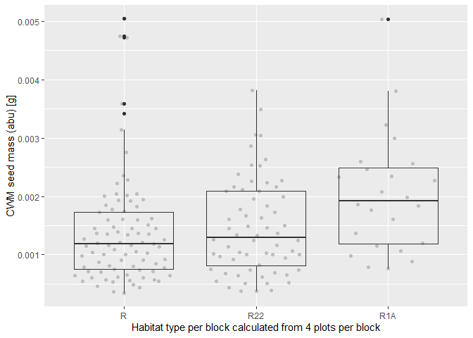<!-- -->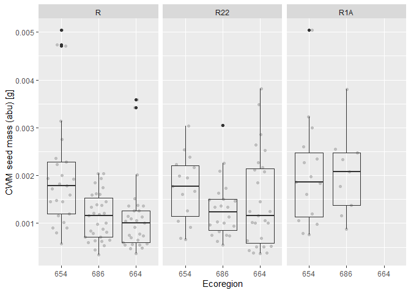<!-- -->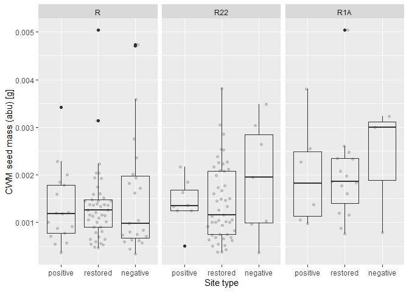<!-- -->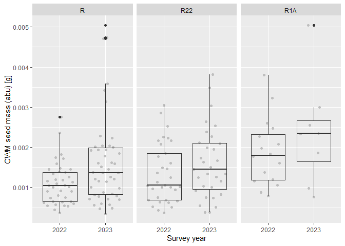<!-- -->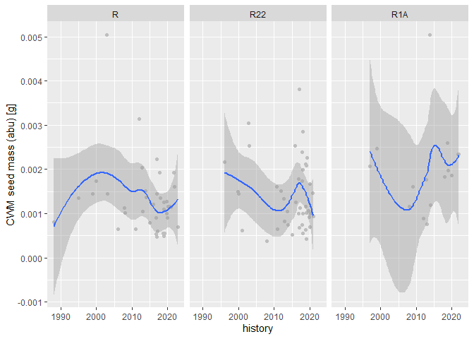<!-- -->

### Outliers, zero-inflation, transformations? (Step 1, 3, 4)

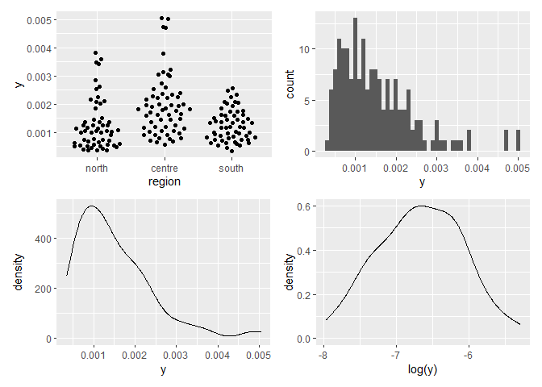<!-- -->

### Check collinearity part 1 (Step 5)

Exclude r \> 0.7 <br> Dormann et al. 2013 Ecography [DOI:
10.1111/j.1600-0587.2012.07348.x](https://doi.org/10.1111/j.1600-0587.2012.07348.x)

``` r
# sites %>%
#   select(where(is.numeric), -y, -starts_with("cwm.")) %>%
#   GGally::ggpairs(
#     lower = list(continuous = "smooth_loess")
#     ) +
#   theme(strip.text = element_text(size = 7))

# -> no continuous variables
```

## Models

> **NOTE:** Only here you have to modify the script to compare other
> models

``` r
load(file = here("outputs", "models", "model_seedmass_esy16_1.Rdata"))
load(file = here("outputs", "models", "model_seedmass_esy16_2.Rdata"))
m_1 <- m1
m_2 <- m2
```

``` r
m_1$call
## lm(formula = y ~ esy16 * (site.type + eco.id) + obs.year, data = sites)
m_2$call
## lm(formula = y ~ esy16 * site.type + eco.id + obs.year, data = sites)
```

## Model check

### DHARMa

``` r
simulation_output_1 <- simulateResiduals(m_1, plot = TRUE)
```

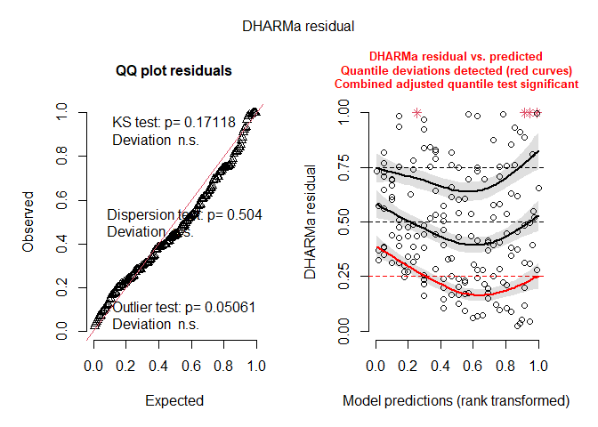<!-- -->

``` r
simulation_output_2 <- simulateResiduals(m_2, plot = TRUE)
```

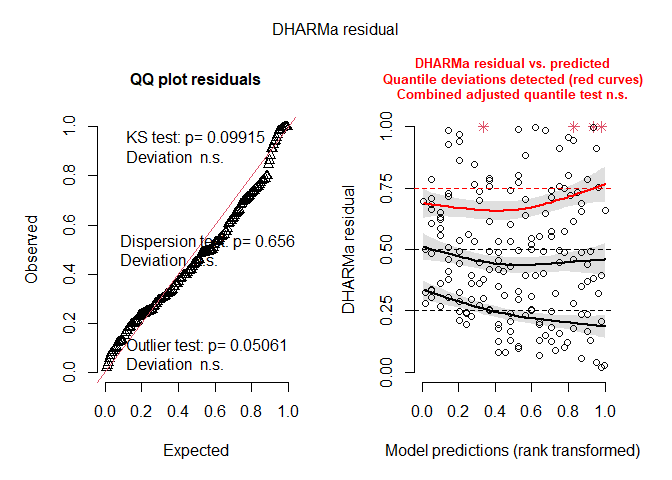<!-- -->

``` r
plotResiduals(simulation_output_1$scaledResiduals, sites$eco.id)
```

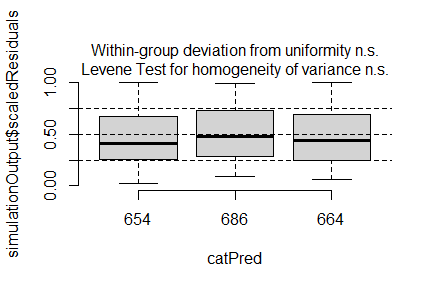<!-- -->

``` r
plotResiduals(simulation_output_2$scaledResiduals, sites$eco.id)
```

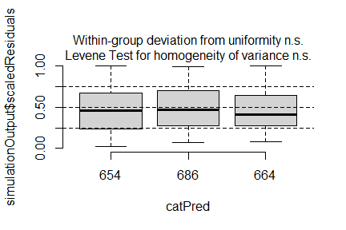<!-- -->

``` r
plotResiduals(simulation_output_1$scaledResiduals, sites$site.type)
```

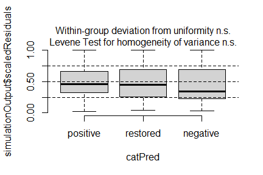<!-- -->

``` r
plotResiduals(simulation_output_2$scaledResiduals, sites$site.type)
```

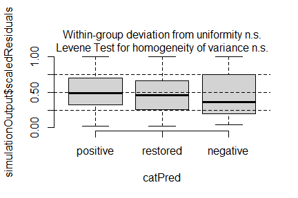<!-- -->

``` r
plotResiduals(simulation_output_1$scaledResiduals, sites$obs.year)
```

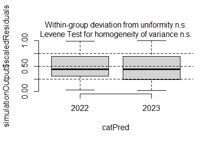<!-- -->

``` r
plotResiduals(simulation_output_2$scaledResiduals, sites$obs.year)
```

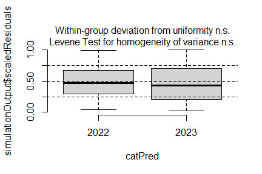<!-- -->

``` r
plotResiduals(simulation_output_1$scaledResiduals, sites$history)
```

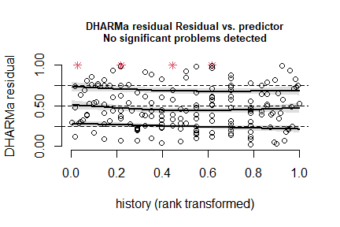<!-- -->

``` r
plotResiduals(simulation_output_2$scaledResiduals, sites$history)
```

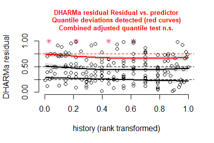<!-- -->

``` r
plotResiduals(simulation_output_1$scaledResiduals, sites$hydrology)
## Warning in ensurePredictor(simulationOutput, form): DHARMa:::ensurePredictor:
## character string was provided as predictor. DHARMa has converted to factor
## automatically. To remove this warning, please convert to factor before
## attempting to plot with DHARMa.
```

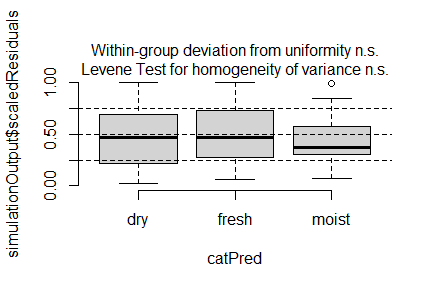<!-- -->

``` r
plotResiduals(simulation_output_2$scaledResiduals, sites$hydrology)
## Warning in ensurePredictor(simulationOutput, form): DHARMa:::ensurePredictor:
## character string was provided as predictor. DHARMa has converted to factor
## automatically. To remove this warning, please convert to factor before
## attempting to plot with DHARMa.
```

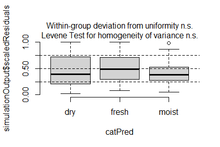<!-- -->

``` r
plotResiduals(simulation_output_1$scaledResiduals, sites$land.use.hist)
## Warning in ensurePredictor(simulationOutput, form): DHARMa:::ensurePredictor:
## character string was provided as predictor. DHARMa has converted to factor
## automatically. To remove this warning, please convert to factor before
## attempting to plot with DHARMa.
```

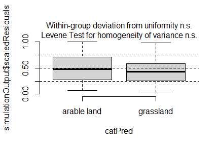<!-- -->

``` r
plotResiduals(simulation_output_2$scaledResiduals, sites$land.use.hist)
## Warning in ensurePredictor(simulationOutput, form): DHARMa:::ensurePredictor:
## character string was provided as predictor. DHARMa has converted to factor
## automatically. To remove this warning, please convert to factor before
## attempting to plot with DHARMa.
```

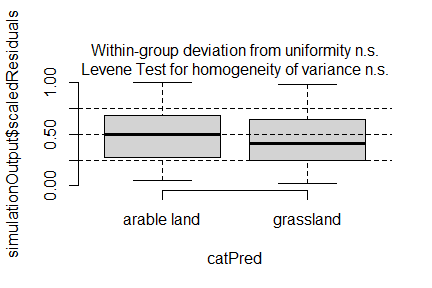<!-- -->

``` r
plotResiduals(simulation_output_1$scaledResiduals, sites$fertilized)
```

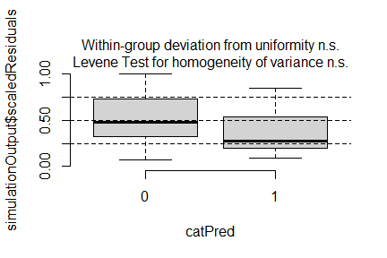<!-- -->

``` r
plotResiduals(simulation_output_2$scaledResiduals, sites$fertilized)
```

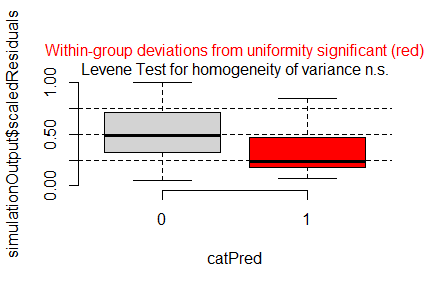<!-- -->

``` r
plotResiduals(simulation_output_1$scaledResiduals, sites$freq.mow)
```

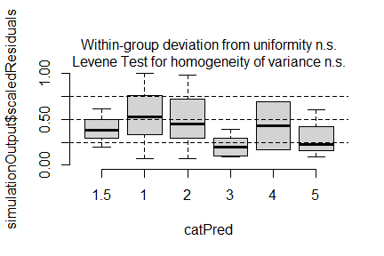<!-- -->

``` r
plotResiduals(simulation_output_2$scaledResiduals, sites$freq.mow)
```

<!-- -->

### Check collinearity part 2 (Step 5)

Remove VIF \> 3 or \> 10 <br> Zuur et al. 2010 Methods Ecol Evol [DOI:
10.1111/j.2041-210X.2009.00001.x](https://doi.org/10.1111/j.2041-210X.2009.00001.x)

``` r
car::vif(m_1, type = "predictor")
```

    ## Warning in cor(X): Standardabweichung ist Null

    ## GVIFs computed for predictors

    ##           GVIF Df GVIF^(1/(2*Df))    Interacts With         Other Predictors
    ## esy16       NA 14              NA site.type, eco.id                 obs.year
    ## site.type   NA  8              NA             esy16         eco.id, obs.year
    ## eco.id      NA  8              NA             esy16      site.type, obs.year
    ## obs.year    NA  1              NA              --   esy16, site.type, eco.id

``` r
car::vif(m_2)
```

    ## there are higher-order terms (interactions) in this model
    ## consider setting type = 'predictor'; see ?vif

    ##                     GVIF Df GVIF^(1/(2*Df))
    ## esy16           2.848953  2        1.299186
    ## site.type       3.169306  2        1.334262
    ## eco.id          1.169420  2        1.039902
    ## obs.year        1.047374  1        1.023413
    ## esy16:site.type 7.205665  4        1.279998

## Model comparison

### <i>R</i><sup>2</sup> values

``` r
MuMIn::r.squaredGLMM(m_1)
##            R2m       R2c
## [1,] 0.2214462 0.2214462
MuMIn::r.squaredGLMM(m_2)
##            R2m       R2c
## [1,] 0.1862143 0.1862143
```

### AICc

Use AICc and not AIC since ratio n/K \< 40 <br> Burnahm & Anderson 2002
p. 66 ISBN: 978-0-387-95364-9

``` r
MuMIn::AICc(m_1, m_2) %>%
  arrange(AICc)
##     df      AICc
## m_1 16 -1937.054
## m_2 13 -1935.421
```

## Predicted values

### Summary table

``` r
car::Anova(m_1, type = 2)
```

    ## Note: model has aliased coefficients
    ##       sums of squares computed by model comparison

    ## Anova Table (Type II tests)
    ## 
    ## Response: y
    ##                     Sum Sq  Df F value    Pr(>F)    
    ## esy16           5.9850e-06   2  4.1774 0.0170647 *  
    ## site.type       2.0550e-06   2  1.4343 0.2413615    
    ## eco.id          1.0283e-05   2  7.1780 0.0010380 ** 
    ## obs.year        8.2080e-06   1 11.4583 0.0008979 ***
    ## esy16:site.type 3.1700e-07   4  0.1107 0.9786462    
    ## esy16:eco.id    5.9270e-06   3  2.7583 0.0441686 *  
    ## Residuals       1.1318e-04 158                      
    ## ---
    ## Signif. codes:  0 '***' 0.001 '**' 0.01 '*' 0.05 '.' 0.1 ' ' 1

``` r
summary(m_1)
```

    ## 
    ## Call:
    ## lm(formula = y ~ esy16 * (site.type + eco.id) + obs.year, data = sites)
    ## 
    ## Residuals:
    ##        Min         1Q     Median         3Q        Max 
    ## -0.0015147 -0.0005116 -0.0001496  0.0004315  0.0028213 
    ## 
    ## Coefficients: (1 not defined because of singularities)
    ##                        Estimate Std. Error t value Pr(>|t|)    
    ## (Intercept)           1.792e-03  1.870e-04   9.586  < 2e-16 ***
    ## esy16R22             -2.092e-04  3.104e-04  -0.674 0.501312    
    ## esy16R1A              1.195e-04  2.965e-04   0.403 0.687534    
    ## site.type.L           2.282e-04  1.928e-04   1.184 0.238243    
    ## site.type.Q           2.241e-05  1.516e-04   0.148 0.882681    
    ## eco.id686            -9.171e-04  2.281e-04  -4.021 8.95e-05 ***
    ## eco.id664            -9.090e-04  2.316e-04  -3.925 0.000129 ***
    ## obs.year2023          4.473e-04  1.321e-04   3.385 0.000898 ***
    ## esy16R22:site.type.L  6.441e-06  3.700e-04   0.017 0.986133    
    ## esy16R1A:site.type.L  6.705e-05  4.832e-04   0.139 0.889818    
    ## esy16R22:site.type.Q  1.541e-04  2.561e-04   0.602 0.548152    
    ## esy16R1A:site.type.Q  1.421e-04  3.416e-04   0.416 0.678053    
    ## esy16R22:eco.id686    5.118e-04  3.667e-04   1.396 0.164798    
    ## esy16R1A:eco.id686    1.089e-03  4.399e-04   2.475 0.014373 *  
    ## esy16R22:eco.id664    6.798e-04  3.630e-04   1.873 0.062945 .  
    ## esy16R1A:eco.id664           NA         NA      NA       NA    
    ## ---
    ## Signif. codes:  0 '***' 0.001 '**' 0.01 '*' 0.05 '.' 0.1 ' ' 1
    ## 
    ## Residual standard error: 0.0008463 on 158 degrees of freedom
    ## Multiple R-squared:  0.2364, Adjusted R-squared:  0.1688 
    ## F-statistic: 3.494 on 14 and 158 DF,  p-value: 5.518e-05

### Forest plot

``` r
dotwhisker::dwplot(
  list(m_1, m_2),
  ci = 0.95,
  show_intercept = FALSE,
  vline = geom_vline(xintercept = 0, colour = "grey60", linetype = 2)) +
  xlim(-.0015, .0025) +
  theme_classic()
```

    ## Model matrix is rank deficient. Parameters `esy16R1A:eco.id664` were not
    ##   estimable.

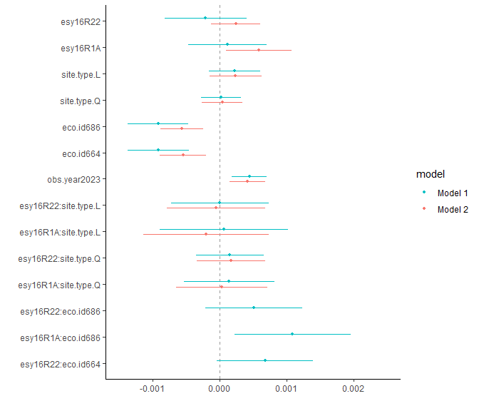<!-- -->

### Effect sizes

Effect sizes of chosen model just to get exact values of means etc. if
necessary.

#### ESy EUNIS Habitat type

``` r
(emm <- emmeans(
  m_1,
  revpairwise ~ esy16,
  type = "response"
  ))
```

    ## $emmeans
    ##  esy16  emmean       SE  df lower.CL upper.CL
    ##  R     0.00141 0.000100 158  0.00121  0.00160
    ##  R22   0.00160 0.000157 158  0.00128  0.00191
    ##  R1A    nonEst       NA  NA       NA       NA
    ## 
    ## Results are averaged over the levels of: site.type, eco.id, obs.year 
    ## Confidence level used: 0.95 
    ## 
    ## $contrasts
    ##  contrast  estimate       SE  df t.ratio p.value
    ##  R22 - R   0.000188 0.000186 158   1.010  0.3139
    ##  R1A - R     nonEst       NA  NA      NA      NA
    ##  R1A - R22   nonEst       NA  NA      NA      NA
    ## 
    ## Results are averaged over the levels of: site.type, eco.id, obs.year 
    ## P value adjustment: tukey method for comparing a family of 2 estimates

``` r
plot(emm, comparison = TRUE)
```

    ## Warning: Removed 1 row containing missing values or values outside the scale range
    ## (`geom_point()`).

    ## Warning: Removed 1 row containing missing values or values outside the scale range
    ## (`geom_segment()`).

    ## Warning: Removed 1 row containing missing values or values outside the scale range
    ## (`geom_point()`).

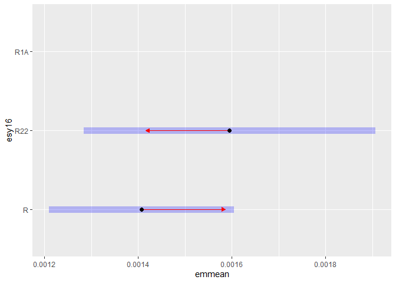<!-- -->

#### Habiat type x Region

``` r
(emm <- emmeans(
  m_1,
  revpairwise ~ eco.id | esy16,
  type = "response"
  ))
```

    ## $emmeans
    ## esy16 = R:
    ##  eco.id  emmean       SE  df lower.CL upper.CL
    ##  654    0.00202 0.000173 158 0.001675  0.00236
    ##  686    0.00110 0.000158 158 0.000786  0.00141
    ##  664    0.00111 0.000163 158 0.000786  0.00143
    ## 
    ## esy16 = R22:
    ##  eco.id  emmean       SE  df lower.CL upper.CL
    ##  654    0.00181 0.000258 158 0.001296  0.00232
    ##  686    0.00140 0.000213 158 0.000981  0.00182
    ##  664    0.00158 0.000189 158 0.001204  0.00195
    ## 
    ## esy16 = R1A:
    ##  eco.id  emmean       SE  df lower.CL upper.CL
    ##  654    0.00214 0.000241 158 0.001660  0.00261
    ##  686    0.00231 0.000340 158 0.001636  0.00298
    ##  664     nonEst       NA  NA       NA       NA
    ## 
    ## Results are averaged over the levels of: site.type, obs.year 
    ## Confidence level used: 0.95 
    ## 
    ## $contrasts
    ## esy16 = R:
    ##  contrast               estimate       SE  df t.ratio p.value
    ##  eco.id686 - eco.id654 -9.17e-04 0.000228 158  -4.021  0.0003
    ##  eco.id664 - eco.id654 -9.09e-04 0.000232 158  -3.925  0.0004
    ##  eco.id664 - eco.id686  8.16e-06 0.000219 158   0.037  0.9992
    ## 
    ## esy16 = R22:
    ##  contrast               estimate       SE  df t.ratio p.value
    ##  eco.id686 - eco.id654 -4.05e-04 0.000287 158  -1.412  0.3372
    ##  eco.id664 - eco.id654 -2.29e-04 0.000280 158  -0.820  0.6912
    ##  eco.id664 - eco.id686  1.76e-04 0.000244 158   0.722  0.7508
    ## 
    ## esy16 = R1A:
    ##  contrast               estimate       SE  df t.ratio p.value
    ##  eco.id686 - eco.id654  1.72e-04 0.000376 158   0.457  0.6480
    ##  eco.id664 - eco.id654    nonEst       NA  NA      NA      NA
    ##  eco.id664 - eco.id686    nonEst       NA  NA      NA      NA
    ## 
    ## Results are averaged over the levels of: site.type, obs.year 
    ## P value adjustment: tukey method for varying family sizes

``` r
plot(emm, comparison = TRUE)
```

    ## Warning: Removed 1 row containing missing values or values outside the scale range
    ## (`geom_point()`).

    ## Warning: Removed 1 row containing missing values or values outside the scale range
    ## (`geom_segment()`).

    ## Warning: Removed 1 row containing missing values or values outside the scale range
    ## (`geom_point()`).

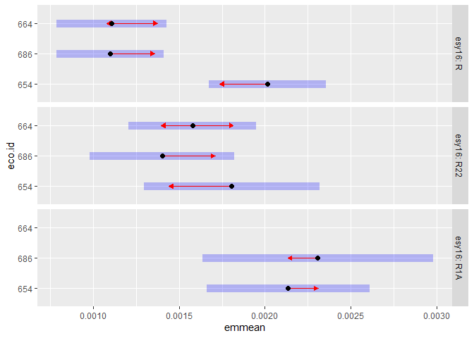<!-- -->

#### Habiat type x Site type

``` r
(emm <- emmeans(
  m_1,
  revpairwise ~ site.type | esy16,
  type = "response"
  ))
```

    ## $emmeans
    ## esy16 = R:
    ##  site.type  emmean       SE  df lower.CL upper.CL
    ##  positive  0.00125 0.000207 158 0.000846  0.00166
    ##  restored  0.00139 0.000127 158 0.001138  0.00164
    ##  negative  0.00158 0.000177 158 0.001229  0.00193
    ## 
    ## esy16 = R22:
    ##  site.type  emmean       SE  df lower.CL upper.CL
    ##  positive  0.00150 0.000312 158 0.000884  0.00212
    ##  restored  0.00145 0.000122 158 0.001209  0.00169
    ##  negative  0.00183 0.000322 158 0.001197  0.00247
    ## 
    ## esy16 = R1A:
    ##  site.type  emmean       SE  df lower.CL upper.CL
    ##  positive   nonEst       NA  NA       NA       NA
    ##  restored   nonEst       NA  NA       NA       NA
    ##  negative   nonEst       NA  NA       NA       NA
    ## 
    ## Results are averaged over the levels of: eco.id, obs.year 
    ## Confidence level used: 0.95 
    ## 
    ## $contrasts
    ## esy16 = R:
    ##  contrast             estimate       SE  df t.ratio p.value
    ##  restored - positive  1.34e-04 0.000242 158   0.553  0.8453
    ##  negative - positive  3.23e-04 0.000273 158   1.184  0.4645
    ##  negative - restored  1.89e-04 0.000218 158   0.868  0.6614
    ## 
    ## esy16 = R22:
    ##  contrast             estimate       SE  df t.ratio p.value
    ##  restored - positive -5.03e-05 0.000331 158  -0.152  0.9873
    ##  negative - positive  3.32e-04 0.000445 158   0.746  0.7365
    ##  negative - restored  3.82e-04 0.000344 158   1.111  0.5089
    ## 
    ## esy16 = R1A:
    ##  contrast             estimate       SE  df t.ratio p.value
    ##  restored - positive  7.35e-06 0.000411 158   0.018  0.9998
    ##  negative - positive  4.18e-04 0.000627 158   0.666  0.7837
    ##  negative - restored  4.10e-04 0.000556 158   0.738  0.7414
    ## 
    ## Results are averaged over the levels of: eco.id, obs.year 
    ## P value adjustment: tukey method for comparing a family of 3 estimates

``` r
plot(emm, comparison = TRUE)
```

    ## Warning: Removed 3 rows containing missing values or values outside the scale range
    ## (`geom_point()`).

    ## Warning: Removed 3 rows containing missing values or values outside the scale range
    ## (`geom_segment()`).

    ## Warning: Removed 3 rows containing missing values or values outside the scale range
    ## (`geom_point()`).

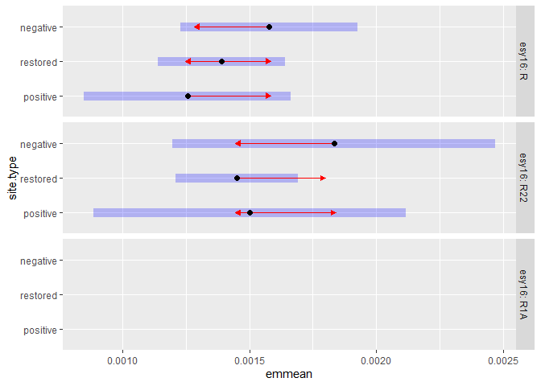<!-- -->

# Session info

    ## R version 4.4.2 (2024-10-31 ucrt)
    ## Platform: x86_64-w64-mingw32/x64
    ## Running under: Windows 11 x64 (build 26100)
    ## 
    ## Matrix products: default
    ## 
    ## 
    ## locale:
    ## [1] LC_COLLATE=German_Germany.utf8  LC_CTYPE=German_Germany.utf8   
    ## [3] LC_MONETARY=German_Germany.utf8 LC_NUMERIC=C                   
    ## [5] LC_TIME=German_Germany.utf8    
    ## 
    ## time zone: Europe/Berlin
    ## tzcode source: internal
    ## 
    ## attached base packages:
    ## [1] stats     graphics  grDevices utils     datasets  methods   base     
    ## 
    ## other attached packages:
    ##  [1] emmeans_1.11.0   DHARMa_0.4.7     patchwork_1.2.0  ggbeeswarm_0.7.2
    ##  [5] lubridate_1.9.3  forcats_1.0.0    stringr_1.5.1    dplyr_1.1.4     
    ##  [9] purrr_1.0.2      readr_2.1.5      tidyr_1.3.1      tibble_3.2.1    
    ## [13] ggplot2_3.5.1    tidyverse_2.0.0  here_1.0.1      
    ## 
    ## loaded via a namespace (and not attached):
    ##  [1] tidyselect_1.2.1   vipor_0.4.7        farver_2.1.2       fastmap_1.2.0     
    ##  [5] bayestestR_0.15.2  promises_1.3.2     digest_0.6.36      estimability_1.5.1
    ##  [9] timechange_0.3.0   mime_0.12          lifecycle_1.0.4    magrittr_2.0.3    
    ## [13] compiler_4.4.2     rlang_1.1.4        tools_4.4.2        utf8_1.2.4        
    ## [17] yaml_2.3.9         knitr_1.48         labeling_0.4.3     bit_4.0.5         
    ## [21] ggstance_0.3.7     plyr_1.8.9         gap.datasets_0.0.6 abind_1.4-8       
    ## [25] withr_3.0.0        datawizard_1.0.2   stats4_4.4.2       grid_4.4.2        
    ## [29] fansi_1.0.6        xtable_1.8-4       colorspace_2.1-0   scales_1.3.0      
    ## [33] iterators_1.0.14   MASS_7.3-60.2      insight_1.1.0      cli_3.6.3         
    ## [37] mvtnorm_1.3-3      dotwhisker_0.8.3   rmarkdown_2.27     crayon_1.5.3      
    ## [41] reformulas_0.4.0   generics_0.1.3     performance_0.13.0 rstudioapi_0.16.0 
    ## [45] tzdb_0.4.0         parameters_0.24.2  minqa_1.2.8        splines_4.4.2     
    ## [49] parallel_4.4.2     vctrs_0.6.5        boot_1.3-31        Matrix_1.7-0      
    ## [53] carData_3.0-5      car_3.1-3          hms_1.1.3          bit64_4.0.5       
    ## [57] Formula_1.2-5      qgam_1.3.4         beeswarm_0.4.0     Rmisc_1.5.1       
    ## [61] foreach_1.5.2      gap_1.6            glue_1.7.0         nloptr_2.2.1      
    ## [65] codetools_0.2-20   stringi_1.8.4      gtable_0.3.5       later_1.4.1       
    ## [69] lme4_1.1-37        munsell_0.5.1      pillar_1.9.0       htmltools_0.5.8.1 
    ## [73] R6_2.5.1           Rdpack_2.6.3       doParallel_1.0.17  rprojroot_2.0.4   
    ## [77] vroom_1.6.5        evaluate_0.24.0    shiny_1.10.0       lattice_0.22-6    
    ## [81] highr_0.11         rbibutils_2.3      httpuv_1.6.15      Rcpp_1.0.14       
    ## [85] gridExtra_2.3      coda_0.19-4.1      nlme_3.1-164       MuMIn_1.48.11     
    ## [89] mgcv_1.9-1         xfun_0.45          pkgconfig_2.0.3
