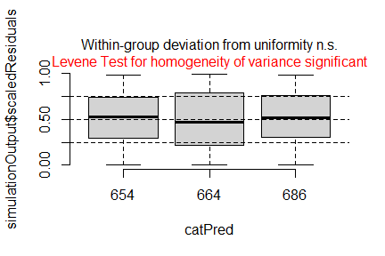
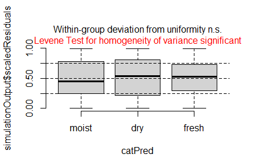
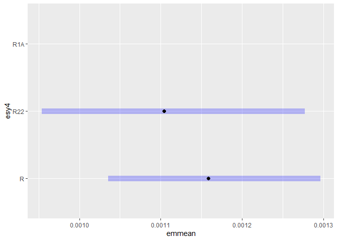

Analysis of Bauer et al. (submitted) Functional traits of grasslands:
<br> Community weighted mean of seed mass per plot (esy4)
================
<b>Markus Bauer</b> <br>
<b>2025-06-10</b>

- [Preparation](#preparation)
- [Statistics](#statistics)
  - [Data exploration](#data-exploration)
    - [Means and deviations](#means-and-deviations)
    - [Graphs of raw data (Step 2, 6,
      7)](#graphs-of-raw-data-step-2-6-7)
    - [Outliers, zero-inflation, transformations? (Step 1, 3,
      4)](#outliers-zero-inflation-transformations-step-1-3-4)
    - [Check collinearity part 1 (Step
      5)](#check-collinearity-part-1-step-5)
  - [Models](#models)
  - [Model check](#model-check)
    - [DHARMa](#dharma)
    - [Check collinearity part 2 (Step
      5)](#check-collinearity-part-2-step-5)
  - [Model comparison](#model-comparison)
    - [<i>R</i><sup>2</sup> values](#r2-values)
    - [AICc](#aicc)
  - [Predicted values](#predicted-values)
    - [Summary table](#summary-table)
    - [Forest plot](#forest-plot)
    - [Effect sizes](#effect-sizes)
- [Session info](#session-info)

<br/> <br/> <b>Markus Bauer</b>

Technichal University of Munich, TUM School of Life Sciences, Chair of
Restoration Ecology, Emil-Ramann-Straße 6, 85354 Freising, Germany

<markus1.bauer@tum.de>

ORCiD ID: [0000-0001-5372-4174](https://orcid.org/0000-0001-5372-4174)
<br> [Google
Scholar](https://scholar.google.de/citations?user=oHhmOkkAAAAJ&hl=de&oi=ao)
<br> GitHub: [markus1bauer](https://github.com/markus1bauer)

> **NOTE:** To compare different models, you only have to change the
> models in the section ‘Load models’

# Preparation

Protocol of data exploration (Steps 1-8) used from Zuur et al. (2010)
Methods Ecol Evol [DOI:
10.1111/2041-210X.12577](https://doi.org/10.1111/2041-210X.12577)

#### Packages

``` r
library(here)
library(tidyverse)
library(ggbeeswarm)
library(patchwork)
library(DHARMa)
library(emmeans)
```

#### Load data

``` r
sites <- read_csv(
  here("data", "processed", "data_processed_sites_esy4.csv"),
  col_names = TRUE, na = c("na", "NA", ""), col_types = cols(
    .default = "?",
    eco.id = "f",
    region = col_factor(levels = c("north", "centre", "south"), ordered = TRUE),
    site.type = col_factor(
      levels = c("positive", "restored", "negative"), ordered = TRUE
      ),
    fertilized = "f",
    obs.year = "f"
  )
) %>%
  mutate(
    esy4 = fct_relevel(esy4, "R", "R22", "R1A"),
    eco.id = factor(eco.id)
    ) %>%
  rename(y = cwm.abu.seedmass)
```

# Statistics

## Data exploration

### Means and deviations

``` r
Rmisc::CI(sites$y, ci = .95)
```

    ##       upper        mean       lower 
    ## 0.001574195 0.001489662 0.001405129

``` r
median(sites$y)
```

    ## [1] 0.00122

``` r
sd(sites$y)
```

    ## [1] 0.001072695

``` r
quantile(sites$y, probs = c(0.05, 0.95), na.rm = TRUE)
```

    ##      5%     95% 
    ## 0.00038 0.00347

``` r
sites %>% count(eco.id)
```

    ## # A tibble: 3 × 2
    ##   eco.id     n
    ##   <fct>  <int>
    ## 1 654      203
    ## 2 664      203
    ## 3 686      215

``` r
sites %>% count(site.type)
```

    ## # A tibble: 3 × 2
    ##   site.type     n
    ##   <ord>     <int>
    ## 1 positive    102
    ## 2 restored    401
    ## 3 negative    118

``` r
sites %>% count(esy4)
```

    ## # A tibble: 3 × 2
    ##   esy4      n
    ##   <fct> <int>
    ## 1 R       330
    ## 2 R22     210
    ## 3 R1A      81

``` r
sites %>% count(esy4, eco.id)
```

    ## # A tibble: 8 × 3
    ##   esy4  eco.id     n
    ##   <fct> <fct>  <int>
    ## 1 R     654      102
    ## 2 R     664      112
    ## 3 R     686      116
    ## 4 R22   654       48
    ## 5 R22   664       91
    ## 6 R22   686       71
    ## 7 R1A   654       53
    ## 8 R1A   686       28

``` r
sites %>% count(esy4, site.type)
```

    ## # A tibble: 9 × 3
    ##   esy4  site.type     n
    ##   <fct> <ord>     <int>
    ## 1 R     positive     57
    ## 2 R     restored    180
    ## 3 R     negative     93
    ## 4 R22   positive     25
    ## 5 R22   restored    169
    ## 6 R22   negative     16
    ## 7 R1A   positive     20
    ## 8 R1A   restored     52
    ## 9 R1A   negative      9

### Graphs of raw data (Step 2, 6, 7)

<!-- --><!-- --><!-- --><!-- -->

### Outliers, zero-inflation, transformations? (Step 1, 3, 4)

<!-- -->

### Check collinearity part 1 (Step 5)

Exclude r \> 0.7 <br> Dormann et al. 2013 Ecography [DOI:
10.1111/j.1600-0587.2012.07348.x](https://doi.org/10.1111/j.1600-0587.2012.07348.x)

``` r
# sites %>%
#   select(where(is.numeric), -y, -starts_with("cwm.")) %>%
#   GGally::ggpairs(
#     lower = list(continuous = "smooth_loess")
#     ) +
#   theme(strip.text = element_text(size = 7))

# -> no continuous variables
```

## Models

> **NOTE:** Only here you have to modify the script to compare other
> models

``` r
load(file = here("outputs", "models", "model_seedmass_esy4_1.Rdata"))
load(file = here("outputs", "models", "model_seedmass_esy4_2.Rdata"))
m_1 <- m1
m_2 <- m2
```

``` r
m_1@call
## lmer(formula = log(y) ~ esy4 * (site.type + eco.id) + obs.year + 
##     (1 | id.site), data = sites, REML = FALSE)
m_2@call
## lmer(formula = log(y) ~ esy4 * site.type + eco.id + obs.year + 
##     (1 | id.site), data = sites, REML = FALSE)
```

## Model check

### DHARMa

``` r
simulation_output_1 <- simulateResiduals(m_1, plot = TRUE)
```

<!-- -->

``` r
simulation_output_2 <- simulateResiduals(m_2, plot = TRUE)
```

<!-- -->

``` r
plotResiduals(simulation_output_1$scaledResiduals, sites$eco.id)
```

<!-- -->

``` r
plotResiduals(simulation_output_2$scaledResiduals, sites$eco.id)
```

<!-- -->

``` r
plotResiduals(simulation_output_1$scaledResiduals, sites$site.type)
```

<!-- -->

``` r
plotResiduals(simulation_output_2$scaledResiduals, sites$site.type)
```

<!-- -->

``` r
plotResiduals(simulation_output_1$scaledResiduals, sites$obs.year)
```

<!-- -->

``` r
plotResiduals(simulation_output_2$scaledResiduals, sites$obs.year)
```

<!-- -->

``` r
plotResiduals(simulation_output_1$scaledResiduals, sites$hydrology)
## Warning in ensurePredictor(simulationOutput, form): DHARMa:::ensurePredictor:
## character string was provided as predictor. DHARMa has converted to factor
## automatically. To remove this warning, please convert to factor before
## attempting to plot with DHARMa.
```

<!-- -->

``` r
plotResiduals(simulation_output_2$scaledResiduals, sites$hydrology)
## Warning in ensurePredictor(simulationOutput, form): DHARMa:::ensurePredictor:
## character string was provided as predictor. DHARMa has converted to factor
## automatically. To remove this warning, please convert to factor before
## attempting to plot with DHARMa.
```

<!-- -->

``` r
plotResiduals(simulation_output_1$scaledResiduals, sites$fertilized)
```

<!-- -->

``` r
plotResiduals(simulation_output_2$scaledResiduals, sites$fertilized)
```

<!-- -->

### Check collinearity part 2 (Step 5)

Remove VIF \> 3 or \> 10 <br> Zuur et al. 2010 Methods Ecol Evol [DOI:
10.1111/j.2041-210X.2009.00001.x](https://doi.org/10.1111/j.2041-210X.2009.00001.x)

``` r
car::vif(m_1)
```

    ##                     GVIF Df GVIF^(1/(2*Df))
    ## esy4           11.330679  2        1.834695
    ## site.type       1.418765  2        1.091384
    ## eco.id          1.594355  2        1.123689
    ## obs.year        1.022266  1        1.011072
    ## esy4:site.type  4.999271  4        1.222822
    ## esy4:eco.id     9.139388  3        1.445949

``` r
car::vif(m_2)
```

    ##                    GVIF Df GVIF^(1/(2*Df))
    ## esy4           3.562976  2        1.373894
    ## site.type      1.407477  2        1.089207
    ## eco.id         1.068299  2        1.016654
    ## obs.year       1.020872  1        1.010382
    ## esy4:site.type 4.572230  4        1.209250

## Model comparison

### <i>R</i><sup>2</sup> values

``` r
MuMIn::r.squaredGLMM(m_1)
##            R2m       R2c
## [1,] 0.1409498 0.6805522
MuMIn::r.squaredGLMM(m_2)
##            R2m       R2c
## [1,] 0.1349357 0.6835346
```

### AICc

Use AICc and not AIC since ratio n/K \< 40 <br> Burnahm & Anderson 2002
p. 66 ISBN: 978-0-387-95364-9

``` r
MuMIn::AICc(m_1, m_2) %>%
  arrange(AICc)
##     df     AICc
## m_2 14 953.1135
## m_1 17 955.5114
```

## Predicted values

### Summary table

``` r
car::Anova(m_2, type = 3)
```

    ## Analysis of Deviance Table (Type III Wald chisquare tests)
    ## 
    ## Response: log(y)
    ##                    Chisq Df Pr(>Chisq)    
    ## (Intercept)    4855.0423  1  < 2.2e-16 ***
    ## esy4              2.5312  2     0.2821    
    ## site.type         0.4092  2     0.8150    
    ## eco.id           23.5376  2  7.742e-06 ***
    ## obs.year          5.6460  1     0.0175 *  
    ## esy4:site.type    2.4268  4     0.6578    
    ## ---
    ## Signif. codes:  0 '***' 0.001 '**' 0.01 '*' 0.05 '.' 0.1 ' ' 1

``` r
summary(m_2)
```

    ## Linear mixed model fit by maximum likelihood  ['lmerMod']
    ## Formula: log(y) ~ esy4 * site.type + eco.id + obs.year + (1 | id.site)
    ##    Data: sites
    ## 
    ##       AIC       BIC    logLik -2*log(L)  df.resid 
    ##     952.4    1014.5    -462.2     924.4       607 
    ## 
    ## Scaled residuals: 
    ##     Min      1Q  Median      3Q     Max 
    ## -3.9281 -0.4932  0.0268  0.4490  2.9340 
    ## 
    ## Random effects:
    ##  Groups   Name        Variance Std.Dev.
    ##  id.site  (Intercept) 0.2596   0.5095  
    ##  Residual             0.1498   0.3870  
    ## Number of obs: 621, groups:  id.site, 177
    ## 
    ## Fixed effects:
    ##                     Estimate Std. Error t value
    ## (Intercept)         -6.55188    0.09403 -69.678
    ## esy4R22             -0.04901    0.06340  -0.773
    ## esy4R1A              0.16056    0.12175   1.319
    ## site.type.L         -0.05962    0.10646  -0.560
    ## site.type.Q         -0.02049    0.07834  -0.262
    ## eco.id664           -0.48605    0.10524  -4.618
    ## eco.id686           -0.37553    0.10291  -3.649
    ## obs.year2023         0.19970    0.08404   2.376
    ## esy4R22:site.type.L  0.15397    0.12818   1.201
    ## esy4R1A:site.type.L  0.26317    0.24206   1.087
    ## esy4R22:site.type.Q  0.01948    0.08740   0.223
    ## esy4R1A:site.type.Q  0.06442    0.16493   0.391
    ## 
    ## Correlation of Fixed Effects:
    ##             (Intr) es4R22 es4R1A st.t.L st.t.Q ec.664 ec.686 o.2023 e4R22:..L
    ## esy4R22     -0.147                                                           
    ## esy4R1A     -0.302  0.086                                                    
    ## site.type.L -0.096  0.044  0.003                                             
    ## site.type.Q  0.318 -0.122 -0.130 -0.083                                      
    ## eco.id664   -0.587 -0.058  0.178  0.043  0.004                               
    ## eco.id686   -0.562 -0.015  0.125  0.034  0.008  0.514                        
    ## obs.yer2023 -0.495  0.025  0.101  0.023 -0.070  0.033 -0.008                 
    ## esy4R22:..L -0.009  0.115 -0.014 -0.265  0.036  0.047  0.012  0.025          
    ## esy4R1A:..L -0.077 -0.025  0.491 -0.237 -0.009  0.050  0.073  0.056  0.090   
    ## esy4R22:..Q -0.087  0.647  0.044  0.041 -0.321 -0.011  0.011  0.030  0.104   
    ## esy4R1A:..Q -0.127  0.042  0.642 -0.003 -0.259  0.036  0.061  0.030 -0.020   
    ##             e4R1A:..L e4R22:..Q
    ## esy4R22                        
    ## esy4R1A                        
    ## site.type.L                    
    ## site.type.Q                    
    ## eco.id664                      
    ## eco.id686                      
    ## obs.yer2023                    
    ## esy4R22:..L                    
    ## esy4R1A:..L                    
    ## esy4R22:..Q -0.020             
    ## esy4R1A:..Q  0.435     0.113

### Forest plot

``` r
dotwhisker::dwplot(
  list(m_1, m_2),
  ci = 0.95,
  show_intercept = FALSE,
  vline = geom_vline(xintercept = 0, colour = "grey60", linetype = 2)) +
  theme_classic()
```

    ## Package 'merDeriv' needs to be installed to compute confidence intervals
    ##   for random effect parameters.
    ## Package 'merDeriv' needs to be installed to compute confidence intervals
    ##   for random effect parameters.

<!-- -->

### Effect sizes

Effect sizes of chosen model just to get exact values of means etc. if
necessary.

#### ESy EUNIS Habitat type

``` r
(emm <- emmeans(
  m_2,
  revpairwise ~ esy4,
  type = "response"
  ))
```

    ## $emmeans
    ##  esy4 response       SE  df lower.CL upper.CL
    ##  R     0.00118 6.52e-05 237 0.001062  0.00132
    ##  R22   0.00113 8.09e-05 460 0.000979  0.00130
    ##  R1A   0.00139 1.70e-04 454 0.001093  0.00177
    ## 
    ## Results are averaged over the levels of: site.type, eco.id, obs.year 
    ## Degrees-of-freedom method: kenward-roger 
    ## Confidence level used: 0.95 
    ## Intervals are back-transformed from the log scale 
    ## 
    ## $contrasts
    ##  contrast  ratio     SE  df null t.ratio p.value
    ##  R22 / R   0.952 0.0609 565    1  -0.766  0.7239
    ##  R1A / R   1.174 0.1450 552    1   1.297  0.3976
    ##  R1A / R22 1.233 0.1660 579    1   1.559  0.2646
    ## 
    ## Results are averaged over the levels of: site.type, eco.id, obs.year 
    ## Degrees-of-freedom method: kenward-roger 
    ## P value adjustment: tukey method for comparing a family of 3 estimates 
    ## Tests are performed on the log scale

``` r
plot(emm, comparison = TRUE)
```

<!-- -->
\#### Habiat type x Region

``` r
(emm <- emmeans(
  m_2,
  revpairwise ~ eco.id,
  type = "response"
  ))
```

    ## $emmeans
    ##  eco.id response       SE  df lower.CL upper.CL
    ##  654     0.00164 1.34e-04 203 0.001393  0.00192
    ##  664     0.00101 8.87e-05 233 0.000847  0.00120
    ##  686     0.00112 9.66e-05 214 0.000949  0.00133
    ## 
    ## Results are averaged over the levels of: esy4, site.type, obs.year 
    ## Degrees-of-freedom method: kenward-roger 
    ## Confidence level used: 0.95 
    ## Intervals are back-transformed from the log scale 
    ## 
    ## $contrasts
    ##  contrast              ratio     SE  df null t.ratio p.value
    ##  eco.id664 / eco.id654 0.615 0.0662 199    1  -4.519  <.0001
    ##  eco.id686 / eco.id654 0.687 0.0723 187    1  -3.569  0.0013
    ##  eco.id686 / eco.id664 1.117 0.1170 187    1   1.053  0.5442
    ## 
    ## Results are averaged over the levels of: esy4, site.type, obs.year 
    ## Degrees-of-freedom method: kenward-roger 
    ## P value adjustment: tukey method for comparing a family of 3 estimates 
    ## Tests are performed on the log scale

``` r
plot(emm, comparison = TRUE)
```

<!-- -->

#### Habiat type x Site type

``` r
# (emm <- emmeans(
#   m_2,
#   revpairwise ~ site.type | esy4,
#   type = "response"
#   ))
# plot(emm, comparison = TRUE)
```

# Session info

    ## R version 4.5.0 (2025-04-11 ucrt)
    ## Platform: x86_64-w64-mingw32/x64
    ## Running under: Windows 11 x64 (build 26100)
    ## 
    ## Matrix products: default
    ##   LAPACK version 3.12.1
    ## 
    ## locale:
    ## [1] LC_COLLATE=German_Germany.utf8  LC_CTYPE=German_Germany.utf8   
    ## [3] LC_MONETARY=German_Germany.utf8 LC_NUMERIC=C                   
    ## [5] LC_TIME=German_Germany.utf8    
    ## 
    ## time zone: Europe/Berlin
    ## tzcode source: internal
    ## 
    ## attached base packages:
    ## [1] stats     graphics  grDevices utils     datasets  methods   base     
    ## 
    ## other attached packages:
    ##  [1] emmeans_1.11.1   DHARMa_0.4.7     patchwork_1.3.0  ggbeeswarm_0.7.2
    ##  [5] lubridate_1.9.4  forcats_1.0.0    stringr_1.5.1    dplyr_1.1.4     
    ##  [9] purrr_1.0.4      readr_2.1.5      tidyr_1.3.1      tibble_3.2.1    
    ## [13] ggplot2_3.5.2    tidyverse_2.0.0  here_1.0.1      
    ## 
    ## loaded via a namespace (and not attached):
    ##  [1] Rdpack_2.6.4           gridExtra_2.3          rlang_1.1.6           
    ##  [4] magrittr_2.0.3         compiler_4.5.0         mgcv_1.9-1            
    ##  [7] vctrs_0.6.5            pkgconfig_2.0.3        crayon_1.5.3          
    ## [10] fastmap_1.2.0          backports_1.5.0        labeling_0.4.3        
    ## [13] utf8_1.2.5             ggstance_0.3.7         promises_1.3.2        
    ## [16] rmarkdown_2.29         tzdb_0.5.0             nloptr_2.2.1          
    ## [19] bit_4.6.0              xfun_0.52              later_1.4.2           
    ## [22] broom_1.0.8            parallel_4.5.0         R6_2.6.1              
    ## [25] gap.datasets_0.0.6     stringi_1.8.7          qgam_2.0.0            
    ## [28] RColorBrewer_1.1-3     car_3.1-3              boot_1.3-31           
    ## [31] estimability_1.5.1     Rcpp_1.0.14            iterators_1.0.14      
    ## [34] knitr_1.50             parameters_0.25.0      httpuv_1.6.16         
    ## [37] Matrix_1.7-3           splines_4.5.0          timechange_0.3.0      
    ## [40] tidyselect_1.2.1       rstudioapi_0.17.1      abind_1.4-8           
    ## [43] yaml_2.3.10            MuMIn_1.48.11          doParallel_1.0.17     
    ## [46] codetools_0.2-20       lattice_0.22-6         plyr_1.8.9            
    ## [49] shiny_1.10.0           withr_3.0.2            bayestestR_0.15.3     
    ## [52] evaluate_1.0.3         marginaleffects_0.25.1 pillar_1.10.2         
    ## [55] gap_1.6                carData_3.0-5          foreach_1.5.2         
    ## [58] stats4_4.5.0           reformulas_0.4.1       insight_1.2.0         
    ## [61] generics_0.1.4         vroom_1.6.5            rprojroot_2.0.4       
    ## [64] hms_1.1.3              scales_1.4.0           minqa_1.2.8           
    ## [67] xtable_1.8-4           glue_1.8.0             tools_4.5.0           
    ## [70] data.table_1.17.2      lme4_1.1-37            mvtnorm_1.3-3         
    ## [73] grid_4.5.0             rbibutils_2.3          datawizard_1.1.0      
    ## [76] nlme_3.1-168           Rmisc_1.5.1            performance_0.13.0    
    ## [79] beeswarm_0.4.0         vipor_0.4.7            Formula_1.2-5         
    ## [82] cli_3.6.5              gtable_0.3.6           digest_0.6.37         
    ## [85] pbkrtest_0.5.4         farver_2.1.2           htmltools_0.5.8.1     
    ## [88] lifecycle_1.0.4        mime_0.13              bit64_4.6.0-1         
    ## [91] dotwhisker_0.8.4       MASS_7.3-65
