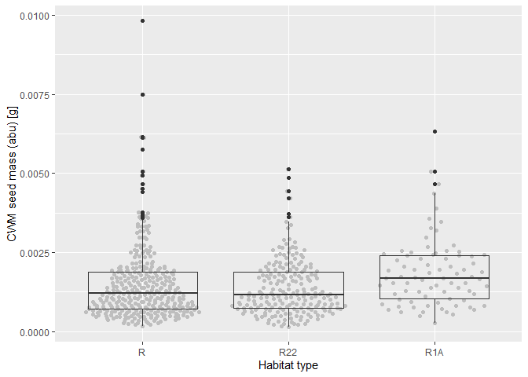
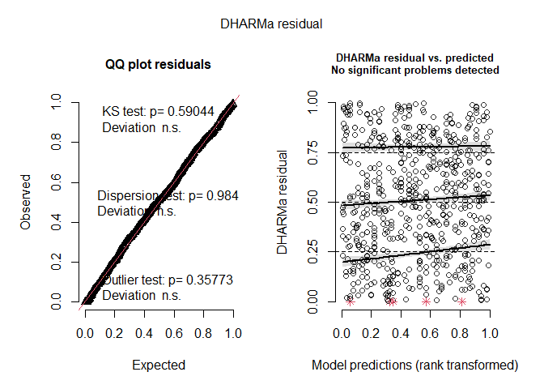
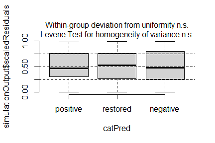
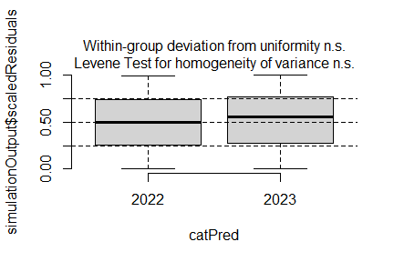
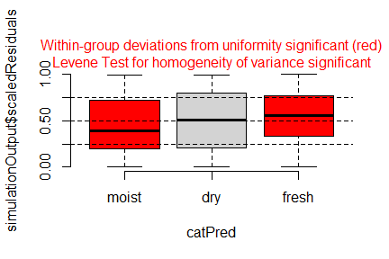

Analysis of Bauer et al. (submitted) Functional traits of grasslands:
<br> Community weighted mean of seed mass per plot (esy4)
================
<b>Markus Bauer</b> <br>
<b>2025-06-10</b>

- [Preparation](#preparation)
- [Statistics](#statistics)
  - [Data exploration](#data-exploration)
    - [Means and deviations](#means-and-deviations)
    - [Graphs of raw data (Step 2, 6,
      7)](#graphs-of-raw-data-step-2-6-7)
    - [Outliers, zero-inflation, transformations? (Step 1, 3,
      4)](#outliers-zero-inflation-transformations-step-1-3-4)
    - [Check collinearity part 1 (Step
      5)](#check-collinearity-part-1-step-5)
  - [Models](#models)
  - [Model check](#model-check)
    - [DHARMa](#dharma)
    - [Check collinearity part 2 (Step
      5)](#check-collinearity-part-2-step-5)
  - [Model comparison](#model-comparison)
    - [<i>R</i><sup>2</sup> values](#r2-values)
    - [AICc](#aicc)
  - [Predicted values](#predicted-values)
    - [Summary table](#summary-table)
    - [Forest plot](#forest-plot)
    - [Effect sizes](#effect-sizes)
- [Session info](#session-info)

<br/> <br/> <b>Markus Bauer</b>

Technichal University of Munich, TUM School of Life Sciences, Chair of
Restoration Ecology, Emil-Ramann-Straße 6, 85354 Freising, Germany

<markus1.bauer@tum.de>

ORCiD ID: [0000-0001-5372-4174](https://orcid.org/0000-0001-5372-4174)
<br> [Google
Scholar](https://scholar.google.de/citations?user=oHhmOkkAAAAJ&hl=de&oi=ao)
<br> GitHub: [markus1bauer](https://github.com/markus1bauer)

> **NOTE:** To compare different models, you only have to change the
> models in the section ‘Load models’

# Preparation

Protocol of data exploration (Steps 1-8) used from Zuur et al. (2010)
Methods Ecol Evol [DOI:
10.1111/2041-210X.12577](https://doi.org/10.1111/2041-210X.12577)

#### Packages

``` r
library(here)
library(tidyverse)
library(ggbeeswarm)
library(patchwork)
library(DHARMa)
library(emmeans)
```

#### Load data

``` r
sites <- read_csv(
  here("data", "processed", "data_processed_sites_esy4.csv"),
  col_names = TRUE, na = c("na", "NA", ""), col_types = cols(
    .default = "?",
    eco.id = "f",
    region = col_factor(levels = c("north", "centre", "south"), ordered = TRUE),
    site.type = col_factor(
      levels = c("positive", "restored", "negative"), ordered = TRUE
      ),
    fertilized = "f",
    obs.year = "f"
  )
) %>%
  mutate(
    esy4 = fct_relevel(esy4, "R", "R22", "R1A"),
    eco.id = factor(eco.id)
    ) %>%
  rename(y = cwm.abu.seedmass)
```

# Statistics

## Data exploration

### Means and deviations

``` r
Rmisc::CI(sites$y, ci = .95)
```

    ##       upper        mean       lower 
    ## 0.001574195 0.001489662 0.001405129

``` r
median(sites$y)
```

    ## [1] 0.00122

``` r
sd(sites$y)
```

    ## [1] 0.001072695

``` r
quantile(sites$y, probs = c(0.05, 0.95), na.rm = TRUE)
```

    ##      5%     95% 
    ## 0.00038 0.00347

``` r
sites %>% count(eco.id)
```

    ## # A tibble: 3 × 2
    ##   eco.id     n
    ##   <fct>  <int>
    ## 1 654      203
    ## 2 664      203
    ## 3 686      215

``` r
sites %>% count(site.type)
```

    ## # A tibble: 3 × 2
    ##   site.type     n
    ##   <ord>     <int>
    ## 1 positive    102
    ## 2 restored    401
    ## 3 negative    118

``` r
sites %>% count(esy4)
```

    ## # A tibble: 3 × 2
    ##   esy4      n
    ##   <fct> <int>
    ## 1 R       330
    ## 2 R22     210
    ## 3 R1A      81

``` r
sites %>% count(esy4, eco.id)
```

    ## # A tibble: 8 × 3
    ##   esy4  eco.id     n
    ##   <fct> <fct>  <int>
    ## 1 R     654      102
    ## 2 R     664      112
    ## 3 R     686      116
    ## 4 R22   654       48
    ## 5 R22   664       91
    ## 6 R22   686       71
    ## 7 R1A   654       53
    ## 8 R1A   686       28

``` r
sites %>% count(esy4, site.type)
```

    ## # A tibble: 9 × 3
    ##   esy4  site.type     n
    ##   <fct> <ord>     <int>
    ## 1 R     positive     57
    ## 2 R     restored    180
    ## 3 R     negative     93
    ## 4 R22   positive     25
    ## 5 R22   restored    169
    ## 6 R22   negative     16
    ## 7 R1A   positive     20
    ## 8 R1A   restored     52
    ## 9 R1A   negative      9

### Graphs of raw data (Step 2, 6, 7)

<!-- --><!-- --><!-- --><!-- -->

### Outliers, zero-inflation, transformations? (Step 1, 3, 4)

<!-- -->

### Check collinearity part 1 (Step 5)

Exclude r \> 0.7 <br> Dormann et al. 2013 Ecography [DOI:
10.1111/j.1600-0587.2012.07348.x](https://doi.org/10.1111/j.1600-0587.2012.07348.x)

``` r
# sites %>%
#   select(where(is.numeric), -y, -starts_with("cwm.")) %>%
#   GGally::ggpairs(
#     lower = list(continuous = "smooth_loess")
#     ) +
#   theme(strip.text = element_text(size = 7))

# -> no continuous variables
```

## Models

> **NOTE:** Only here you have to modify the script to compare other
> models

``` r
load(file = here("outputs", "models", "model_seedmass_esy4_1.Rdata"))
load(file = here("outputs", "models", "model_seedmass_esy4_3.Rdata"))
m_1 <- m1
m_2 <- m3
```

``` r
m_1@call
## lmer(formula = log(y) ~ esy4 * (site.type + eco.id) + obs.year + 
##     (1 | id.site), data = sites, REML = FALSE)
m_2@call
## lmer(formula = log(y) ~ esy4 * (site.type + eco.id) + obs.year + 
##     hydrology + (1 | id.site), data = sites, REML = FALSE)
```

## Model check

### DHARMa

``` r
simulation_output_1 <- simulateResiduals(m_1, plot = TRUE)
```

<!-- -->

``` r
simulation_output_2 <- simulateResiduals(m_2, plot = TRUE)
```

<!-- -->

``` r
plotResiduals(simulation_output_1$scaledResiduals, sites$eco.id)
```

<!-- -->

``` r
plotResiduals(simulation_output_2$scaledResiduals, sites$eco.id)
```

<!-- -->

``` r
plotResiduals(simulation_output_1$scaledResiduals, sites$site.type)
```

<!-- -->

``` r
plotResiduals(simulation_output_2$scaledResiduals, sites$site.type)
```

<!-- -->

``` r
plotResiduals(simulation_output_1$scaledResiduals, sites$obs.year)
```

<!-- -->

``` r
plotResiduals(simulation_output_2$scaledResiduals, sites$obs.year)
```

<!-- -->

``` r
plotResiduals(simulation_output_1$scaledResiduals, sites$hydrology)
## Warning in ensurePredictor(simulationOutput, form): DHARMa:::ensurePredictor:
## character string was provided as predictor. DHARMa has converted to factor
## automatically. To remove this warning, please convert to factor before
## attempting to plot with DHARMa.
```

<!-- -->

``` r
plotResiduals(simulation_output_2$scaledResiduals, sites$hydrology)
## Warning in ensurePredictor(simulationOutput, form): DHARMa:::ensurePredictor:
## character string was provided as predictor. DHARMa has converted to factor
## automatically. To remove this warning, please convert to factor before
## attempting to plot with DHARMa.
```

<!-- -->

``` r
plotResiduals(simulation_output_1$scaledResiduals, sites$fertilized)
```

<!-- -->

``` r
plotResiduals(simulation_output_2$scaledResiduals, sites$fertilized)
```

<!-- -->

### Check collinearity part 2 (Step 5)

Remove VIF \> 3 or \> 10 <br> Zuur et al. 2010 Methods Ecol Evol [DOI:
10.1111/j.2041-210X.2009.00001.x](https://doi.org/10.1111/j.2041-210X.2009.00001.x)

``` r
car::vif(m_1)
```

    ##                     GVIF Df GVIF^(1/(2*Df))
    ## esy4           11.330679  2        1.834695
    ## site.type       1.418765  2        1.091384
    ## eco.id          1.594355  2        1.123689
    ## obs.year        1.022266  1        1.011072
    ## esy4:site.type  4.999271  4        1.222822
    ## esy4:eco.id     9.139388  3        1.445949

``` r
car::vif(m_2)
```

    ##                     GVIF Df GVIF^(1/(2*Df))
    ## esy4           12.586319  2        1.883539
    ## site.type       1.504139  2        1.107445
    ## eco.id          1.630581  2        1.130019
    ## obs.year        1.029409  1        1.014598
    ## hydrology       1.300347  2        1.067861
    ## esy4:site.type  5.063599  4        1.224778
    ## esy4:eco.id     9.354352  3        1.451562

## Model comparison

### <i>R</i><sup>2</sup> values

``` r
MuMIn::r.squaredGLMM(m_1)
##            R2m       R2c
## [1,] 0.1409498 0.6805522
MuMIn::r.squaredGLMM(m_2)
##           R2m       R2c
## [1,] 0.149761 0.6790846
```

### AICc

Use AICc and not AIC since ratio n/K \< 40 <br> Burnahm & Anderson 2002
p. 66 ISBN: 978-0-387-95364-9

``` r
MuMIn::AICc(m_1, m_2) %>%
  arrange(AICc)
##     df     AICc
## m_1 17 955.5114
## m_2 19 956.6572
```

## Predicted values

### Summary table

``` r
car::Anova(m_2, type = 3)
```

    ## Analysis of Deviance Table (Type III Wald chisquare tests)
    ## 
    ## Response: log(y)
    ##                    Chisq Df Pr(>Chisq)    
    ## (Intercept)    2877.1107  1  < 2.2e-16 ***
    ## esy4              0.5213  2    0.77055    
    ## site.type         0.7991  2    0.67062    
    ## eco.id           23.2769  2   8.82e-06 ***
    ## obs.year          5.2836  1    0.02153 *  
    ## hydrology         3.1367  2    0.20839    
    ## esy4:site.type    3.4804  4    0.48087    
    ## esy4:eco.id       3.8800  3    0.27471    
    ## ---
    ## Signif. codes:  0 '***' 0.001 '**' 0.01 '*' 0.05 '.' 0.1 ' ' 1

``` r
summary(m_2)
```

    ## Linear mixed model fit by maximum likelihood  ['lmerMod']
    ## Formula: log(y) ~ esy4 * (site.type + eco.id) + obs.year + hydrology +  
    ##     (1 | id.site)
    ##    Data: sites
    ## 
    ##       AIC       BIC    logLik -2*log(L)  df.resid 
    ##     955.4    1039.6    -458.7     917.4       602 
    ## 
    ## Scaled residuals: 
    ##     Min      1Q  Median      3Q     Max 
    ## -3.9928 -0.4799  0.0140  0.4601  2.8670 
    ## 
    ## Random effects:
    ##  Groups   Name        Variance Std.Dev.
    ##  id.site  (Intercept) 0.2472   0.4972  
    ##  Residual             0.1499   0.3871  
    ## Number of obs: 621, groups:  id.site, 177
    ## 
    ## Fixed effects:
    ##                     Estimate Std. Error t value
    ## (Intercept)         -6.55120    0.12214 -53.639
    ## esy4R22             -0.04730    0.10199  -0.464
    ## esy4R1A              0.07028    0.14104   0.498
    ## site.type.L         -0.09094    0.10684  -0.851
    ## site.type.Q         -0.01542    0.07743  -0.199
    ## eco.id664           -0.52268    0.11482  -4.552
    ## eco.id686           -0.41497    0.11180  -3.712
    ## obs.year2023         0.19000    0.08266   2.299
    ## hydrologyfresh       0.10291    0.10752   0.957
    ## hydrologymoist      -0.07868    0.12397  -0.635
    ## esy4R22:site.type.L  0.15406    0.12845   1.199
    ## esy4R1A:site.type.L  0.36780    0.24447   1.504
    ## esy4R22:site.type.Q  0.02517    0.08767   0.287
    ## esy4R1A:site.type.Q  0.12844    0.16818   0.764
    ## esy4R22:eco.id664    0.03455    0.12635   0.273
    ## esy4R22:eco.id686   -0.03764    0.11714  -0.321
    ## esy4R1A:eco.id686    0.32621    0.18321   1.781

    ## 
    ## Correlation matrix not shown by default, as p = 17 > 12.
    ## Use print(x, correlation=TRUE)  or
    ##     vcov(x)        if you need it

    ## fit warnings:
    ## fixed-effect model matrix is rank deficient so dropping 1 column / coefficient

### Forest plot

``` r
dotwhisker::dwplot(
  list(m_1, m_2),
  ci = 0.95,
  show_intercept = FALSE,
  vline = geom_vline(xintercept = 0, colour = "grey60", linetype = 2)) +
  theme_classic()
```

    ## Package 'merDeriv' needs to be installed to compute confidence intervals
    ##   for random effect parameters.
    ## Package 'merDeriv' needs to be installed to compute confidence intervals
    ##   for random effect parameters.

<!-- -->

### Effect sizes

Effect sizes of chosen model just to get exact values of means etc. if
necessary.

#### ESy EUNIS Habitat type

``` r
(emm <- emmeans(m_2, "esy4", type = "response"))
```

    ##  esy4 response       SE  df lower.CL upper.CL
    ##  R     0.00116 6.58e-05 249 0.001036  0.00130
    ##  R22   0.00110 8.19e-05 475 0.000954  0.00128
    ##  R1A    nonEst       NA  NA       NA       NA
    ## 
    ## Results are averaged over the levels of: site.type, eco.id, obs.year, hydrology 
    ## Degrees-of-freedom method: kenward-roger 
    ## Confidence level used: 0.95 
    ## Intervals are back-transformed from the log scale

``` r
plot(emm, comparison = FALSE)
```

    ## Warning: Removed 1 row containing missing values or values outside the scale range
    ## (`geom_point()`).

    ## Warning: Removed 1 row containing missing values or values outside the scale range
    ## (`geom_segment()`).

    ## Warning: Removed 1 row containing missing values or values outside the scale range
    ## (`geom_point()`).

<!-- -->

#### Habiat type x Region

``` r
(emm <- emmeans(
  m_2,
  revpairwise ~ eco.id + esy4,
  type = "response"
  ))
```

    ## $emmeans
    ##  eco.id esy4 response       SE  df lower.CL upper.CL
    ##  654    R    0.001583 1.41e-04 267 0.001329  0.00189
    ##  664    R    0.000939 8.30e-05 261 0.000789  0.00112
    ##  686    R    0.001046 8.99e-05 241 0.000883  0.00124
    ##  654    R22  0.001510 1.75e-04 484 0.001202  0.00190
    ##  664    R22  0.000927 9.27e-05 360 0.000761  0.00113
    ##  686    R22  0.000961 9.86e-05 398 0.000785  0.00118
    ##  654    R1A  0.001699 2.35e-04 427 0.001295  0.00223
    ##  664    R1A    nonEst       NA  NA       NA       NA
    ##  686    R1A  0.001554 2.77e-04 509 0.001095  0.00221
    ## 
    ## Results are averaged over the levels of: site.type, obs.year, hydrology 
    ## Degrees-of-freedom method: kenward-roger 
    ## Confidence level used: 0.95 
    ## Intervals are back-transformed from the log scale 
    ## 
    ## $contrasts
    ##  contrast                       ratio     SE  df null t.ratio p.value
    ##  eco.id664 R / eco.id654 R      0.593 0.0699 268    1  -4.431  0.0004
    ##  eco.id686 R / eco.id654 R      0.660 0.0759 258    1  -3.612  0.0086
    ##  eco.id686 R / eco.id664 R      1.114 0.1280 259    1   0.938  0.9820
    ##  eco.id654 R22 / eco.id654 R    0.954 0.0985 574    1  -0.458  0.9998
    ##  eco.id654 R22 / eco.id664 R    1.609 0.2250 411    1   3.394  0.0171
    ##  eco.id654 R22 / eco.id686 R    1.444 0.1980 404    1   2.681  0.1315
    ##  eco.id664 R22 / eco.id654 R    0.585 0.0749 338    1  -4.183  0.0010
    ##  eco.id664 R22 / eco.id664 R    0.987 0.0954 624    1  -0.132  1.0000
    ##  eco.id664 R22 / eco.id686 R    0.887 0.1100 329    1  -0.970  0.9784
    ##  eco.id664 R22 / eco.id654 R22  0.614 0.0835 385    1  -3.589  0.0089
    ##  eco.id686 R22 / eco.id654 R    0.607 0.0783 360    1  -3.874  0.0032
    ##  eco.id686 R22 / eco.id664 R    1.023 0.1310 362    1   0.177  1.0000
    ##  eco.id686 R22 / eco.id686 R    0.919 0.0786 539    1  -0.992  0.9755
    ##  eco.id686 R22 / eco.id654 R22  0.636 0.0861 393    1  -3.343  0.0203
    ##  eco.id686 R22 / eco.id664 R22  1.036 0.1300 327    1   0.284  1.0000
    ##  eco.id654 R1A / eco.id654 R    1.073 0.1540 612    1   0.488  0.9997
    ##  eco.id654 R1A / eco.id664 R    1.809 0.2980 408    1   3.598  0.0085
    ##  eco.id654 R1A / eco.id686 R    1.625 0.2650 405    1   2.977  0.0609
    ##  eco.id654 R1A / eco.id654 R22  1.125 0.1890 630    1   0.701  0.9970
    ##  eco.id654 R1A / eco.id664 R22  1.833 0.3120 424    1   3.558  0.0098
    ##  eco.id654 R1A / eco.id686 R22  1.769 0.3050 451    1   3.310  0.0223
    ##  eco.id664 R1A / eco.id654 R   nonEst     NA  NA    1      NA      NA
    ##  eco.id664 R1A / eco.id664 R   nonEst     NA  NA    1      NA      NA
    ##  eco.id664 R1A / eco.id686 R   nonEst     NA  NA    1      NA      NA
    ##  eco.id664 R1A / eco.id654 R22 nonEst     NA  NA    1      NA      NA
    ##  eco.id664 R1A / eco.id664 R22 nonEst     NA  NA    1      NA      NA
    ##  eco.id664 R1A / eco.id686 R22 nonEst     NA  NA    1      NA      NA
    ##  eco.id664 R1A / eco.id654 R1A nonEst     NA  NA    1      NA      NA
    ##  eco.id686 R1A / eco.id654 R    0.982 0.1940 480    1  -0.093  1.0000
    ##  eco.id686 R1A / eco.id664 R    1.656 0.3290 480    1   2.537  0.1825
    ##  eco.id686 R1A / eco.id686 R    1.487 0.2660 618    1   2.213  0.3453
    ##  eco.id686 R1A / eco.id654 R22  1.029 0.2190 528    1   0.136  1.0000
    ##  eco.id686 R1A / eco.id664 R22  1.677 0.3410 492    1   2.544  0.1797
    ##  eco.id686 R1A / eco.id686 R22  1.618 0.3060 626    1   2.546  0.1784
    ##  eco.id686 R1A / eco.id654 R1A  0.915 0.1700 477    1  -0.477  0.9998
    ##  eco.id686 R1A / eco.id664 R1A nonEst     NA  NA    1      NA      NA
    ## 
    ## Results are averaged over the levels of: site.type, obs.year, hydrology 
    ## Degrees-of-freedom method: kenward-roger 
    ## P value adjustment: tukey method for comparing a family of 8 estimates 
    ## Tests are performed on the log scale

``` r
plot(emm, comparison = TRUE)
```

    ## Warning: Removed 1 row containing missing values or values outside the scale range
    ## (`geom_point()`).

    ## Warning: Removed 1 row containing missing values or values outside the scale range
    ## (`geom_segment()`).

    ## Warning: Removed 1 row containing missing values or values outside the scale range
    ## (`geom_point()`).

<!-- -->

#### Habiat type x Site type

``` r
# (emm <- emmeans(
#   m_2,
#   revpairwise ~ site.type | esy4,
#   type = "response"
#   ))
# plot(emm, comparison = TRUE)
```

# Session info

    ## R version 4.5.0 (2025-04-11 ucrt)
    ## Platform: x86_64-w64-mingw32/x64
    ## Running under: Windows 11 x64 (build 26100)
    ## 
    ## Matrix products: default
    ##   LAPACK version 3.12.1
    ## 
    ## locale:
    ## [1] LC_COLLATE=German_Germany.utf8  LC_CTYPE=German_Germany.utf8   
    ## [3] LC_MONETARY=German_Germany.utf8 LC_NUMERIC=C                   
    ## [5] LC_TIME=German_Germany.utf8    
    ## 
    ## time zone: Europe/Berlin
    ## tzcode source: internal
    ## 
    ## attached base packages:
    ## [1] stats     graphics  grDevices utils     datasets  methods   base     
    ## 
    ## other attached packages:
    ##  [1] emmeans_1.11.1   DHARMa_0.4.7     patchwork_1.3.0  ggbeeswarm_0.7.2
    ##  [5] lubridate_1.9.4  forcats_1.0.0    stringr_1.5.1    dplyr_1.1.4     
    ##  [9] purrr_1.0.4      readr_2.1.5      tidyr_1.3.1      tibble_3.2.1    
    ## [13] ggplot2_3.5.2    tidyverse_2.0.0  here_1.0.1      
    ## 
    ## loaded via a namespace (and not attached):
    ##  [1] Rdpack_2.6.4           gridExtra_2.3          sandwich_3.1-1        
    ##  [4] rlang_1.1.6            magrittr_2.0.3         multcomp_1.4-28       
    ##  [7] compiler_4.5.0         mgcv_1.9-1             vctrs_0.6.5           
    ## [10] pkgconfig_2.0.3        crayon_1.5.3           fastmap_1.2.0         
    ## [13] backports_1.5.0        labeling_0.4.3         utf8_1.2.5            
    ## [16] ggstance_0.3.7         promises_1.3.2         rmarkdown_2.29        
    ## [19] tzdb_0.5.0             nloptr_2.2.1           bit_4.6.0             
    ## [22] xfun_0.52              later_1.4.2            broom_1.0.8           
    ## [25] parallel_4.5.0         R6_2.6.1               gap.datasets_0.0.6    
    ## [28] stringi_1.8.7          qgam_2.0.0             RColorBrewer_1.1-3    
    ## [31] car_3.1-3              boot_1.3-31            estimability_1.5.1    
    ## [34] Rcpp_1.0.14            iterators_1.0.14       knitr_1.50            
    ## [37] zoo_1.8-14             parameters_0.25.0      httpuv_1.6.16         
    ## [40] Matrix_1.7-3           splines_4.5.0          timechange_0.3.0      
    ## [43] tidyselect_1.2.1       rstudioapi_0.17.1      abind_1.4-8           
    ## [46] yaml_2.3.10            MuMIn_1.48.11          doParallel_1.0.17     
    ## [49] codetools_0.2-20       lattice_0.22-6         plyr_1.8.9            
    ## [52] bayestestR_0.15.3      shiny_1.10.0           withr_3.0.2           
    ## [55] evaluate_1.0.3         marginaleffects_0.25.1 survival_3.8-3        
    ## [58] pillar_1.10.2          gap_1.6                carData_3.0-5         
    ## [61] foreach_1.5.2          stats4_4.5.0           reformulas_0.4.1      
    ## [64] insight_1.2.0          generics_0.1.4         vroom_1.6.5           
    ## [67] rprojroot_2.0.4        hms_1.1.3              scales_1.4.0          
    ## [70] minqa_1.2.8            xtable_1.8-4           glue_1.8.0            
    ## [73] tools_4.5.0            data.table_1.17.2      lme4_1.1-37           
    ## [76] mvtnorm_1.3-3          grid_4.5.0             rbibutils_2.3         
    ## [79] datawizard_1.1.0       nlme_3.1-168           Rmisc_1.5.1           
    ## [82] performance_0.13.0     beeswarm_0.4.0         vipor_0.4.7           
    ## [85] Formula_1.2-5          cli_3.6.5              gtable_0.3.6          
    ## [88] digest_0.6.37          pbkrtest_0.5.4         TH.data_1.1-3         
    ## [91] farver_2.1.2           htmltools_0.5.8.1      lifecycle_1.0.4       
    ## [94] mime_0.13              bit64_4.6.0-1          dotwhisker_0.8.4      
    ## [97] MASS_7.3-65
