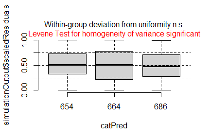
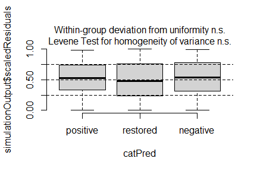
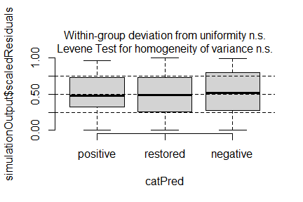
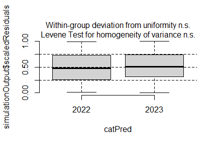
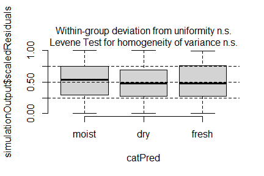
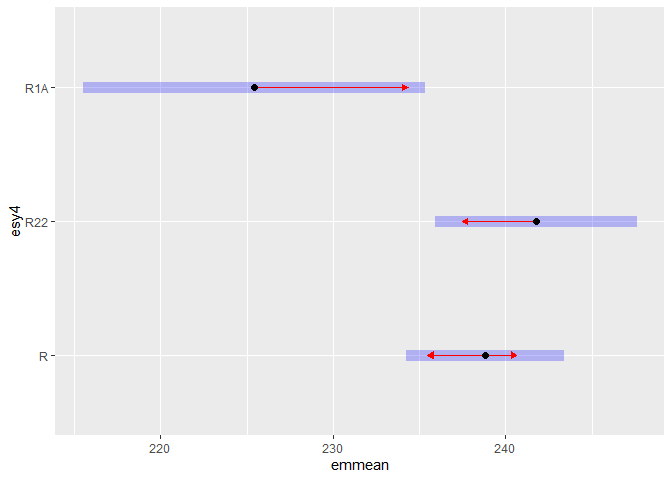
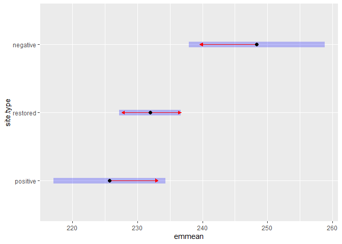

Analysis of Bauer et al. (submitted) Functional traits of grasslands:
<br> Community weighted mean of specific leaf area (SLA) per plot (esy4)
================
<b>Markus Bauer</b> <br>
<b>2025-06-10</b>

- [Preparation](#preparation)
- [Statistics](#statistics)
  - [Data exploration](#data-exploration)
    - [Means and deviations](#means-and-deviations)
    - [Graphs of raw data (Step 2, 6,
      7)](#graphs-of-raw-data-step-2-6-7)
    - [Outliers, zero-inflation, transformations? (Step 1, 3,
      4)](#outliers-zero-inflation-transformations-step-1-3-4)
    - [Check collinearity part 1 (Step
      5)](#check-collinearity-part-1-step-5)
  - [Models](#models)
  - [Model check](#model-check)
    - [DHARMa](#dharma)
    - [Check collinearity part 2 (Step
      5)](#check-collinearity-part-2-step-5)
  - [Model comparison](#model-comparison)
    - [<i>R</i><sup>2</sup> values](#r2-values)
    - [AICc](#aicc)
  - [Predicted values](#predicted-values)
    - [Summary table](#summary-table)
    - [Forest plot](#forest-plot)
    - [Effect sizes](#effect-sizes)
- [Session info](#session-info)

<br/> <br/> <b>Markus Bauer</b>

Technichal University of Munich, TUM School of Life Sciences, Chair of
Restoration Ecology, Emil-Ramann-Straße 6, 85354 Freising, Germany

<markus1.bauer@tum.de>

ORCiD ID: [0000-0001-5372-4174](https://orcid.org/0000-0001-5372-4174)
<br> [Google
Scholar](https://scholar.google.de/citations?user=oHhmOkkAAAAJ&hl=de&oi=ao)
<br> GitHub: [markus1bauer](https://github.com/markus1bauer)

> **NOTE:** To compare different models, you only have to change the
> models in the section ‘Load models’

# Preparation

Protocol of data exploration (Steps 1-8) used from Zuur et al. (2010)
Methods Ecol Evol [DOI:
10.1111/2041-210X.12577](https://doi.org/10.1111/2041-210X.12577)

#### Packages

``` r
library(here)
library(tidyverse)
library(ggbeeswarm)
library(patchwork)
library(DHARMa)
library(emmeans)
```

#### Load data

``` r
sites <- read_csv(
  here("data", "processed", "data_processed_sites_esy4.csv"),
  col_names = TRUE, na = c("na", "NA", ""), col_types = cols(
    .default = "?",
    eco.id = "f",
    region = col_factor(levels = c("north", "centre", "south"), ordered = TRUE),
    site.type = col_factor(
      levels = c("positive", "restored", "negative"), ordered = TRUE
      ),
    fertilized = "f",
    obs.year = "f"
  )
) %>%
  mutate(
    esy4 = fct_relevel(esy4, "R", "R22", "R1A"),
    eco.id = factor(eco.id)
    ) %>%
  rename(y = cwm.abu.sla)
```

# Statistics

## Data exploration

### Means and deviations

``` r
Rmisc::CI(sites$y, ci = .95)
```

    ##    upper     mean    lower 
    ## 241.2086 238.5490 235.8893

``` r
median(sites$y)
```

    ## [1] 238.45

``` r
sd(sites$y)
```

    ## [1] 33.75003

``` r
quantile(sites$y, probs = c(0.05, 0.95), na.rm = TRUE)
```

    ##     5%    95% 
    ## 178.73 293.08

``` r
sites %>% count(eco.id)
```

    ## # A tibble: 3 × 2
    ##   eco.id     n
    ##   <fct>  <int>
    ## 1 654      203
    ## 2 664      203
    ## 3 686      215

``` r
sites %>% count(site.type)
```

    ## # A tibble: 3 × 2
    ##   site.type     n
    ##   <ord>     <int>
    ## 1 positive    102
    ## 2 restored    401
    ## 3 negative    118

``` r
sites %>% count(esy4)
```

    ## # A tibble: 3 × 2
    ##   esy4      n
    ##   <fct> <int>
    ## 1 R       330
    ## 2 R22     210
    ## 3 R1A      81

``` r
sites %>% count(esy4, eco.id)
```

    ## # A tibble: 8 × 3
    ##   esy4  eco.id     n
    ##   <fct> <fct>  <int>
    ## 1 R     654      102
    ## 2 R     664      112
    ## 3 R     686      116
    ## 4 R22   654       48
    ## 5 R22   664       91
    ## 6 R22   686       71
    ## 7 R1A   654       53
    ## 8 R1A   686       28

``` r
sites %>% count(esy4, site.type)
```

    ## # A tibble: 9 × 3
    ##   esy4  site.type     n
    ##   <fct> <ord>     <int>
    ## 1 R     positive     57
    ## 2 R     restored    180
    ## 3 R     negative     93
    ## 4 R22   positive     25
    ## 5 R22   restored    169
    ## 6 R22   negative     16
    ## 7 R1A   positive     20
    ## 8 R1A   restored     52
    ## 9 R1A   negative      9

### Graphs of raw data (Step 2, 6, 7)

<!-- --><!-- --><!-- --><!-- -->

### Outliers, zero-inflation, transformations? (Step 1, 3, 4)

<!-- -->

### Check collinearity part 1 (Step 5)

Exclude r \> 0.7 <br> Dormann et al. 2013 Ecography [DOI:
10.1111/j.1600-0587.2012.07348.x](https://doi.org/10.1111/j.1600-0587.2012.07348.x)

``` r
# sites %>%
#   select(where(is.numeric), -y, -starts_with("cwm.")) %>%
#   GGally::ggpairs(
#     lower = list(continuous = "smooth_loess")
#     ) +
#   theme(strip.text = element_text(size = 7))

# -> no continuous variables
```

## Models

> **NOTE:** Only here you have to modify the script to compare other
> models

``` r
load(file = here("outputs", "models", "model_sla_esy4_1.Rdata"))
load(file = here("outputs", "models", "model_sla_esy4_3.Rdata"))
m_1 <- m1
m_2 <- m3
```

``` r
m_1@call
## lmer(formula = y ~ esy4 * (site.type + eco.id) + obs.year + (1 | 
##     id.site), data = sites, REML = FALSE)
m_2@call
## lmer(formula = y ~ esy4 * site.type + eco.id + obs.year + hydrology + 
##     (1 | id.site), data = sites, REML = FALSE)
```

## Model check

### DHARMa

``` r
simulation_output_1 <- simulateResiduals(m_1, plot = TRUE)
```

<!-- -->

``` r
simulation_output_2 <- simulateResiduals(m_2, plot = TRUE)
```

<!-- -->

``` r
plotResiduals(simulation_output_1$scaledResiduals, sites$eco.id)
```

<!-- -->

``` r
plotResiduals(simulation_output_2$scaledResiduals, sites$eco.id)
```

<!-- -->

``` r
plotResiduals(simulation_output_1$scaledResiduals, sites$site.type)
```

<!-- -->

``` r
plotResiduals(simulation_output_2$scaledResiduals, sites$site.type)
```

<!-- -->

``` r
plotResiduals(simulation_output_1$scaledResiduals, sites$obs.year)
```

<!-- -->

``` r
plotResiduals(simulation_output_2$scaledResiduals, sites$obs.year)
```

<!-- -->

``` r
plotResiduals(simulation_output_1$scaledResiduals, sites$hydrology)
## Warning in ensurePredictor(simulationOutput, form): DHARMa:::ensurePredictor:
## character string was provided as predictor. DHARMa has converted to factor
## automatically. To remove this warning, please convert to factor before
## attempting to plot with DHARMa.
```

<!-- -->

``` r
plotResiduals(simulation_output_2$scaledResiduals, sites$hydrology)
## Warning in ensurePredictor(simulationOutput, form): DHARMa:::ensurePredictor:
## character string was provided as predictor. DHARMa has converted to factor
## automatically. To remove this warning, please convert to factor before
## attempting to plot with DHARMa.
```

<!-- -->

``` r
plotResiduals(simulation_output_1$scaledResiduals, sites$fertilized)
```

<!-- -->

``` r
plotResiduals(simulation_output_2$scaledResiduals, sites$fertilized)
```

<!-- -->

### Check collinearity part 2 (Step 5)

Remove VIF \> 3 or \> 10 <br> Zuur et al. 2010 Methods Ecol Evol [DOI:
10.1111/j.2041-210X.2009.00001.x](https://doi.org/10.1111/j.2041-210X.2009.00001.x)

``` r
car::vif(m_1)
```

    ##                     GVIF Df GVIF^(1/(2*Df))
    ## esy4           11.414767  2        1.838090
    ## site.type       1.371237  2        1.082127
    ## eco.id          1.524788  2        1.111226
    ## obs.year        1.020636  1        1.010265
    ## esy4:site.type  4.925531  4        1.220553
    ## esy4:eco.id     8.915162  3        1.439975

``` r
car::vif(m_2)
```

    ##                    GVIF Df GVIF^(1/(2*Df))
    ## esy4           3.939149  2        1.408804
    ## site.type      1.483165  2        1.103564
    ## eco.id         1.080657  2        1.019581
    ## obs.year       1.027422  1        1.013618
    ## hydrology      1.268040  2        1.061166
    ## esy4:site.type 4.626501  4        1.211035

## Model comparison

### <i>R</i><sup>2</sup> values

``` r
MuMIn::r.squaredGLMM(m_1)
##            R2m       R2c
## [1,] 0.3313799 0.7767097
MuMIn::r.squaredGLMM(m_2)
##            R2m      R2c
## [1,] 0.4233399 0.790452
```

### AICc

Use AICc and not AIC since ratio n/K \< 40 <br> Burnahm & Anderson 2002
p. 66 ISBN: 978-0-387-95364-9

``` r
MuMIn::AICc(m_1, m_2) %>%
  arrange(AICc)
##     df     AICc
## m_2 16 5538.950
## m_1 17 5568.802
```

## Predicted values

### Summary table

``` r
car::Anova(m_2, type = 3)
```

    ## Analysis of Deviance Table (Type III Wald chisquare tests)
    ## 
    ## Response: y
    ##                    Chisq Df Pr(>Chisq)    
    ## (Intercept)    1903.1430  1  < 2.2e-16 ***
    ## esy4              8.7355  2    0.01268 *  
    ## site.type        28.3086  2  7.126e-07 ***
    ## eco.id           39.4132  2  2.764e-09 ***
    ## obs.year          3.0430  1    0.08109 .  
    ## hydrology        29.9967  2  3.064e-07 ***
    ## esy4:site.type    9.0403  4    0.06010 .  
    ## ---
    ## Signif. codes:  0 '***' 0.001 '**' 0.01 '*' 0.05 '.' 0.1 ' ' 1

``` r
summary(m_2)
```

    ## Linear mixed model fit by maximum likelihood  ['lmerMod']
    ## Formula: y ~ esy4 * site.type + eco.id + obs.year + hydrology + (1 | id.site)
    ##    Data: sites
    ## 
    ##       AIC       BIC    logLik -2*log(L)  df.resid 
    ##      5538      5609     -2753      5506       605 
    ## 
    ## Scaled residuals: 
    ##     Min      1Q  Median      3Q     Max 
    ## -3.1782 -0.5504 -0.0016  0.5039  3.3962 
    ## 
    ## Random effects:
    ##  Groups   Name        Variance Std.Dev.
    ##  id.site  (Intercept) 418.7    20.46   
    ##  Residual             239.0    15.46   
    ## Number of obs: 621, groups:  id.site, 177
    ## 
    ## Fixed effects:
    ##                     Estimate Std. Error t value
    ## (Intercept)         211.7360     4.8535  43.625
    ## esy4R22               2.9293     2.5382   1.154
    ## esy4R1A             -13.3948     5.1132  -2.620
    ## site.type.L          20.8033     4.3645   4.766
    ## site.type.Q           6.1834     3.1590   1.957
    ## eco.id664            25.8684     4.2421   6.098
    ## eco.id686            18.3211     4.1408   4.425
    ## obs.year2023         -5.9023     3.3835  -1.744
    ## hydrologyfresh       20.9107     4.3766   4.778
    ## hydrologymoist       24.9844     5.0251   4.972
    ## esy4R22:site.type.L -12.9476     5.1252  -2.526
    ## esy4R1A:site.type.L  -1.3590     9.7365  -0.140
    ## esy4R22:site.type.Q  -6.5424     3.4948  -1.872
    ## esy4R1A:site.type.Q   0.4328     6.6125   0.065

    ## 
    ## Correlation matrix not shown by default, as p = 14 > 12.
    ## Use print(x, correlation=TRUE)  or
    ##     vcov(x)        if you need it

### Forest plot

``` r
dotwhisker::dwplot(
  list(m_1, m_2),
  ci = 0.95,
  show_intercept = FALSE,
  vline = geom_vline(xintercept = 0, colour = "grey60", linetype = 2)) +
  xlim(-35, 40) +
  theme_classic()
```

    ## Package 'merDeriv' needs to be installed to compute confidence intervals
    ##   for random effect parameters.
    ## Package 'merDeriv' needs to be installed to compute confidence intervals
    ##   for random effect parameters.

<!-- -->

### Effect sizes

Effect sizes of chosen model just to get exact values of means etc. if
necessary.

#### ESY EUNIS Habitat type

``` r
(emm <- emmeans(
  m_2,
  revpairwise ~ esy4,
  type = "response"
  ))
```

    ## $emmeans
    ##  esy4 emmean   SE  df lower.CL upper.CL
    ##  R       239 2.31 246      234      243
    ##  R22     242 2.97 463      236      248
    ##  R1A     225 5.04 508      216      235
    ## 
    ## Results are averaged over the levels of: site.type, eco.id, obs.year, hydrology 
    ## Degrees-of-freedom method: kenward-roger 
    ## Confidence level used: 0.95 
    ## 
    ## $contrasts
    ##  contrast  estimate   SE  df t.ratio p.value
    ##  R22 - R       2.93 2.56 563   1.143  0.4880
    ##  R1A - R     -13.39 5.20 606  -2.574  0.0277
    ##  R1A - R22   -16.32 5.62 618  -2.906  0.0106
    ## 
    ## Results are averaged over the levels of: site.type, eco.id, obs.year, hydrology 
    ## Degrees-of-freedom method: kenward-roger 
    ## P value adjustment: tukey method for comparing a family of 3 estimates

``` r
plot(emm, comparison = TRUE)
```

<!-- -->

#### Habiat type x Region

``` r
(emm <- emmeans(
  m_2,
  revpairwise ~ eco.id,
  type = "response"
  ))
```

    ## $emmeans
    ##  eco.id emmean   SE  df lower.CL upper.CL
    ##  654       221 3.37 207      214      227
    ##  664       246 3.56 236      239      253
    ##  686       239 3.50 215      232      246
    ## 
    ## Results are averaged over the levels of: esy4, site.type, obs.year, hydrology 
    ## Degrees-of-freedom method: kenward-roger 
    ## Confidence level used: 0.95 
    ## 
    ## $contrasts
    ##  contrast              estimate   SE  df t.ratio p.value
    ##  eco.id664 - eco.id654    25.87 4.36 200   5.933  <.0001
    ##  eco.id686 - eco.id654    18.32 4.26 188   4.302  0.0001
    ##  eco.id686 - eco.id664    -7.55 4.24 190  -1.779  0.1793
    ## 
    ## Results are averaged over the levels of: esy4, site.type, obs.year, hydrology 
    ## Degrees-of-freedom method: kenward-roger 
    ## P value adjustment: tukey method for comparing a family of 3 estimates

``` r
plot(emm, comparison = TRUE)
```

<!-- -->

#### Habiat type x Site type

``` r
(emm <- emmeans(
  m_2,
  revpairwise ~ site.type,
  type = "response"
  ))
```

    ## $emmeans
    ##  site.type emmean   SE  df lower.CL upper.CL
    ##  positive     226 4.37 211      217      234
    ##  restored     232 2.41 226      227      237
    ##  negative     248 5.30 284      238      259
    ## 
    ## Results are averaged over the levels of: esy4, eco.id, obs.year, hydrology 
    ## Degrees-of-freedom method: kenward-roger 
    ## Confidence level used: 0.95 
    ## 
    ## $contrasts
    ##  contrast            estimate   SE  df t.ratio p.value
    ##  restored - positive     6.26 4.99 211   1.254  0.4231
    ##  negative - positive    22.68 6.90 249   3.288  0.0033
    ##  negative - restored    16.42 5.74 274   2.859  0.0127
    ## 
    ## Results are averaged over the levels of: esy4, eco.id, obs.year, hydrology 
    ## Degrees-of-freedom method: kenward-roger 
    ## P value adjustment: tukey method for comparing a family of 3 estimates

``` r
plot(emm, comparison = TRUE)
```

<!-- -->

# Session info

    ## R version 4.5.0 (2025-04-11 ucrt)
    ## Platform: x86_64-w64-mingw32/x64
    ## Running under: Windows 11 x64 (build 26100)
    ## 
    ## Matrix products: default
    ##   LAPACK version 3.12.1
    ## 
    ## locale:
    ## [1] LC_COLLATE=German_Germany.utf8  LC_CTYPE=German_Germany.utf8   
    ## [3] LC_MONETARY=German_Germany.utf8 LC_NUMERIC=C                   
    ## [5] LC_TIME=German_Germany.utf8    
    ## 
    ## time zone: Europe/Berlin
    ## tzcode source: internal
    ## 
    ## attached base packages:
    ## [1] stats     graphics  grDevices utils     datasets  methods   base     
    ## 
    ## other attached packages:
    ##  [1] emmeans_1.11.1   DHARMa_0.4.7     patchwork_1.3.0  ggbeeswarm_0.7.2
    ##  [5] lubridate_1.9.4  forcats_1.0.0    stringr_1.5.1    dplyr_1.1.4     
    ##  [9] purrr_1.0.4      readr_2.1.5      tidyr_1.3.1      tibble_3.2.1    
    ## [13] ggplot2_3.5.2    tidyverse_2.0.0  here_1.0.1      
    ## 
    ## loaded via a namespace (and not attached):
    ##  [1] Rdpack_2.6.4           gridExtra_2.3          rlang_1.1.6           
    ##  [4] magrittr_2.0.3         compiler_4.5.0         mgcv_1.9-1            
    ##  [7] vctrs_0.6.5            pkgconfig_2.0.3        crayon_1.5.3          
    ## [10] fastmap_1.2.0          backports_1.5.0        labeling_0.4.3        
    ## [13] utf8_1.2.5             ggstance_0.3.7         promises_1.3.2        
    ## [16] rmarkdown_2.29         tzdb_0.5.0             nloptr_2.2.1          
    ## [19] bit_4.6.0              xfun_0.52              later_1.4.2           
    ## [22] broom_1.0.8            parallel_4.5.0         R6_2.6.1              
    ## [25] gap.datasets_0.0.6     stringi_1.8.7          qgam_2.0.0            
    ## [28] RColorBrewer_1.1-3     car_3.1-3              boot_1.3-31           
    ## [31] estimability_1.5.1     Rcpp_1.0.14            iterators_1.0.14      
    ## [34] knitr_1.50             parameters_0.25.0      httpuv_1.6.16         
    ## [37] Matrix_1.7-3           splines_4.5.0          timechange_0.3.0      
    ## [40] tidyselect_1.2.1       rstudioapi_0.17.1      abind_1.4-8           
    ## [43] yaml_2.3.10            MuMIn_1.48.11          doParallel_1.0.17     
    ## [46] codetools_0.2-20       lattice_0.22-6         plyr_1.8.9            
    ## [49] shiny_1.10.0           withr_3.0.2            bayestestR_0.15.3     
    ## [52] evaluate_1.0.3         marginaleffects_0.25.1 pillar_1.10.2         
    ## [55] gap_1.6                carData_3.0-5          foreach_1.5.2         
    ## [58] stats4_4.5.0           reformulas_0.4.1       insight_1.2.0         
    ## [61] generics_0.1.4         vroom_1.6.5            rprojroot_2.0.4       
    ## [64] hms_1.1.3              scales_1.4.0           minqa_1.2.8           
    ## [67] xtable_1.8-4           glue_1.8.0             tools_4.5.0           
    ## [70] data.table_1.17.2      lme4_1.1-37            mvtnorm_1.3-3         
    ## [73] grid_4.5.0             rbibutils_2.3          datawizard_1.1.0      
    ## [76] nlme_3.1-168           Rmisc_1.5.1            performance_0.13.0    
    ## [79] beeswarm_0.4.0         vipor_0.4.7            Formula_1.2-5         
    ## [82] cli_3.6.5              gtable_0.3.6           digest_0.6.37         
    ## [85] pbkrtest_0.5.4         farver_2.1.2           htmltools_0.5.8.1     
    ## [88] lifecycle_1.0.4        mime_0.13              bit64_4.6.0-1         
    ## [91] dotwhisker_0.8.4       MASS_7.3-65
